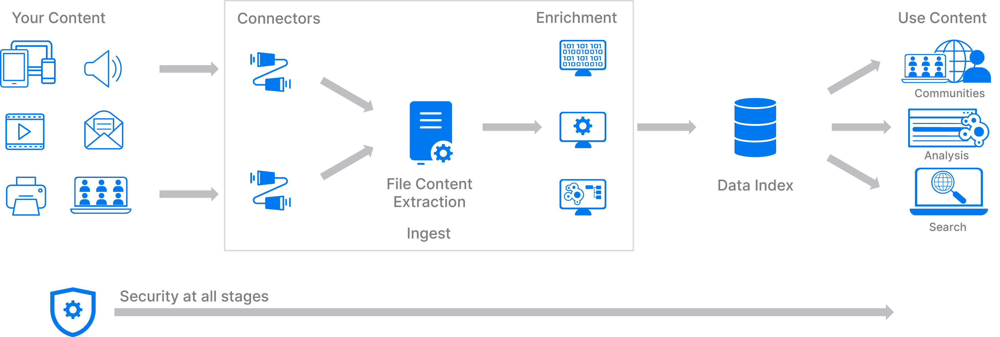

# Knowledge Discovery Tutorials

A set of guides to introduce you to the Knowledge Discovery (formerly IDOL), a software platform for enterprise search and unstructured data analysis.

These tutorials are intended as a step-by-step guide to walk you through common setup steps for a Knowledge Discovery system, introducing you to key concepts as we go. There is much more to learn from the documentation and the Knowledge Discovery user community. See the links [below](#learn-more).

---

- [Taster](#taster)
- [Getting started](#getting-started)
  - [Obtaining tutorial materials](#obtaining-tutorial-materials)
    - [Following this guide offline](#following-this-guide-offline)
  - [Software access](#software-access)
  - [System requirements](#system-requirements)
- [Introduction](#introduction)
  - [Your first installation](#your-first-installation)
  - [End-to-end deployment with containers](#end-to-end-deployment-with-containers)
- [Showcase lessons](#showcase-lessons)
  - [Administration](#administration)
  - [Search and Question Answering](#search-and-question-answering)
  - [Ingest and enrichment](#ingest-and-enrichment)
  - [Investigate](#investigate)
- [Learn more](#learn-more)
  - [Rich media](#rich-media)
  - [Embedded Knowledge Discovery](#embedded-knowledge-discovery)
  - [Useful links](#useful-links)

---

## Taster

A quick first look at a Knowledge Discovery system. Watch a demonstration video where Knowledge Discovery is used to provide answers to natural language questions from a corpus of unstructured documents.

[Watch](https://www.youtube.com/watch?v=QEAejsJc8ws&list=PLlUdEXI83_Xoq5Fe2iUnY8fjV9PuX61FA&index=45).

## Getting started

### Obtaining tutorial materials

Get a local copy of this tutorial to give you all the configuration files and sample media you will need.  You can either clone this repository or download the `.zip` from [GitHub](https://github.com/opentext-idol/idol-tutorials).

In the following tutorials, we will assume these materials are stored under `C:\OpenText`.

#### Following this guide offline

You can stay on GitHub to follow the steps in this and further linked README files in your browser or, if you prefer to work with the downloaded files, see [these steps](./appendix/Markdown_reader.md) for some convenient offline reading options.

### Software access

To use Knowledge Discovery software, you must have an active entitlement with the [Software Licensing and Downloads](https://sld.microfocus.com/mysoftware/index) portal.

### System requirements

Knowledge Discovery software can be installed on Windows, Linux, on-prem, in the cloud, and in containers.

Most people trying Knowledge Discovery for the first time will have access to a Windows laptop, so these tutorials assume that is what you are using.

> NOTE: For Linux users, there will be notes along the way for relevant changes.

Your Windows laptop will need at least the following spare capacity:

- 4 CPU cores, 8 GB RAM and 50 GB disk.

> NOTE: Sizing Knowledge Discovery for your own production tasks depends greatly on your use case. Please discuss your needs with your OpenText account manager.

For Windows users, you must be running Windows 11, or Windows 10 (Build 19041 or higher).

You will also need:

- Administrator privileges to install software.
- A text editor, for example [VS Code](https://code.visualstudio.com/download).

## Introduction

A Knowledge Discovery system collects your source content, using analytics to build an index of useful data that you can search and analyze.

This introduction is in two parts, first a *native* installation of two essential Knowledge Discovery components on your Windows machine, then second an end-to-end containerized deployment using Docker.

### Your first installation

Generate a license key then download, install and run Knowledge Discovery Content, the search index at the core of your Knowledge Discovery system.

Get started with [Knowledge Discovery Content](./introduction/native/README.md).

### End-to-end deployment with containers

Use the official Knowledge Discovery container repository to simplify installation of larger Knowledge Discovery systems. Use Docker to set up a multi-component, end-to-end system from ingest with NiFi to search with Knowledge Discovery Find.

Get started with [Knowledge Discovery containers](./introduction/containers/README.md).

## Showcase lessons

Dip into any of the following lesson series to develop your Knowledge Discovery knowledge and try out more features.

### Administration

Learn how to monitor your Knowledge Discovery system and perform maintenance tasks, such as update your containerized Knowledge Discovery software.

Get started with selected [administrative tasks](./admin/README.md).

### Search and Question Answering

Do you want an answer, not a list of search results?  Excited about what you can do with LLMs and *your* data?

Get started with [Knowledge Discovery Answer](./retrieval/answer/README.md).

### Ingest and enrichment

Use Knowledge Discovery processors with Apache NiFi to do more with your data. Collect securely, enrich, ingest and view.

Get started with new [ingest flows](./ingest/README.md).

<!-- 
- [NiFi Process Groups](./ingestion/nifi-process-group/README.md)
- [NiFi Ingest Showcase Examples](./ingestion/nifi-ingest-showcases/README.md)

Connectors - Discuss multiple sources and show examples for:
- [ ] xECM ingest
- [ ] Documentum ingest
- [ ] Dropbox ingest
- [ ] Twitter ingest - stream and channel
- [ ] Web ingest - Wookiepedia - <https://starwars.fandom.com/wiki/Main_Page> or <https://starwars.fandom.com/wiki/Special:Random>
    - Grab Categories, title, long_title, content (in sections) and dates (created, last updated?)
- [ ] ODBC ingest (Filr?)

Within the above, showcase some enrichment tasks
- [ ] Processor groups
- [ ] KeyView extract and filter, route on filetype.
- [ ] Eduction:
    - Grab names from a document in NiFi
      - Point to all available grammar packages
    - Create a custom grammar
      - quotes, build to solution for Don
    - Use the custom grammar in NiFi
- [x] OCR, with analyze media
 -->

### Investigate

Install and run Discover, the new investigative application that combines Knowledge Discovery's search and entity enrichment with a graph database to help you do more with your data.

<!-- Get started with [Knowledge Discovery Discover](./discover/README.md). -->

> COMING SOON!

## Learn more

### Rich media

Knowledge Discovery Media Server includes a wide range of image, video and audio analytics to enrich your data as part of an ingest pipeline. Media Server is also used as a stand-alone solution. For more details, see this dedicated tutorial project: <https://github.com/opentext-idol/idol-rich-media-tutorials>

### Embedded Knowledge Discovery

Knowledge Discovery servers and components can be embedded in your third-party applications with an OEM agreement. For more details on embedding specific Knowledge Discovery capabilities into stand-alone solution and applications using the Knowledge Discovery SDKs, see this dedicated tutorial project: <https://github.com/opentext-idol/idol-oem-tutorials>

### Useful links

- Read more tips on working with Knowledge Discovery products in the [Expert](https://www.microfocus.com/documentation/idol/knowledge-discovery-25.2/IDOLServer_25.2_Documentation/Guides/html/expert/Content/IDOLExpert_Welcome.htm) documentation.
- For details of the latest changes to Knowledge Discovery, please see the [Release Notes](https://www.microfocus.com/documentation/idol/knowledge-discovery-25.2/IDOLReleaseNotes_25.2_Documentation/idol/Content/_Introduction.htm).
- Full administration guides are available for all Knowledge Discovery products on the [Knowledge Discovery documentation site](https://www.microfocus.com/documentation/idol/).
- To learn more about the suite of Knowledge Discovery products, visit [opentext.com/idol](https://www.opentext.com/products/knowledge-discovery).
