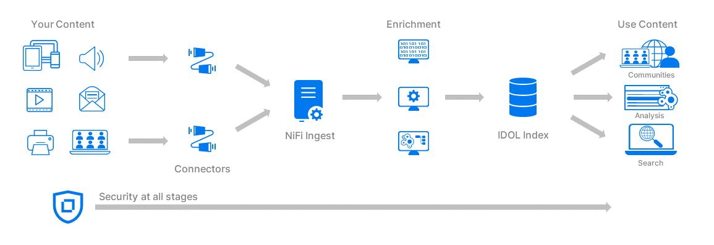

# IDOL Tutorials

A set of guides to introduce you to the Intelligent Data Operating Layer (IDOL), a software platform for enterprise search and unstructured data analysis.

These tutorials are intended as a step-by-step guide to walk you through common setup steps for an IDOL system, introducing you to key concepts as we go. There is much more to learn from the documentation and the IDOL user community. See the links [below](#learn-more).

---

- [Taster](#taster)
- [Getting started](#getting-started)
  - [Software access](#software-access)
  - [System requirements](#system-requirements)
- [Introduction](#introduction)
  - [Your first installation](#your-first-installation)
  - [End-to-end deployment with containers](#end-to-end-deployment-with-containers)
- [Advanced lessons](#advanced-lessons)
  - [Ingest and enrichment](#ingest-and-enrichment)
  - [Search and Question Answering](#search-and-question-answering)
  - [Administration](#administration)
- [Learn more](#learn-more)
  - [Rich media](#rich-media)
  - [Embedded IDOL](#embedded-idol)
  - [Useful links](#useful-links)

---

## Taster

A quick first look at an IDOL system. Watch a demonstration video where IDOL is used to provide answers to natural language questions from a corpus of unstructured documents.

[Watch](https://www.youtube.com/watch?v=QEAejsJc8ws&list=PLlUdEXI83_Xoq5Fe2iUnY8fjV9PuX61FA&index=45).

## Getting started

### Software access

To use IDOL software, you must have an active entitlement with the [Software Licensing and Downloads](https://sld.microfocus.com/mysoftware/index) portal.

### System requirements

IDOL software can be installed on Windows, Linux, on-prem, in the cloud, and in containers.

The easiest option for most people trying IDOL for the first time is to use a Windows laptop. So, these tutorials assume that is what you are using.  

> NOTE: For Linux users, there will be notes like this along the way for relevant changes.

Your Windows laptop will need at least the following spare capacity:

- 4 CPU cores, 8 GB RAM and 50 GB disk.

For Windows users, you must be running Windows 11, or Windows 10 (Build 19041 or higher).

You will also need:

- A text editor.
- Administrator privileges to install software.

> NOTE: Sizing IDOL for your own production tasks depends greatly on your use case. Please discuss your needs with your OpenText account manager.

## Introduction

An IDOL system collects your source content, using analytics to build an index of useful data that you can search and analyze.

This introduction is in two parts, first a *native* installation of two essential IDOL components on your Windows machine, then second an end-to-end containerized deployment using Docker.

### Your first installation

Generate a license key then download, install and run IDOL Content, the search index at the core of your IDOL system.

Get started with [IDOL Content](./introduction/native/README.md).

### End-to-end deployment with containers

Use the official IDOL container repository to simplify installation of larger IDOL systems. Use Docker to set up a multi-component, end-to-end system from ingest with NiFi to search with IDOL Find.

Get started with [IDOL containers](./introduction/containers/README.md).

## Advanced lessons

Dip into any of the following lesson series to develop your IDOL knowledge and try out more features.

### Ingest and enrichment

Use IDOL NiFi processors to do more with your data.  Collect securely, enrich, ingest and view.

> NOTE: NiFi was originally developed as "NiagaraFiles" by the United States National Security Agency and was open-sourced in [2014](https://web.archive.org/web/20171207172647/https://www.nsa.gov/news-features/press-room/press-releases/2014/nifi-announcement.shtml).

> COMING SOON!

<!-- 
- [NiFi Process Groups](./ingestion/nifi-process-group/README.md)
- [NiFi Ingest Showcase Examples](./ingestion/nifi-ingest-showcases/README.md)

Connectors - Discuss multiple sources and show examples for:
- [ ] xECM ingest
- [ ] Documentum ingest
- [ ] Dropbox ingest
- [ ] Twitter ingest - stream and channel
- [ ] Web ingest - Wookiepedia - <https://starwars.fandom.com/wiki/Main_Page> or <https://starwars.fandom.com/wiki/Special:Random>
    - Grab Categories, title, long_title, content (in sections) and dates (created, last updated?)
- [ ] ODBC ingest (Filr?)

Within the above, showcase some enrichment tasks
- [ ] Processor groups
- [ ] KeyView extract and filter, route on filetype.
- [ ] Eduction:
    - Grab names from a document in NiFi
      - Point to all available grammar packages
    - Create a custom grammar
      - quotes, build to solution for Don
    - Use the custom grammar in NiFi
- [ ] OCR, with analyze media
 -->

### Search and Question Answering

Do you want an answer, not a list of search results?  Excited about what you can do with LLMs and *your* data?

Get started with [IDOL Answer](./retrieval/answer/README.md).

### Administration

Learn how to monitor your IDOL system and perform maintenance tasks. Scale up your IDOL system, from distributed ingest to query speed optimization.

> COMING SOON!

<!-- 
  - [ ] Bind-mounting lesson: Bind-mount content.cfg, change log level and also bind-mount logs folder/
 -->

## Learn more

### Rich media

IDOL Media Server includes a wide range of image, video and audio analytics to enrich your data as part of an ingest pipeline. Media Server is also used as a stand-alone solution. For more details, see this dedicated tutorial project: <https://github.com/opentext-idol/idol-rich-media-tutorials>

### Embedded IDOL

IDOL servers and components can be embedded in your third-party applications with an OEM agreement. For more details on embedding specific IDOL capabilities into stand-alone solution and applications using the IDOL SDKs, see this dedicated tutorial project: <https://github.com/opentext-idol/idol-oem-tutorials>

### Useful links

- Read more tips on working with IDOL products in [IDOL Expert](https://www.microfocus.com/documentation/idol/IDOL_24_3/IDOLServer_24.3_Documentation/Guides/html/expert/Content/IDOLExpert_Welcome.htm).
- For details of the latest changes to IDOL, please see the [Release Notes](https://www.microfocus.com/documentation/idol/IDOL_24_3/IDOLReleaseNotes_24.3_Documentation/idol/Content/_Introduction.htm).
- Full administration guides are available for all IDOL products on the [IDOL documentation site](https://www.microfocus.com/documentation/idol/).
- To learn more about the suite of IDOL products, visit [opentext.com/idol](https://www.opentext.com/products/unstructured-data-analytics).
