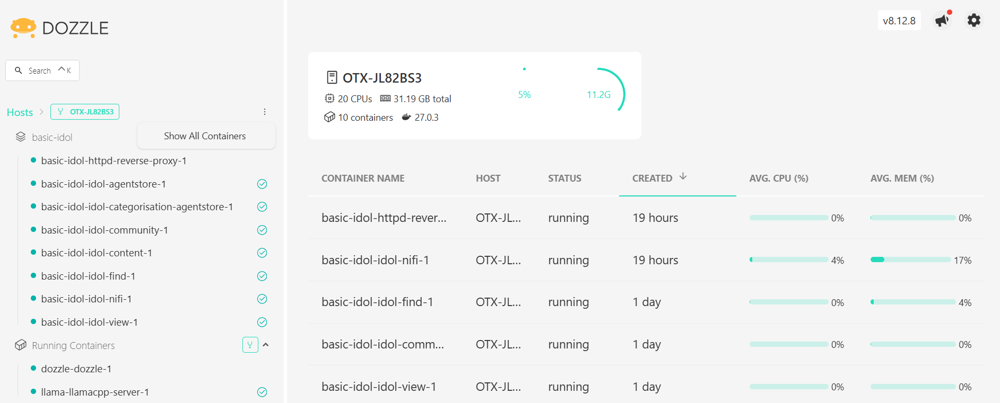

# Monitoring Docker containers

Tips and suggestions for monitoring docker containers on your system.

---

- [Command line](#command-line)
  - [List running containers](#list-running-containers)
  - [Monitor hardware usage per container](#monitor-hardware-usage-per-container)
  - [Monitor processes within a container](#monitor-processes-within-a-container)
  - [Logging container processes](#logging-container-processes)
- [Web app dashboard](#web-app-dashboard)
- [End](#end)

---

## Command line

The following actions use the `docker` command to monitor all containers on your system. To optionally monitor only containers deployed in a particular project, you can run the same commands via the helper script `deploy.sh`.

> NOTE: Remember this script calls `docker compose` with the collection of compose `.yml` files that comprise your project, as described in the [introductory tutorial](../introduction/containers/PART_III.md#keeping-track-of-compose-files).

### List running containers

- See which container services are running on your system:

    ```sh
    $ docker ps
    CONTAINER ID   IMAGE                                                 COMMAND                  CREATED        STATUS                             PORTS                                                                                                   NAMES
    3e6d8aff1947   httpd:2.4                                             "httpd-foreground"       19 hours ago   Up 19 hours                        80/tcp, 0.0.0.0:8080->8080/tcp, :::8080->8080/tcp                                                       basic-idol-httpd-reverse-proxy-1
    3a861337992c   microfocusidolserver/nifi-ver2-minimal:25.2           "./start-idol-nifi.sh"   19 hours ago   Up 19 hours (healthy)              0.0.0.0:11000->11000/tcp, :::11000->11000/tcp, 0.0.0.0:8001->8081/tcp, :::8001->8081/tcp                basic-idol-idol-nifi-1
    8fa5cae937ef   microfocusidolserver/find:25.2                        "./run_idol_ui.sh"       27 hours ago   Up 27 hours (healthy)              0.0.0.0:8000->8000/tcp, :::8000->8000/tcp                                                               basic-idol-idol-find-1
    1573b1897d7c   microfocusidolserver/community:25.2                   "./run_idol.sh"          27 hours ago   Up 27 hours (healthy)              0.0.0.0:9030-9032->9030-9032/tcp, :::9030-9032->9030-9032/tcp                                           basic-idol-idol-community-1
    63b2a003d7a4   microfocusidolserver/view:25.2                        "./run_idol.sh"          27 hours ago   Up 27 hours (healthy)              0.0.0.0:9080-9082->9080-9082/tcp, :::9080-9082->9080-9082/tcp                                           basic-idol-idol-view-1
    d6d30910bedd   microfocusidolserver/agentstore:25.2                  "./run_idol.sh"          27 hours ago   Up 27 hours (healthy)              0.0.0.0:9050-9052->9050-9052/tcp, :::9050-9052->9050-9052/tcp, 9100-9102/tcp                            basic-idol-idol-agentstore-1
    bf5613d92c70   microfocusidolserver/categorisation-agentstore:25.2   "./run_idol.sh"          27 hours ago   Up 27 hours (healthy)              9050-9052/tcp, 9100-9102/tcp, 9183/tcp, 0.0.0.0:9180-9182->9180-9182/tcp, :::9180-9182->9180-9182/tcp   basic-idol-idol-categorisation-agentstore-1
    6d7de1d2ea74   microfocusidolserver/content:25.2                     "./run_idol.sh"          27 hours ago   Up 27 hours (healthy)              0.0.0.0:9100-9102->9100-9102/tcp, :::9100-9102->9100-9102/tcp                                           basic-idol-idol-content-1
    8e0fa448f356   ghcr.io/ggml-org/llama.cpp:server                    "/llama-server"          2 weeks ago    Up 12 seconds (health: starting)   0.0.0.0:8888->8080/tcp, :::8888->8080/tcp                                                               llama-llamacpp-server-1
    ```

- See which container services are running in your project:

    ```sh
    $ cd /opt/idol/llama
    $ ./deploy.sh ps
    NAME                      IMAGE                                COMMAND           SERVICE           CREATED       STATUS                             PORTS
    llama-llamacpp-server-1   ghcr.io/ggml-org/llama.cpp:server   "/llama-server"   llamacpp-server   2 weeks ago   Up 17 seconds (health: starting)   0.0.0.0:8888->8080/tcp, :::8888->8080/tcp
    ```

### Monitor hardware usage per container

- See which container services are running on your system:

    ```sh
    $ docker stats
    CONTAINER ID   NAME                                          CPU %     MEM USAGE / LIMIT     MEM %     NET I/O           BLOCK I/O   PIDS
    3e6d8aff1947   basic-idol-httpd-reverse-proxy-1              0.00%     24.36MiB / 31.19GiB   0.08%     1.65kB / 0B       0B / 0B     82
    3a861337992c   basic-idol-idol-nifi-1                        4.49%     5.398GiB / 31.19GiB   17.30%    2.96MB / 5.18MB   0B / 0B     130
    8fa5cae937ef   basic-idol-idol-find-1                        0.14%     1.293GiB / 31.19GiB   4.14%     4.13kB / 0B       0B / 0B     63
    1573b1897d7c   basic-idol-idol-community-1                   0.02%     33.59MiB / 31.19GiB   0.11%     2.35MB / 468kB    0B / 0B     17
    63b2a003d7a4   basic-idol-idol-view-1                        0.02%     10.5MiB / 31.19GiB    0.03%     18.6kB / 6.46kB   0B / 0B     14
    d6d30910bedd   basic-idol-idol-agentstore-1                  0.02%     110.5MiB / 31.19GiB   0.35%     26.5kB / 11.5kB   0B / 0B     22
    bf5613d92c70   basic-idol-idol-categorisation-agentstore-1   0.02%     37.32MiB / 31.19GiB   0.12%     25kB / 7.26kB     0B / 0B     22
    6d7de1d2ea74   basic-idol-idol-content-1                     1.55%     149.4MiB / 31.19GiB   0.47%     30MB / 37.7MB     0B / 0B     22
    8e0fa448f356   llama-llamacpp-server-1                       0.00%     4.117GiB / 31.19GiB   13.20%    1.46kB / 0B       0B / 0B     30
    ```

    > NOTE: Press `Ctrl`+`C` to exit.

- Monitor hardware resource use per container in your project:

    ```sh
    $ cd /opt/idol/idol-containers-toolkit/basic-idol
    $ ./deploy.sh stats
    CONTAINER ID   NAME                                          CPU %     MEM USAGE / LIMIT     MEM %     NET I/O           BLOCK I/O   PIDS
    3e6d8aff1947   basic-idol-httpd-reverse-proxy-1              0.00%     24.36MiB / 31.19GiB   0.08%     1.65kB / 0B       0B / 0B     82
    3a861337992c   basic-idol-idol-nifi-1                        5.05%     5.398GiB / 31.19GiB   17.30%    2.98MB / 5.19MB   0B / 0B     131
    8fa5cae937ef   basic-idol-idol-find-1                        0.15%     1.293GiB / 31.19GiB   4.14%     4.13kB / 0B       0B / 0B     63
    1573b1897d7c   basic-idol-idol-community-1                   0.02%     33.59MiB / 31.19GiB   0.11%     2.36MB / 469kB    0B / 0B     17
    63b2a003d7a4   basic-idol-idol-view-1                        0.02%     10.52MiB / 31.19GiB   0.03%     18.6kB / 6.46kB   0B / 0B     14
    d6d30910bedd   basic-idol-idol-agentstore-1                  0.02%     110.5MiB / 31.19GiB   0.35%     26.5kB / 11.5kB   0B / 0B     22
    bf5613d92c70   basic-idol-idol-categorisation-agentstore-1   0.02%     37.33MiB / 31.19GiB   0.12%     25kB / 7.26kB     0B / 0B     22
    6d7de1d2ea74   basic-idol-idol-content-1                     0.02%     149.4MiB / 31.19GiB   0.47%     30.3MB / 37.9MB   0B / 0B     22
    ```

- Optionally, add a service name to restrict the list, for example:

    ```sh
    $ ./deploy.sh stats idol-find
    CONTAINER ID   NAME                     CPU %     MEM USAGE / LIMIT     MEM %     NET I/O       BLOCK I/O   PIDS
    8fa5cae937ef   basic-idol-idol-find-1   0.16%     1.293GiB / 31.19GiB   4.14%     4.13kB / 0B   0B / 0B     63
    ```

### Monitor processes within a container

See which processes are running inside a container.

- Knowledge Discovery Find:

    ```sh
    $ cd /opt/idol/idol-containers-toolkit/basic-idol
    $ ./deploy.sh top idol-find
    basic-idol-idol-find-1
    UID       PID      PPID     C    STIME   TTY   TIME       CMD
    cblanks   545247   545226   0    10:59   ?     00:00:00   bash ./run_idol_ui.sh                                         
    cblanks   545294   545247   25   10:59   ?     00:01:52   java -Didol.find.home=/opt/find/home -Dserver.port=8000 -jar find.war -uriEncoding utf-8
    ```

- Knowledge Discovery Content:

    ```sh
    $ ./deploy.sh top idol-content
    basic-idol-idol-content-1
    UID       PID       PPID      C    STIME   TTY   TIME       CMD
    cblanks   2083586   2083558   0    18:18   ?     00:00:00   /bin/bash ./run_idol.sh                              
    cblanks   2083755   2083586   0    18:18   ?     00:00:00   ./content.exe -configfile /content/cfg/content.cfg 
    ```

### Logging container processes

As you have already seen in the introductory tutorials, docker can be configures to present logs from running processes via the command [`docker logs`](https://docs.docker.com/reference/cli/docker/container/logs/).

For example, to tail the logs from Knowledge Discovery Content:

```sh
docker logs -f basic-idol-idol-content-1
```

> NOTE: You need to provide the full name of the container to follow, which can be confirmed, *e.g.*, from the `docker stats` command above.

You can run the same commands via the helper script `deploy.sh`, which uses the [docker compose logs](https://docs.docker.com/reference/cli/docker/compose/logs/) command behind the scenes:

```sh
cd /opt/idol/idol-containers-toolkit/basic-idol
./deploy.sh logs -f idol-content
```

## Web app dashboard

It can be convenient to monitor you container resource usage with a web application.

There are many options available. [Dozzle](https://dozzle.dev/guide/getting-started#standalone-docker) offers a free and easy method to set up a web page to monitor all your running docker containers.

- Create a project folder:

    ```sh
    mkdir /opt/idol/dozzle
    touch /opt/idol/dozzle/docker-compose.yml
    ```

- Set up with the following docker compose configuration:

    ```yml
    services:
      dozzle:
        image: amir20/dozzle:latest
        volumes:
          - /var/run/docker.sock:/var/run/docker.sock
        ports:
          - 18080:8080
        restart: unless-stopped
    ```

- Run the service with:

    ```sh
    cd /opt/idol/dozzle
    docker compose up -d
    ```

- Point your browser to: <http://idol-docker-host:18080/>.

    

---

## End
