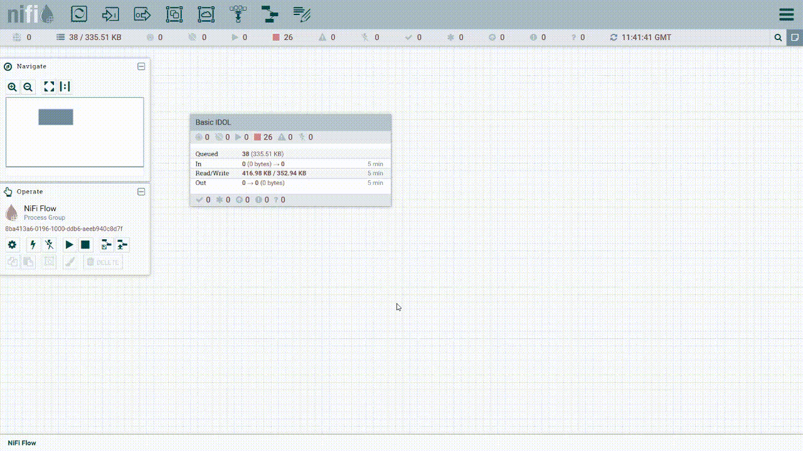

# Update Knowledge Discovery software

Knowledge Discovery has four releases per year, named *e.g.* 25.1, 25.2, 25.3 and 25.4.

Deploying a Knowledge Discovery system with docker containers facilitates simpler updates of entire system:

- Non-stateful components, or those that can rely on start-up scripts for customization, can be simply re-deployed.
- Components with state need to first have this preserved by mounting targeted files and directories outside their containers.

This guide assumes you are using the `basic-idol` deployment, as an example.

---

- [Updating License Server](#updating-license-server)
- [Updating docker container versions](#updating-docker-container-versions)
  - [Mixed version environment](#mixed-version-environment)
- [Persisting state before the upgrade](#persisting-state-before-the-upgrade)
  - [Preparing NiFi for upgrade](#preparing-nifi-for-upgrade)
- [Deploy the updated containers and verify](#deploy-the-updated-containers-and-verify)
  - [Apply the saved NiFi flow definition](#apply-the-saved-nifi-flow-definition)
  - [Store the NiFi indexing state](#store-the-nifi-indexing-state)
- [End](#end)

---

## Updating License Server

To upgrade your system, you must start by updating your `licensekey.dat` file and License Server to the target version (or newer).

To do so, repeat the [steps from the introductory lesson](../introduction/native/GET_KD.md#generate-a-knowledge-discovery-license-key) to create a new key and obtain the newer version of License Server.

> NOTE: If you have a mixed-version system, License Server must match (or be newer than) to latest version deployed.

In case you previously set up License Server as a Windows Service, see the [these steps](./KD_SERVICE.md#remove) to remove the existing service before setting up the new one.

## Updating docker container versions

Updating your target Knowledge Discovery containers, is as simple as changing the `.env`:

```diff
# Version of Knowledge Discovery images to use
-IDOL_SERVER_VERSION=25.1
+IDOL_SERVER_VERSION=25.2
```

### Mixed version environment

If you wish to deploy a mixed version system, *e.g.* to use a specific version of Find, you can:

- Add a new parameter to the `.env` file:
  
    ```diff
    # Version of Knowledge Discovery images to use
    IDOL_SERVER_VERSION=25.2
    +IDOL_UI_VERSION=25.2
    ```

- Change the referenced parameter in your `docker-compose.yml` file:

    ```diff
    idol-find:
    -  image: ${IDOL_REGISTRY}/find:${IDOL_SERVER_VERSION}
    + image: ${IDOL_REGISTRY}/find:${IDOL_UI_VERSION}
    ```

## Persisting state before the upgrade

Stateful containers must have their state preserved outside of the container so that it is not erased on update.

State may include:

- Configuration files. See how to preserve those [here](./CONTAINER_STATE.md#copy-out-configuration-files).
- The Content index. See how to preserve that [here](./CONTAINER_STATE.md#copy-out-indexed-data).
- Find's data folder. See how to preserve that [here](./CONTAINER_STATE.md#preserve-find-state).
- NiFi's flow and indexing status. See below.

### Preparing NiFi for upgrade

> NOTE: The strategy described here is an incomplete one. We will export the current flow, create a new, empty NiFi instance then re-import that flow. While this does preserve the flow definition, the indexing state is lost.

With your Docker system running, go to the [NiFi GUI](http://idol-docker-host:8001/nifi/) to work with your flow.

Navigate to your top-level process group and export the flow definition, with external services:



You browser will download a file named for the process group, *e.g.* `Basic_IDOL.json`.

Un-mount your saved NiFi state:

```diff
idol-nifi:
  volumes:
    - idol-ingest-volume:/idol-ingest
-   - ./nifi/nifi-current:/opt/nifi/nifi-current
```

> NOTE: This step assumes that you have already preserved your state following [this guide](../ingest/preserve-state/README.md).
>
> Consider renaming your old state to `nifi-current-bkp` before proceeding.

If transitioning to Knowledge Discovery 25.2, you can now select between NiFi 1 or NiFi 2 images:

```diff
idol-nifi:
- image: ${IDOL_REGISTRY}/nifi-minimal:${IDOL_SERVER_VERSION} # choose nifi-minimal or nifi-full
+ image: ${IDOL_REGISTRY}/nifi-ver2-minimal:${IDOL_SERVER_VERSION} # choose nifi-ver{1,2}-{minimal,full}
```

> NOTE: To continue using NiFi 1, you must change the image name from `nifi-minimal` to `nifi-ver1-minimal`. See the [documentation](https://www.microfocus.com/documentation/idol/knowledge-discovery-25.2/IDOLServer_25.2_Documentation/Guides/html/gettingstarted/Content/Install_Run_IDOL/Containers/Docker/AvailableContainers.htm) for a full list of available containers.

## Deploy the updated containers and verify

- Deploy the new containers.

    ```sh
    ./deploy.sh up -d
    ```

- New images are downloaded and started automatically:

    

- Verify the deployed versions, *e.g.* of Knowledge Discovery Content:

    ```sh
    $ curl http://localhost:9100/a=getversion | xmllint --format -
    <?xml version="1.0" encoding="UTF-8"?>
    <autnresponse xmlns:autn="http://schemas.autonomy.com/aci/">
      <action>GETVERSION</action>
      <response>SUCCESS</response>
      <responsedata>
        <autn:version>25.2.0</autn:version>
        ...
    ```

### Apply the saved NiFi flow definition

To deploy the saved flow in the new NiFi instance, go to the [NiFi GUI](http://idol-docker-host:8001/nifi/).

Drag in a process group and load the flow definition, *e.g.* `Basic_IDOL.json`.


### Store the NiFi indexing state

Re-do the NiFi state preservation steps [here](../ingest/preserve-state/README.md).

If your flow depends on any Knowledge Discovery extension packages (`.nar` files), make sure to add the latest versions to your new persisted extensions folder, *e.g.* as in the [rich media lesson](../ingest/rich-media/README.md):

```sh
cd /opt/idol/idol-containers-toolkit/basic-idol
cp -r ./temp/NiFiMediaServer_25.2.0_LINUX_X86_64/lib ./nifi/nifi-current/extensions/
cp ./temp/NiFiMediaServer_25.2.0_LINUX_X86_64/*-nifi2.nar ./nifi/nifi-current/extensions/
```

> NOTE: Since version 25.2, all NiFi extensions offer both a NiFi 1 and a NiFi 2 version. Be sure to copy over the correct one.

---

## End
