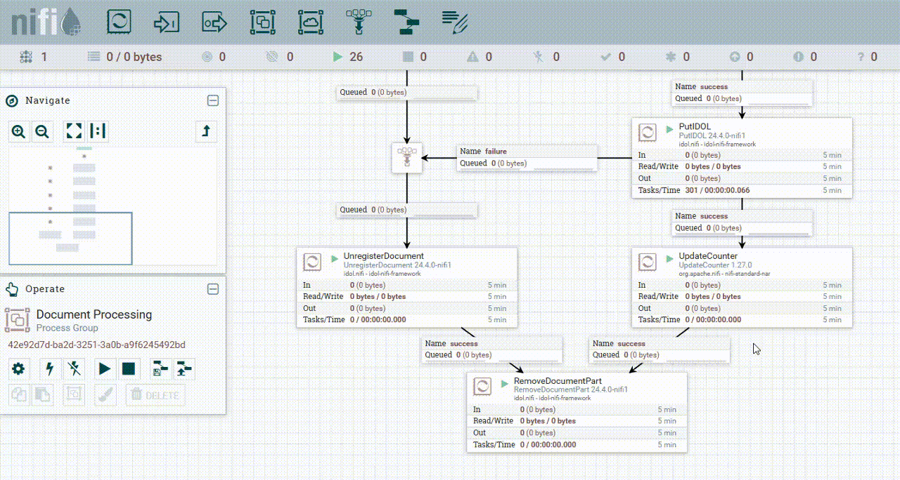

# Knowledge Discovery NiFi state

In this lesson you will learn how to preserve the state of your Knowledge Discovery ingest setup with NiFi. You will:

- Copy the configuration files out from the running NiFi container.
- Stop the container.
- Mount external configuration files to be read from inside the container.
- Restart the container.

Preserving state outside of the container keeps your changes safe when modifying your docker system and also means that you can modify configurations files, load additional packages and review logs even when the container is not running.

This guide assumes you have already familiarized yourself with Knowledge Discovery by completing the [introductory containers tutorial](../../introduction/containers/README.md).

---

- [Setup](#setup)
- [Make a change](#make-a-change)
- [Copy your NiFi state](#copy-your-nifi-state)
- [Mount the external state](#mount-the-external-state)
- [Verify](#verify)
- [Conclusions](#conclusions)
- [Next steps](#next-steps)

---

## Setup

This guide assumes you are using the `basic-idol` deployment, as an example.

## Make a change

With your Docker system running, go to the [NiFi GUI](http://idol-docker-host:8001/nifi/) to work with your flow.

Make the following change to reroute the "UpdateCounter" output to "UnregisterDocument", as show below:



> NOTE: This change will mean that successfully processed documents are unregistered, and will allow you to reprocess and re-index documents.

## Copy your NiFi state

With your Docker system running, use the Linux command line to make a local copy of the NiFi directory:

```sh
$ cd /opt/idol/idol-containers-toolkit/basic-idol
$ docker cp basic-idol-idol-nifi-1:/opt/nifi/nifi-current ./nifi/
Successfully copied 5.55GB to /opt/idol/idol-containers-toolkit/basic-idol/nifi/
```

Check for a new directory `basic-idol/nifi/nifi-current` on your WSL Linux filesystem, containing the full NiFi state.

```sh
ls nifi/nifi-current/
```

Edit your docker compose file, *e.g.* `basic-idol/docker-compose.yml`, to mount the external NiFi directory:

```diff
idol-nifi:
  image: ${IDOL_REGISTRY}/nifi-minimal:${IDOL_SERVER_VERSION} # choose nifi-minimal or nifi-full
  extra_hosts: *external-licenseserver-host
  shm_size: 256m
  environment:
    - NIFI_WEB_PROXY_CONTEXT_PATH=/idol-nifi
    - NIFI_WEB_HTTP_PORT=8081
    - NIFI_SENSITIVE_PROPS_KEY=my_nifi_sensitive_props_key
-   - IDOL_NIFI_FLOWFILE=/opt/nifi/scripts/flow-basic-idol.json
  volumes:
    - idol-ingest-volume:/idol-ingest
+   - ./nifi/nifi-current:/opt/nifi/nifi-current
-   - ./nifi/resources/import-flow.sh:/opt/nifi/scripts/import-flow.sh
-   - ./nifi/resources/basic-idol-entrypoint.sh:/opt/nifi/scripts/basic-idol-entrypoint.sh
-   - ./nifi/flow/basic.json:/opt/nifi/scripts/flow-basic-idol.json
- entrypoint:
-   - sh
-   - -c
-   - "/opt/nifi/scripts/basic-idol-entrypoint.sh"
```

> TIP: With your NiFI configuration now outside the container, you can edit its configuration without the container running. Suggested changes are given in the [appendix](../../appendix/TIPS.md#nifi-settings).

## Mount the external state

Finally, redeploy the Knowledge Discovery NiFi container to pick up these changes:

```sh
./deploy.sh down idol-nifi
./deploy.sh up -d
```

## Verify

Go to the [NiFi GUI](http://idol-docker-host:8001/nifi/) to verify that you still see your modified flow.

## Conclusions

You have learned how to store the state of your NiFi instance, in order to preserve your configuration changes outside of the container.

## Next steps

Why not try more tutorials to explore other [ingestion features](../README.md) from Knowledge Discovery and NiFi.
