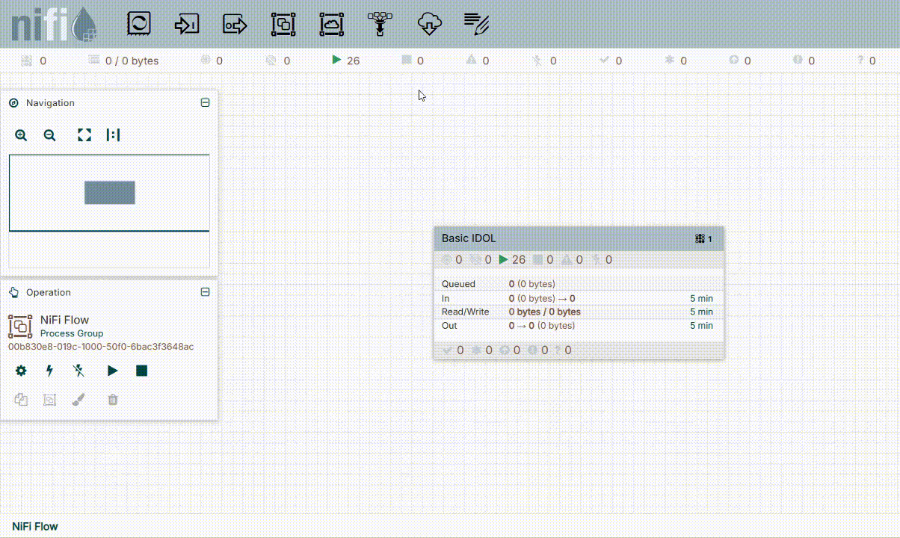

# Knowledge Discovery NiFi state

In this lesson you will learn how to preserve the state of your Knowledge Discovery ingest setup with NiFi. You will:

- Copy the configuration files out from the running NiFi container.
- Stop the container.
- Mount external configuration files to be read from inside the container.
- Restart the container.

Preserving state outside of the container keeps your changes safe when modifying your docker system and also means that you can modify configurations files, load additional packages and review logs even when the container is not running.

This guide assumes you have already familiarized yourself with Knowledge Discovery by completing the [introductory containers tutorial](../../introduction/containers/README.md).

---

- [Setup](#setup)
- [Make a minor edit](#make-a-minor-edit)
- [Update `idol-nifi` to use external folders](#update-idol-nifi-to-use-external-folders)
- [Copy your NiFi state](#copy-your-nifi-state)
- [Mount the external state](#mount-the-external-state)
- [Verify](#verify)
- [Conclusions](#conclusions)
- [Next steps](#next-steps)

---

## Setup

This guide assumes you are using the `basic-idol` deployment, as an example.

## Make a minor edit

Go to the [NiFi GUI](http://idol-docker-host:8001/nifi/) and make a small modification, *e.g.* add a note:



## Update `idol-nifi` to use external folders

Edit your docker compose file, *e.g.* `basic-idol/docker-compose.yml`, to mount external NiFi directories that we will set up shortly.  Uncomment the following lines:

```ini
idol-nifi:
    ...
    volumes:
      ...
      # Example volume mounts to persist nifi data
      ## These need to be copied from the container initially
      - ./nifi/data/conf:/opt/nifi/nifi-current/conf
      - ./nifi/data/extensions:/opt/nifi/nifi-current/extensions
      - ./nifi/data/idol_repository:/opt/nifi/nifi-current/idol_repository
      ## The following entries are all initially empty directories that nifi will populate
      - ./nifi/data/data:/opt/nifi/nifi-current/data
      - ./nifi/data/run:/opt/nifi/nifi-current/run
      - ./nifi/data/state:/opt/nifi/nifi-current/state
      - ./nifi/data/keytool:/opt/nifi/nifi-current/keytool
      - ./nifi/data/content_repository:/opt/nifi/nifi-current/content_repository
      - ./nifi/data/database_repository:/opt/nifi/nifi-current/database_repository
      - ./nifi/data/flowfile_repository:/opt/nifi/nifi-current/flowfile_repository
      - ./nifi/data/provenance_repository:/opt/nifi/nifi-current/provenance_repository
    entrypoint:
      ...
```

## Copy your NiFi state

Create the target folder structure, including the above listed initially empty directories:

```sh
cd /opt/idol/idol-containers-toolkit/basic-idol
mkdir ./nifi/data
cd nifi/data
mkdir data run state keytool content_repository database_repository flowfile_repository provenance_repository
```

With your Docker system running, use the Linux command line to make a local copy of selected NiFi directories:

```sh
$ cd /opt/idol/idol-containers-toolkit/basic-idol
$ docker cp basic-idol-idol-nifi-1:/opt/nifi/nifi-current/conf ./nifi/data/conf
Successfully copied 1.19MB to /opt/idol/idol-containers-toolkit/basic-idol/nifi/data/conf
$ docker cp basic-idol-idol-nifi-1:/opt/nifi/nifi-current/extensions ./nifi/data/extensions
Successfully copied 1.21GB to /opt/idol/idol-containers-toolkit/basic-idol/nifi/data/extensions
$ docker cp basic-idol-idol-nifi-1:/opt/nifi/nifi-current/idol_repository ./nifi/data/idol_repository
Successfully copied 138MB to /opt/idol/idol-containers-toolkit/basic-idol/nifi/data/idol_repository
```

## Mount the external state

Finally, redeploy the Knowledge Discovery NiFi container to pick up these changes:

```sh
./deploy.sh down idol-nifi
./deploy.sh up -d
```

## Verify

Go to the [NiFi GUI](http://idol-docker-host:8001/nifi/) to verify that you still see your modified flow.

## Conclusions

You have learned how to store the state of your NiFi instance, in order to preserve your configuration changes outside of the container.

With your NiFi configuration now outside the container, you can edit its configuration without the container running. Suggested changes are given in the [appendix](../../appendix/TIPS.md#nifi-settings).

## Next steps

Why not try more tutorials to explore other [ingestion features](../README.md) from Knowledge Discovery and NiFi.
