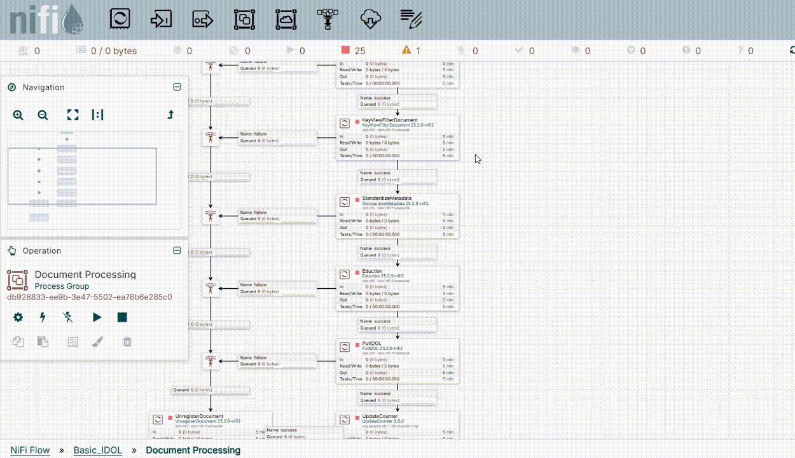

# Knowledge Discovery Rich media processing

In this lesson you will learn how to configure components to enable audio, image and video processing in your NiFi ingest flows. You will:

- Obtain and apply the NiFi Media Server installation package.
- Update your NiFi configuration to include file type detection to identify files for rich media processing.
- Use the "AnalyzeMedia" processor to OCR an example PDF.

> NOTE: The "AnalyzeMedia" processor is a NiFi-embedded implementation of Knowledge Discovery Media Server. To learn more about the possible analytics, read the [Media Server documentation](https://www.microfocus.com/documentation/idol/knowledge-discovery-25.1/MediaServer_25.1_Documentation/Help/Content/Operations/Analyze/_Analyze.htm) and try out the [Knowledge Discovery Rich Media tutorials](https://github.com/opentext-idol/idol-rich-media-tutorials).

This guide assumes you have already familiarized yourself with Knowledge Discovery by completing the [introductory containers tutorial](../../introduction/containers/README.md).

---

- [Setup](#setup)
  - [Create `rich-media` container](#create-rich-media-container)
- [Installation](#installation)
- [Configure processing in NiFi](#configure-processing-in-nifi)
  - [Create a rich media processing group](#create-a-rich-media-processing-group)
  - [Routing files by type](#routing-files-by-type)
    - [Aiming for generalization](#aiming-for-generalization)
  - [Configure a route for images](#configure-a-route-for-images)
  - [Configure a route for PDFs](#configure-a-route-for-pdfs)
  - [Configure image processing](#configure-image-processing)
    - [Add the AnalyzeMedia processor](#add-the-analyzemedia-processor)
    - [Configure the Media Service](#configure-the-media-service)
    - [Configure the AnalyzeMedia processor](#configure-the-analyzemedia-processor)
  - [Finish the rich media processing group](#finish-the-rich-media-processing-group)
  - [Link image processing to the original flow](#link-image-processing-to-the-original-flow)
- [Run](#run)
- [Discussion](#discussion)
- [Conclusions](#conclusions)
- [Next steps](#next-steps)

---

## Setup

This guide assumes you have completed the [preserve NiFi state tutorial](../preserve-state/README.md). We will use the `basic-idol` deployment as an example starting point.

> NOTE: Before continuing, ensure that all other tutorial instances, including `basic-idol` are shut down.

### Create `rich-media` container

We will be modifying the `basic-idol` deployment for this tutorial. To begin, make a copy of your `basic-idol` directory and rename it `rich-media`:

```sh
cp -r /opt/idol/idol-containers-toolkit/basic-idol /opt/idol/idol-containers-toolkit/rich-media
```

Change the name of this new container in `rich-media/docker.compose.yml`:

```diff
  x-common-labels: &common-labels
- docker-compose/instance: ${INSTANCE:-basic-idol}
+ docker-compose/instance: ${INSTANCE:-rich-media}

  x-common-server: &common-server
```

## Installation

To obtain install media for rich media processing in NiFi, follow the steps shown in [the software download guide](../../introduction/native/GET_KD.md#download-knowledge-discovery-components) to download the package `NiFiMediaServer_25.2.0_WINDOWS_X86_64.zip`.

> NOTE: This is a separate package form the standalone Media Server application.

Extract the downloaded package:

```sh
$ cd /opt/idol/idol-containers-toolkit/rich-media
$ unzip /mnt/c/Users/<WINDOWS_USER>/Downloads/NiFiMediaServer_25.2.0_LINUX_X86_64.zip -d ./temp
Archive:  /mnt/c/Users/<WINDOWS_USER>/Downloads/NiFiMediaServer_25.2.0_LINUX_X86_64.zip
   creating: ./temp/NiFiMediaServer_25.2.0_LINUX_X86_64/
   inflating...
```

> NOTE: Please use your own value for `<WINDOWS_USER>` in the above commands.

Move the required files into the NiFi extensions directory, *e.g.* if using NiFi 2:

```sh
cp -r ./temp/NiFiMediaServer_25.2.0_LINUX_X86_64/lib ./nifi/nifi-current/extensions/
cp ./temp/NiFiMediaServer_25.2.0_LINUX_X86_64/*-nifi2.nar ./nifi/nifi-current/extensions/
rm -rf ./temp
```

> NOTE: Since version 25.2, all NiFi extensions offer both a NiFi 1 and a NiFi 2 version. Be sure to copy over the correct one.

Update the `docker-compose.yml` file to reference the included libraries:

```diff
idol-nifi:
  environment:
    - NIFI_WEB_PROXY_CONTEXT_PATH=/idol-nifi
    - NIFI_WEB_HTTP_PORT=8081
    - NIFI_SENSITIVE_PROPS_KEY=my_nifi_sensitive_props_key
+   - LD_LIBRARY_PATH=$LD_LIBRARY_PATH;/opt/nifi/nifi-current/extensions/lib
```

Redeploy the Knowledge Discovery NiFi container to pick up these changes:

```sh
./deploy.sh down idol-nifi
./deploy.sh up -d
```

> TIP: If you see the following error in your NiFi logs, ensure that you have correctly set the `LD_LIBRARY_PATH` environment variable, as directed above.
>
> ```txt
> Suppressed: java.lang.UnsatisfiedLinkError: libgomp.so.1: cannot open shared object file: No such file or directory
> ```

## Configure processing in NiFi

Open the [NiFi](http://idol-docker-host:8001/nifi/) user interface in your favorite web browser to make the following modifications to the Basic Knowledge Discovery document processing flow.

1. Create a new processor group,
1. Configure file-type routing,
1. Add image processing (OCR), and
1. Link everything together with the existing flow.

### Create a rich media processing group

Drag the "Processor Group" icon onto the canvas and give it a name, *e.g.* "Rich Media Processing":



Double click on the processor group tile to configure it.  In the next sections we will build up the configuration within this group to get to the following flow:


### Routing files by type

Before making use of targeted image, video and or audio processing, we must be able to intelligently route the right files to the appropriate analytics, *e.g.* image files to OCR and audio files to Speech to text.

Knowledge Discovery KeyView supports type detection for over 2,200 file types. Individual types are labelled with a unique code or "format", as well as an associate group or "class". For example, a `.png` image file has format `238` and belongs to class `4`, which includes all raster image formats.

> NOTE: This may remind you of the two-part identifier [MIME type standard](https://developer.mozilla.org/en-US/docs/Web/HTTP/Guides/MIME_types), which is widely used in web development, and labels `.png` files as `image/png`. The MIME type standard does not cover a sufficiently wide variety of file types to be used as a primary scheme by Knowledge Discovery KeyView; however equivalent MIME type labels can be used where available.

In NiFi, file type detection is achieved with the "KeyViewRouteOnFileType" processor.

- Drag the "Processor" icon onto the canvas.

- Find, then add the "KeyViewRouteOnFileType" processor.

This processor provides a convenient configuration tool to help find your target file type(s).  Right-click the processor and select **Advanced** to show the guided setup:


The selection shown here results in the following configured output route, seen in the "standard" configuration view as `${file.keyview.format:in('238')}`:


> NOTE: This configuration makes use of the NiFi expression language. For full details on, please read the [NiFi documentation](https://nifi.apache.org/docs/nifi-docs/html/expression-language-guide.html).

Since a MIME type label exists for `.png` files, the same selection could be equivalently made with the string `image/png`:


#### Aiming for generalization

To target file types for rich media processing, it may make more sense to consider file type classes, such as all raster images: `${file.keyview.class:equals('4')}`.

The following suggested classes are recommended for most use cases.

File class | Description | Common examples
--- | --- | ---
4 | Raster images | `.bmp`, `.gif`, `.jpeg`, `.tiff`
9 | Sound | `.avi`, `.mp4`, `.mpeg`, `.wmv`
20 | Movie | `.ac3`, `.mp3`, `.ogg`, `.wav`

> TABLE: Knowledge Discover file type classes for common rich media source files.

### Configure a route for images

Now armed with this understanding, right-click on the "KeyViewRouteOnFileType" processor, then click "Configure" and open the "Properties" tab for manual setup.

- If you created the `png` route already, use the three-dots menu to delete it.

- Click the **+** icon at the top right to add a new route.
  
    

- Name the route "image" and set the value to `${file.keyview.class:equals('4')}`, the raster image class code.

### Configure a route for PDFs

You will be familiar that PDF files often contain image data, such as scanned documents. From file type detection alone, it is not possible to know whether a particular PDF contains image data or not.

To deal with this problem efficiently, both Media Server and its cousin, the NiFi Analyze Media processor, embed KeyView filter libraries to read any embedded text and extract images from PDFs. This allows us to simply extract text from PDFs, whether it was embedded metadata, extracted from images using OCR, or both.

Let's add a PDF route to try this out:

- Right-click on the "KeyViewRouteOnFileType" processor again and click "Advanced" to open the manual setup.

- Click the **+** icon at the top right to add another route.

- Name the route "pdf" and set the value to `${file.keyview.format:equals('230')}`, the PDF format code.

    

We are now ready to send files for image processing.

### Configure image processing

#### Add the AnalyzeMedia processor

Follow these steps to add an "AnalyzeMedia" processor:

- Drag the "Processor" icon onto the canvas.

- Find then add the "AnalyzeMedia" processor.

- Right-click on the new processor and select "Configure".

- Select the existing License Service.

- Use the Media Service parameter's three-dots menu to select "Create new service":

    

    > TIP: If you see an error when trying to create a new Media Service, ensure that you have correctly set the `LD_LIBRARY_PATH` environment variable, as directed above.

#### Configure the Media Service

Follow these steps to configure the new "MediaServiceImpl" service:

- Use the Media Service parameter's three-dots menu again, this time to select "Go to service".

    

- In order to work with PDFs, we need to set up a KeyView Export Service, which is used to extract image data out for processing. Use the KeyView Service parameter's three-dots menu to select "Create new service":

    

    > NOTE: Please read the [documentation](https://www.microfocus.com/documentation/idol/knowledge-discovery-25.2/NiFiIngest_25.2_Documentation/Help/Content/Reference/ControllerServices/MediaServiceImpl.htm?Highlight=MediaServiceImpl) for full details on options for configuring the Media Service.

- Select the "KeyViewExportServiceImpl" and click **Add**.

    

- Use the KeyView Service parameter's three-dots menu again, this time to select "Go to service".

    

- Click the lightening bolt icon to enable the new KeyView Export Service:

    

  - Select "Service only", then click "Enable".

- Hit the bottom-right refresh icon, then enable the Media Service.

    

  - Select "Service only", then click "Enable".

#### Configure the AnalyzeMedia processor

Finally, configure the "AnalyzeMedia" processor for OCR:  

- Click the "Advanced" menu option to go to AnalyzeMedia's process configuration screen.

- Copy the example OCR configuration to the left pane:

    

    > NOTE: The Knowledge Discovery "AnalyzeMedia" processor can be configured to process image, video and audio files using analytics including image classification, face recognition and speech transcription. To learn more about the possible analytics, read the [Media Server documentation](https://www.microfocus.com/documentation/idol/knowledge-discovery-25.1/MediaServer_25.1_Documentation/Help/Content/Operations/Analyze/_Analyze.htm).

- The example restricts OCR to English.  Modify the configuration as follows to attempt to read all supported languages:

    ```diff
    - Languages = en
    + Languages = all
    ```

    > NOTE: Please read the Media Server [documentation](https://www.microfocus.com/documentation/idol/knowledge-discovery-25.2/MediaServer_25.2_Documentation/Help/Content/Configuration/Analysis/OCR/_OCR.htm) for the full configuration options of OCR analysis.

### Finish the rich media processing group

The next step is to complete the "Rich Media Processing" group, as shown above and again here:


You should already be familiar with adding inputs, outputs and funnels to match this screenshot.

When handling the new routes from "KeyViewRouteOnFileType", be sure to:

1. Route the new "image" and "pdf" outputs from "KeyViewRouteOnFileType" to the "AnalyzeMedia" Processor.

1. Route the "unmatched" and "unknown" outputs from "KeyViewRouteOnFileType" to the "Not Processed" output.

    > NOTE: This will preserve the original behavior for files which are not images or PDFs.

### Link image processing to the original flow

Returning to the parent "Document Processing" processor group, now set up the following links:


To create this flow, we will:

1. Re-route the "success" output of "KeyViewExtractFiles" to the "Input" of the "Rich Media Processing" group.

1. Route the "Output" of the "Rich Media Processing" group to "StandardizeMetadata".

1. Route the "Not Processed" output of the "Rich Media Processing" group to "KeyViewFilterDocument".

1. Route the "Failure" output of the "Rich Media Processing" group to the existing chain down to the "UnregisterDocument" processor.

## Run

Assuming you have your FileSystem Connector still ready to ingest from the mounted `nifi-ingest` directory, as [defined earlier](../../introduction/containers/PART_III.md#mount-a-shared-folder-for-ingest), you can simply copy over the included sample folder for the FileSystem Connector to pick the files up. You should see one `.png` and one `.pdf`:


Start the "GetFileSystem" processor to pick up the two files:


To inspect the file information before and after processing, ensure that both the "AnalyzeMedia" processor and its downstream "Output" are both stopped:


View the input files before processing:

`spanish.png` | `TextAndImage.pdf`
--- | ---
 | 

Then run "AnalyzeMedia" and open the new queue:


View the output files:

`spanish.png` | `TextAndImage.pdf`
--- | ---
 | 

This contains structured OCR results in XML for each detected line, as well as a concatenated string of the complete extracted text, providing a lot of flexibility for further downstream processing in your NiFi flows.

## Discussion

In a large NiFi flow, image, audio and video processing can become a bottleneck. To address this issue, you can take advantage of NiFi's parallel processing.

With your "AnalyzeMedia" processor stopped, open its configuration screen and increase value of "Concurrent Tasks", as shown in this screenshot:


## Conclusions

You have now practiced how to add additional Knowledge Discovery packages to NiFi and how to use processor groups to compartmentalize functionality.

By adding KeyView file type detection and Knowledge Discovery media processing, you have enhanced the `basic-idol` flow to perform OCR on image files.

## Next steps

Why not try more tutorials to explore other [ingestion features](../README.md) from Knowledge Discovery and NiFi.
