# Vector search

In this lesson you will learn how to generate text embeddings for files ingested through NiFi and make vectorized queries against those embeddings. You will:

- Configure NiFi to create embeddings for indexed documents
- Configure Content to store embeddings for indexed documents
- Configure Query Manipulation Server to vectorize queries

Vectors are specific numeric representations of data - in this case, text. Vectorized searches provide an alternative to conceptual search and can better detect documents containing synonyms and words semantically related to those in the query.

This guide assumes you have already familiarized yourself with Knowledge Discovery by completing the [introductory containers tutorial](../../introduction/containers/README.md), as well as the [tutorial on preserving state with NiFi](../preserve-state/README.md).

---

- [Setup](#setup)
  - [Create `vector-search` container](#create-vector-search-container)
  - [Download NifiDocumentEmbeddings processor](#download-nifidocumentembeddings-processor)
  - [Move processor files into NiFi container](#move-processor-files-into-nifi-container)
- [Configure NiFi to create embeddings](#configure-nifi-to-create-embeddings)
  - [Add DocumentEmbeddingsService Controller](#add-documentembeddingsservice-controller)
  - [Selecting an embedding model](#selecting-an-embedding-model)
  - [Add a DocumentEmbeddings processor](#add-a-documentembeddings-processor)
- [Configure Content to index embeddings](#configure-content-to-index-embeddings)
- [Re-ingest documents](#re-ingest-documents)
- [Enable vector search](#enable-vector-search)
  - [Set up QMS](#set-up-qms)
- [Verify vector querying](#verify-vector-querying)
- [Conclusions](#conclusions)
- [Next steps](#next-steps)

---

## Setup

This guide assumes you have used the `basic-idol` deployment. We will also be reusing one component from the `data-admin` deployment.

> NOTE: Before continuing, ensure that all other tutorial instances, *e.g.* `basic-idol` are shut down.

### Create `vector-search` container

We will be modifying the `basic-idol` deployment for this tutorial. To begin, make a copy of your `basic-idol` directory and rename it `vector-search`:

```sh
cp -r /opt/idol/idol-containers-toolkit/basic-idol /opt/idol/idol-containers-toolkit/vector-search
```

Change the name of this new container in `vector-search/docker.compose.yml`:

```diff
  x-common-labels: &common-labels
- docker-compose/instance: ${INSTANCE:-basic-idol}
+ docker-compose/instance: ${INSTANCE:-vector-search}

  x-common-server: &common-server
```

### Download NifiDocumentEmbeddings processor

1. Under the Downloads tab, select your product, product name and version from the dropdowns:

    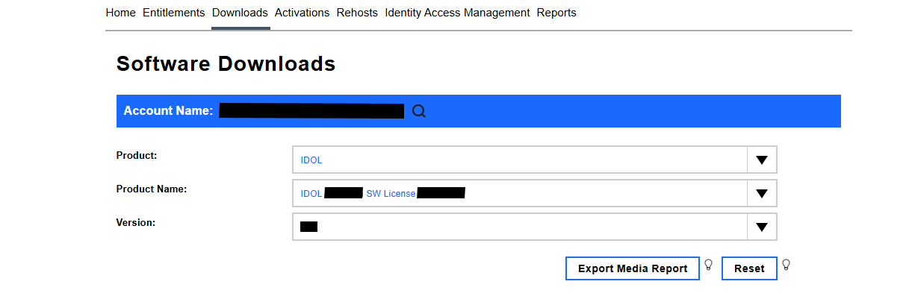

1. From the list of available files, select and download the following:

    - `NiFiDocumentEmbeddings_25.2.0_LINUX_X86_64.zip`

    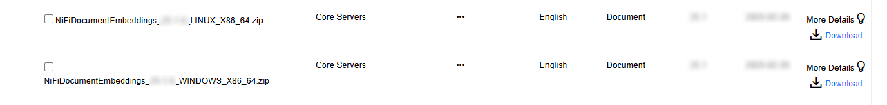

    > NOTE: Make sure to download the same version you have already used for NiFi Ingest, *e.g.* `NiFiIngest_25.2.0_LINUX_X86_64.zip`.

### Move processor files into NiFi container

In the [lesson on NiFi state preservation](../preserve-state/README.md), you mounted the `nifi-current` directory externally. We will now move all necessary files for the `NiFiDocumentEmbeddings` processor into the appropriate locations of that mounted directory.

Move the required files into the NiFi extensions directory, *e.g.* if using NiFi 2:

- Unzip the package:

  ```sh
  $ cd /opt/idol/idol-containers-toolkit/vector-search
  $ unzip /mnt/c/Users/<WINDOWS_USER>/Downloads/NiFiDocumentEmbeddings_25.2.0_LINUX_X86_64.zip -d ./temp
  Archive:  /mnt/c/Users/<WINDOWS_USER>/Downloads/NiFiDocumentEmbeddings_25.2.0_LINUX_X86_64.zip
    creating: ./temp/NiFiDocumentEmbeddings_25.2.0_LINUX_X86_64/
    inflating...
  ```

- Copy over the `.nar` files and libs:

  ```sh
  cp ./temp/NiFiDocumentEmbeddings_25.2.0_LINUX_X86_64/*-nifi2.nar ./nifi/nifi-current/extensions/
  cp -r ./temp/NiFiDocumentEmbeddings_25.2.0_LINUX_X86_64/lib/* ./nifi/nifi-current/NiFiIngest/libs/
  rm -rf ./temp
  ```

Once you have transferred the files, restart the NiFi container.

```sh
./deploy.sh down idol-nifi
./deploy.sh up -d
```

## Configure NiFi to create embeddings

With the embeddings processor downloaded, we need to configure our NiFi flow to utilize it.

### Add DocumentEmbeddingsService Controller

Open NiFi at <http://idol-docker-host:8001/nifi/> (using the direct link).

Ensure the flow is stopped, then right click on the **Basic IDOL** tile and click **Controller Services**:

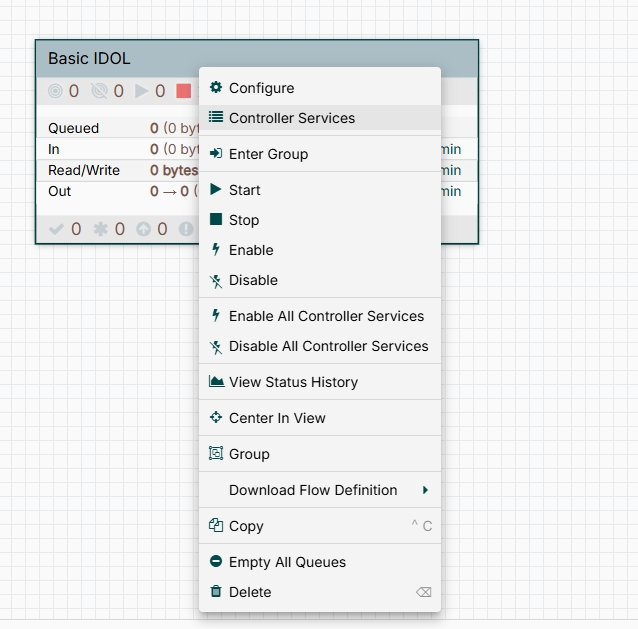

Inside the **Controller Services** view, click **+**. From the pop-up menu, select `DocumentEmbeddingsServiceImpl` and click **Add**:

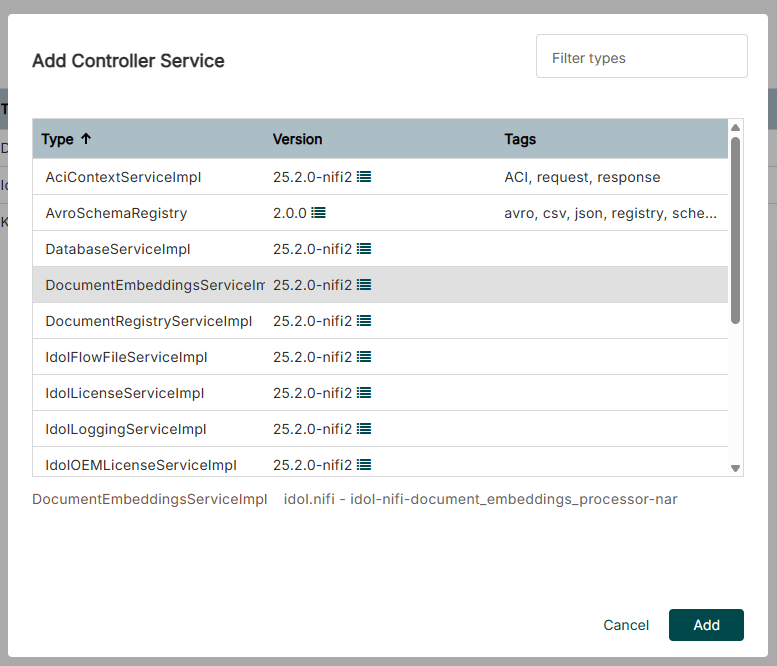

With the Controller Service added, we need to configure it appropriately. First, click **Edit** on `DocEmbeddingsServiceImpl`:

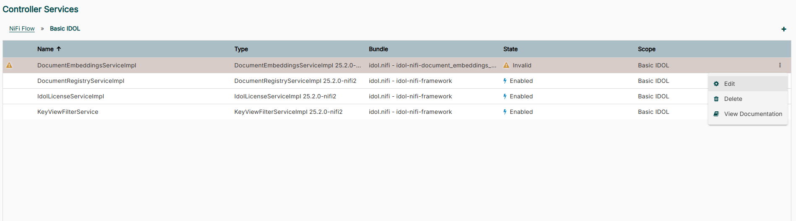

In the pop-up, ensure that **IDOL License Service** is set. The rest of the settings will depend upon the particular embedding model you choose. Follow the steps below.

### Selecting an embedding model

You may choose any sentence-transformer model from [Hugging Face](https://huggingface.co/sentence-transformers). For this guide, we will use [sentence-transformers/multi-qa-MiniLM-L6-cos-v1](https://huggingface.co/sentence-transformers/multi-qa-MiniLM-L6-cos-v1), a relatively small, efficient model specifically designed for search use cases.

For this model, configure the following properties:

Property | Value | Comment
--- | --- | ---
**Model Name** | `sentence-transformers/multi-qa-MiniLM-L6-cos-v1` | This should be the model name exactly as it appears on Hugging Face.
**Model Max Sequence Length** | `512` | This can sometimes be found on the model card, and is either 256 or 512 for most sentence-transformer models.
**Model Sequence Overlap** | `0` | The overlapping sequences potentially allows improved retrieval but also increases the index size.
**Model Minimum Final Sequence Length** | `257` | This should be half of **Model Max Sequence Length** value, plus one (see [documentation for QMS](https://www.microfocus.com/documentation/idol/knowledge-discovery-25.2/QMS_25.2_Documentation/Help/Content/Configuration/Embeddings/ModelMinimumFinalSequenceLength.htm)).
**Embedding Precision** | `5` | This can be set to any value between 1 and 10. The higher the precision, the greater the processing load. For this tutorial, we will set it to 5, but feel free to experiment with other values.

> NOTE: Setting **Embedding Precision** to 1 is not recommended, as all values end up being rounded to 0.1, 0.0, or -0.1.

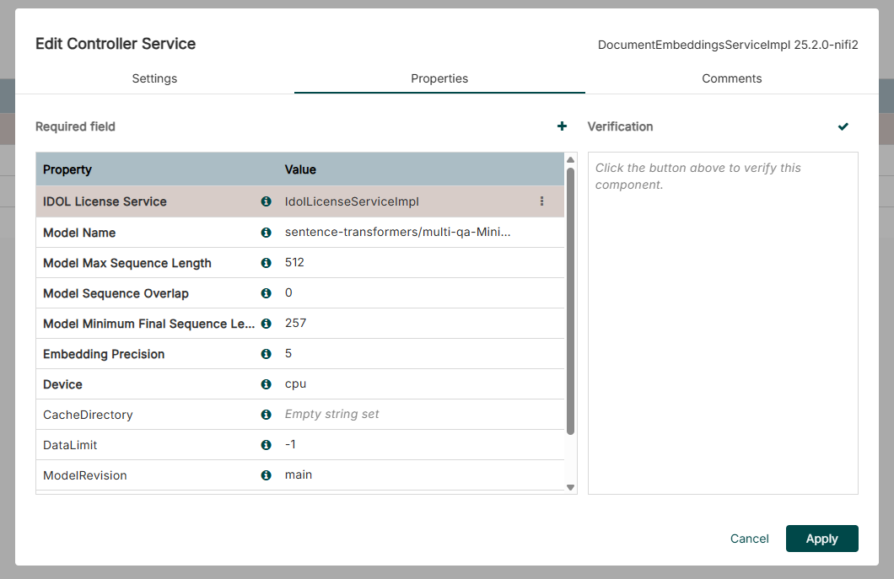

If you have access to a CUDA-compatible GPU, you may set **Device** to **cuda**, but the model we have chosen performs well even on CPU.

Once you've validated this configuration, click **Enable**:

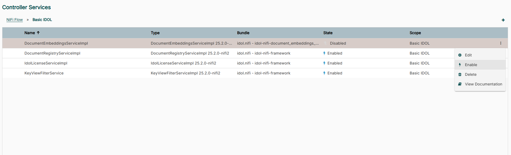

> NOTE: The Document Embeddings service downloads this model from Hugging Face when the service starts. It then caches it for future use. The default cache directory is `~/.cache/huggingface/hub`, as described in the [reference guide](https://www.microfocus.com/documentation/idol/knowledge-discovery-25.2/NiFiIngest_25.2_Documentation/Help/Content/Reference/ControllerServices/DocumentEmbeddingsServiceImpl.htm).
>
> ```sh
> $ docker exec -it vector-search-idol-nifi-1 bash
> [nifi@a8005ee54792 /]$ ls ~/.cache/huggingface/hub/
> models--sentence-transformers--multi-qa-MiniLM-L6-cos-v1  version.txt
> ```

### Add a DocumentEmbeddings processor

With the new Controller Service enabled, we need to add the embeddings processor itself into our NiFi flow.

Navigate to the **Document Processing** Process Group, then drag a new **Processor** from the top toolbar onto the canvas. From the **Add Processor** pop-up that appears, select `DocumentEmbeddings`, then click **Add**. Then, right click on the new **DocumentEmbeddings** tile and click **Configure**.

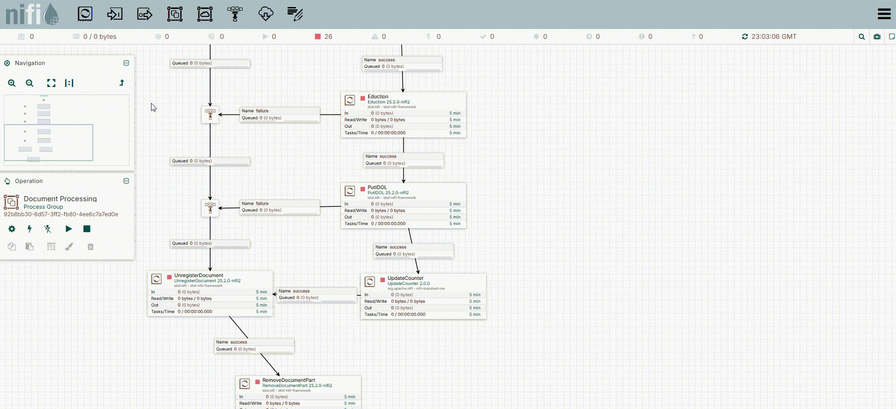

Within the **Configure** pop-up, ensure that both **IDOL License Service** and **Document Embeddings Service** are set, then choose a name for the field that will store the embeddings, *e.g.* `VECTOR_SENTENCE_MULTI_QA`. Finally, click **Apply**.

> TIP: Remember your **Document Field Name**, because it will be needed again later in the guide.

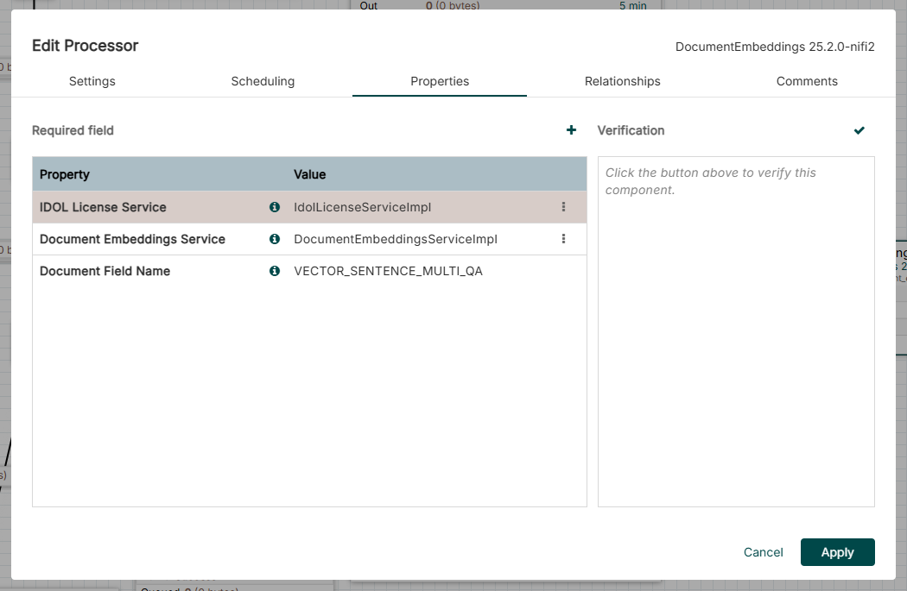

With the **Document Embeddings** processor configured, we need to incorporate it into the flow. Place it between **Eduction** and **PutIDOL**, as shown below. You will need to drag in a new **Funnel** from the top toolbar as well for any documents which might fail. The final steps of the processing flow should appear as below:

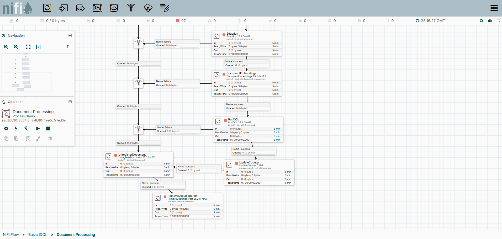

## Configure Content to index embeddings

Now, we have to configure Content to store the embeddings created in the NiFi flow.

First, edit the file `vector-search/content/cfg/original.content.cfg`:

```diff
  [FieldProcessing]
  ...

  // These can all be regenerated 
  22=SetNumericFields
  23=SetNumericDateFields
  24=SetParametricFields
  25=SetMatchFields
+ 26=SetVectorFields

  // These can be freely changed at any time
- 26=SetHighlightFields
+ 27=SetHighlightFields
- 27=SetPrintFields
+ 28=SetPrintFields
- 28=SetNonReversibleFields
+ 29=SetNonReversibleFields
  ...

  [SetMatchFields]
  Property=MatchFields
  PropertyFieldCSVs=*/*_MATCH,*/EDK_*,*/MATCH_*

+ [SetVectorFields]
+ Property=VectorFields
+ PropertyFieldCSVs=*/*_VECTOR,*/VECTOR_*

+ [VectorFields]
+ VectorType=True
+ DistanceMetric=L2

  [SetHighlightFields]
  ...
```

Next, edit `vector-search/content/cfg/content.cfg` by adding the following fields:

```diff  
  [SetMatchFields] < "original.content.cfg" [SetMatchFields]

+ [SetVectorFields] < "original.content.cfg" [SetVectorFields]
+
+ [VectorFields] < "original.content.cfg" [VectorFields]
+
  [SetHighlightFields] < "original.content.cfg" [SetHighlightFields]
```

> NOTE: Other options for `DistanceMetric` are `Cosine` and `InnerProduct` (see the [reference guide](https://www.microfocus.com/documentation/idol/knowledge-discovery-25.2/Content_25.2_Documentation/Help/Content/Configuration/Properties/_IX_DistanceMetric.htm)). Because our model produces normalized embeddings, these metrics should all produce identical rankings (although there may be slight differences in performance). In this guide, we use the default `L2`.

Now, stop and restart Content in order to pick up the config changes.

```sh
./deploy.sh stop idol-content
./deploy.sh up -d
```

## Re-ingest documents

> NOTE: This part of the guide assumes you have already completed the [**preserve-state** lesson](../preserve-state/README.md).

With both NiFi and Content modified, we can re-ingest the files from our `hotfolder` to ensure that vectors are added to each document.

Open NiFi at <http://idol-docker-host:8001/nifi/>. To run the files through our flow again, we must purge NiFi's datastore. To begin, make sure that the **Basic IDOL** flow is stopped.

Then, navigate to the **FileSystem Connector Group**. Right click on the **GetFileSystem** tile and click **Advanced**.

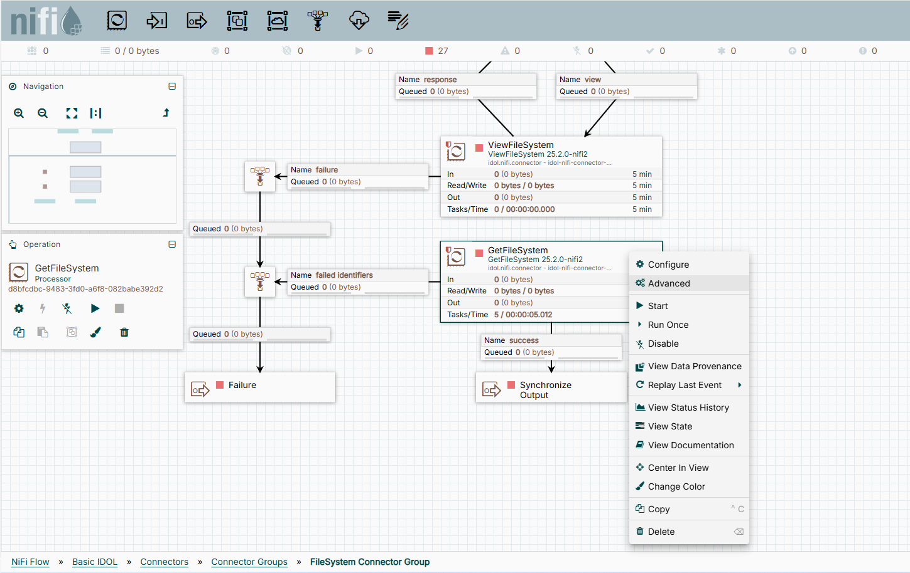

On the next screen, click **Purge Datastore** in the top right, then click **Yes**.

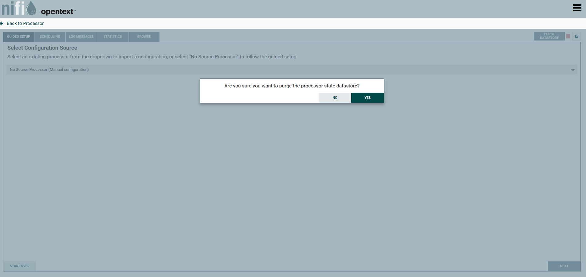

Once the datastore is purged, restart the **Basic IDOL** flow. This should automatically run the files through again and reindex them in Content.

While this is happening, you can navigate to the [Indexer Status](http://idol-docker-host:9100/action=admin#page/indexer-status) page in Content to see when the documents have successfully been reindexed.

Within the **Index Command** column, you should eventually see a `DREADD` command, as below:

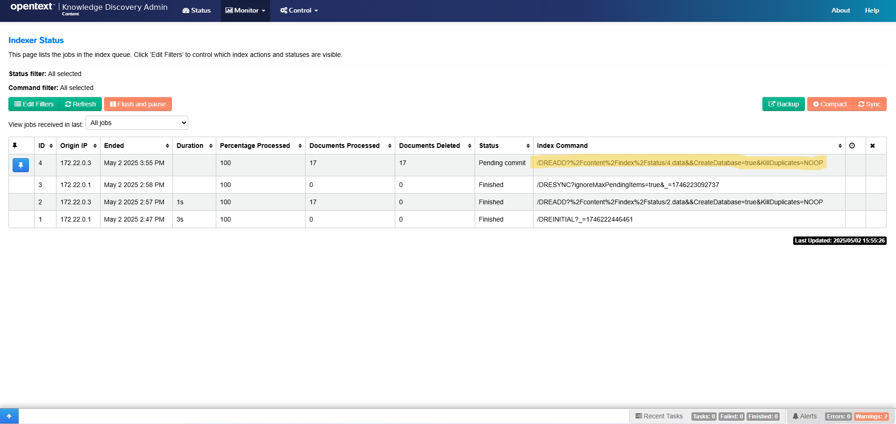

Once this event is logged, you may click **Sync** in the top right to force an on-demand sync.

To check if our new vector field has been added, navigate to the **Databases** page (under the **Control** tab). Click the **Query** button in the **Default** row.

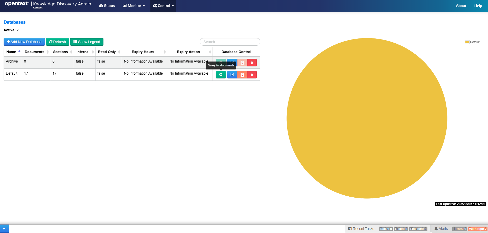

Try the following query:

```url
action=Query&text=*&databasematch=Default&print=fields&printfields=VECTOR_SENTENCE_MULTI_QA
```

In the results, you should see the vectors indexed for each document.

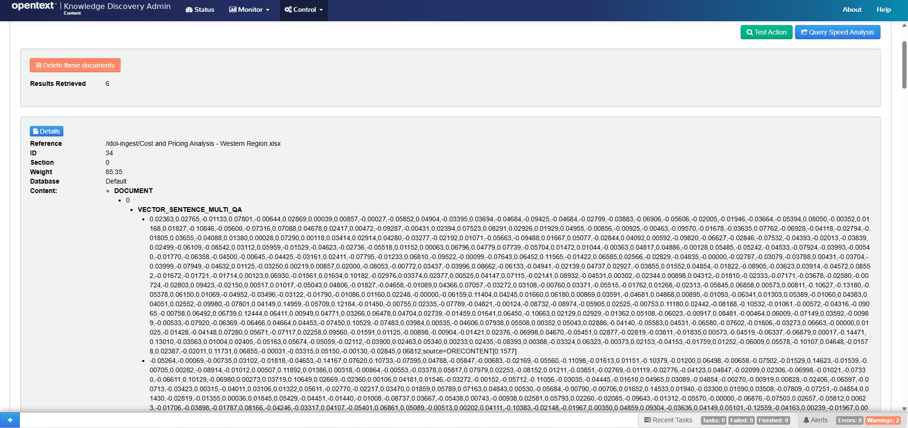

> NOTE: At the end of each vector, notice a label of the form `;source=DRECONTENT[0:1577]`, which tells you which block of text is represented. In this example, it is the `DRECONTENT` field from characters `0` to `1577`.

## Enable vector search

In order to perform a vector search, both the documents to be searched and the query string must be vectorized by the same encoder. You have already vectorized the documents above. Next, to vectorize the query, we need to add a Query Manipulation Server (QMS) to our container setup. For this, we can reuse part of the `data-admin` container.

### Set up QMS

First, from within the `idol-containers-toolkit` directory, copy the `qms` directory from `data-admin` into `vector-search`.

```sh
cp -r data-admin/qms vector-search/qms
```

Next, we configure QMS. Within `qms.cfg`, make the following changes:

- Make the QMS Admin UI accessible:

    ```diff
      [Service]
      ServicePort=16002
    + Access-Control-Allow-Origin=*
    ```

- Update the address of your Content:

    ```diff
      [IDOL]
    - Host=idol-passageextractor-content
    + Host=idol-content
      Port=9100
    ```

- Add the embedding definition:

    ```diff
      [PromotionAgentStore]
      Host=idol-qms-agentstore
      Port=20050

    + [Embeddings]
    + 0=SentenceTransformer

    + [SentenceTransformer]
    + Type=Transformer
    + ModelName=sentence-transformers/multi-qa-MiniLM-L6-cos-v1
    + ModelMaxSequenceLength=512
    + EmbeddingPrecision=5
    ```

    > NOTE: The embeddings generated for the query must be compatible with the embeddings generated for our ingested documents, so we will use the same model for both, with the same `ModelMaxSequenceLength` and `EmbeddingPrecision`. QMS downloads this model from Hugging Face when your first run a query. It then caches it for future use. The default cache directory is `~/.cache/huggingface/hub`, as described in the [reference guide](https://www.microfocus.com/documentation/idol/knowledge-discovery-25.2/NiFiIngest_25.2_Documentation/Help/Content/Reference/ControllerServices/DocumentEmbeddingsServiceImpl.htm).
    >
    > ```sh
    > $ docker exec -it vector-search-idol-qms-1 bash
    > [nifi@a8005ee54792 /]$ ls ~/.cache/huggingface/hub/
    > models--sentence-transformers--multi-qa-MiniLM-L6-cos-v1  version.txt
    > ```

- Identify the field name where Content stores vector values for the indexed documents:

    ```diff
    + [VectorFields]
    + 0=MultiQAVector

    + [MultiQAVector]
    + FieldName=VECTOR_SENTENCE_MULTI_QA
    + Model=SentenceTransformer
    ```

Next, edit `docker-compose.cfg` to utilize QMS and its AgentStore dependency:

```diff
  idol-community:
  <<: *common-server
  image: ${IDOL_REGISTRY}/community:${IDOL_SERVER_VERSION}
  depends_on:
      - idol-content
      - idol-agentstore
+ idol-qms-agentstore:
+   <<: *common-server
+   image: ${IDOL_REGISTRY}/qms-agentstore:${IDOL_SERVER_VERSION}
+ idol-qms:
+   <<: *common-server
+   image: ${IDOL_REGISTRY}/qms:${IDOL_SERVER_VERSION}
+   volumes:
+     - ./qms/qms.cfg:/qms/cfg/qms.cfg
  idol-view:
    <<: *common-server
  ...
```

Finally, expose the necessary ports for QMS in `docker-compose.expose-ports.yml`:

```diff
  idol-view:
    ports:
     - 9080-9082:9080-9082
+ idol-qms-agentstore:
+   ports:
+    - 20050-20052:20050-20052
+ idol-qms:
+   ports:
+    - 16000-16002:16000-16002
```

Start up QMS:

```sh
./deploy.sh up -d
```

## Verify vector querying

You are now ready to try your first vectorized query by using [Test Action](http://idol-docker-host:16000/action=admin#page/console/test-action) in QMS.

To showcase the strengths of vector search, imagine we want to find the document `Contoso Electronics to Open Miami Store.docx` but cannot remember the exact name of the business and only remember the general region in which it opened. We could try the query string "new southern US business."

```url
Action=query&Text=new%20southern%20us%20business&VectorConfig=MultiQAVector
```

> NOTE: By setting the `VectorConfig` parameter, QMS vectorizes the query and compares it to the vectors stored in Content.

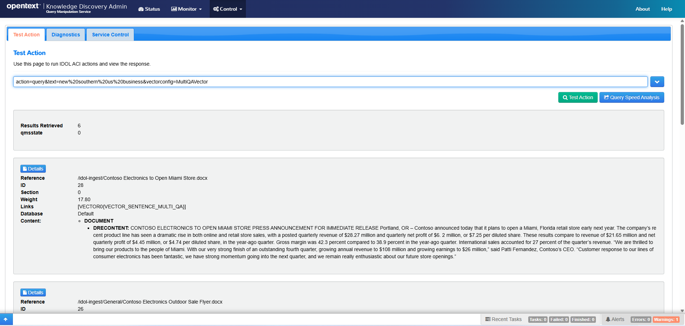

The file we were looking for still appears as the top hit even though nothing similar to the exact query terms appears in the document. This is because our query terms are nevertheless closely related semantically to terms that do appear.

If we try the same query without setting `VectorConfig`, the document we're searching for does not appear in the result set at all.

> TIP: Add the parameter `print=none` to make the results easier to scroll through.

```url
Action=query&Text=new%20southern%20us%20business&print=none
```

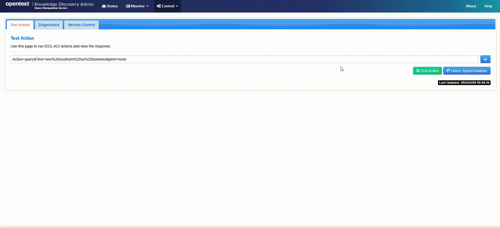

We can also highlight the differences between a standard query and a vector query by setting the parameter `QuerySummary=true`. This will return the most important terms and phrases in the result set.

For the standard query, we do not see many meaningful terms in the query summary.

```url
action=query&text=new%20southern%20us%20business&QuerySummary=true
```

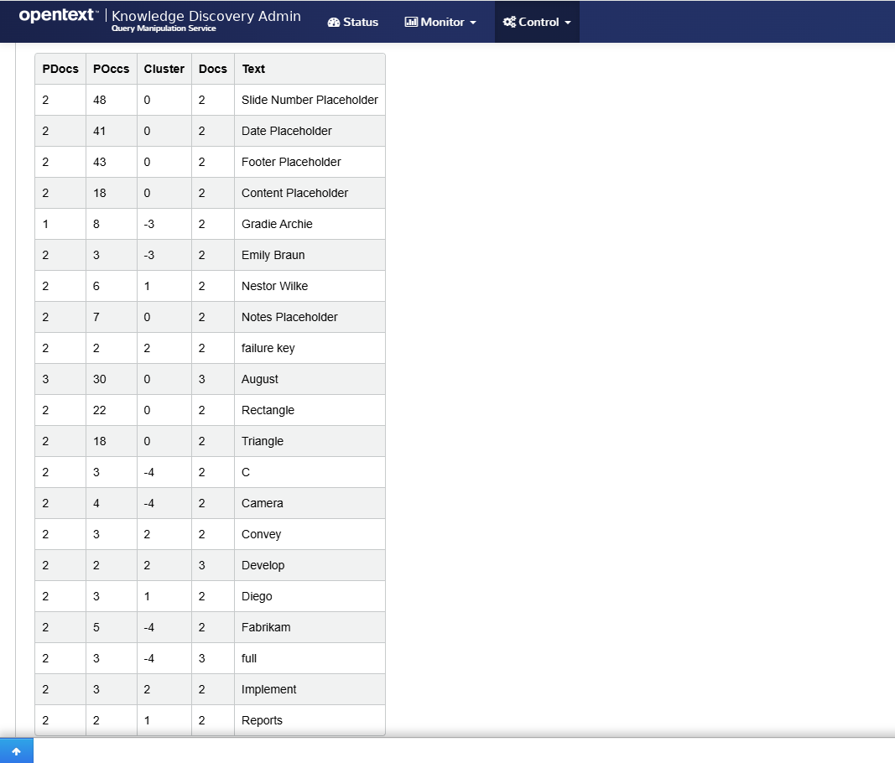

But for the vector query, the results are more relevant.

```url
action=query&text=new%20southern%20us%20business&VectorConfig=MultiQAVector&querysummary=true
```

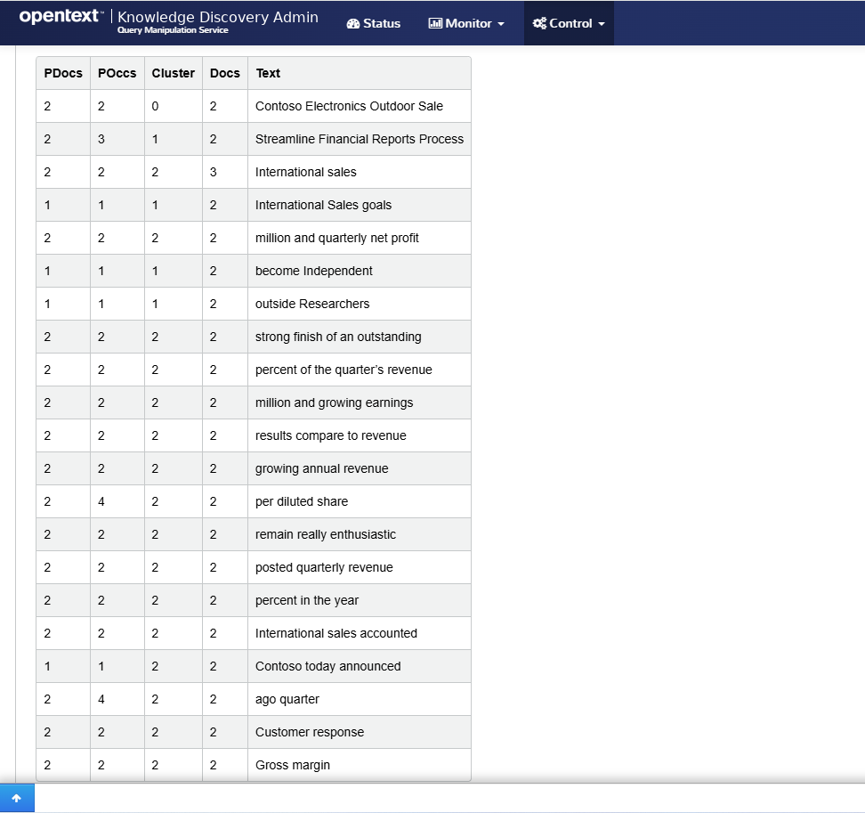

## Conclusions

You have now configured Knowledge Discovery to perform vector searches against your indexed documents. You accomplished this by modifying an existing NiFi flow and adding a Query Manipulation Server to the `basic-idol` containerized deployment to enable query vectorization.

## Next steps

Explore some advanced IDOL configurations, in the [showcase section](../../README.md#showcase-lessons).
