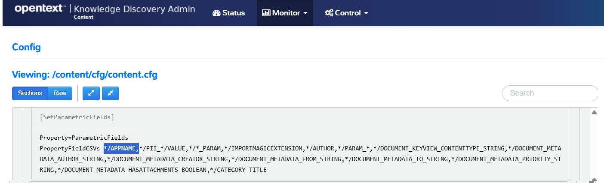

# Deploy with modifications

This section walks you through key modifications to the `basic-idol` deployment, to configure your system.

---

- [Keeping track of compose files](#keeping-track-of-compose-files)
- [Make each IDOL component accessible](#make-each-idol-component-accessible)
- [Mount a shared folder](#mount-a-shared-folder)
- [Edit IDOL component configuration files](#edit-idol-component-configuration-files)
  - [Copy out configuration files](#copy-out-configuration-files)
  - [Mount external configuration files](#mount-external-configuration-files)
  - [Update the configuration file](#update-the-configuration-file)
    - [Include file metadata](#include-file-metadata)
  - [Redeploy](#redeploy)
  - [Validate](#validate)
- [Conclusions](#conclusions)
- [Next steps](#next-steps)

---

## Keeping track of compose files

You will find that you need to reference your list of `.yml` files whenever you run commands for your system with `docker compose`, which can be a source of confusion. To simplify things, I recommend creating a `deploy.sh` script, for example:

```sh
touch deploy.sh
chmod +x deploy.sh
```

Add the following content:

```sh
docker compose \
  -f docker-compose.yml \
  "$@"
```

Now, you can use this to conveniently control your deployment with the standard `docker compose` options, for example:

- Start all containers (and rebuild any changes): `./deploy.sh up -d`
- Stop all containers (without destroying anything): `./deploy.sh stop`
- Stop one containers: `./deploy.sh stop idol-content`
- Take down all containers: `./deploy.sh down`

> NOTE: For full details on the verbs available for `docker compose`, see the [docker documentation](https://docs.docker.com/compose/reference/).

## Make each IDOL component accessible

By default, in the `basic-idol` deployment, only the NiFi and IDOL Find use interfaces are accessible. The following modification exposes all component ports, for example allowing you to see IDOL Admin for Content as you did in the first lesson.

- First, stop the current system with:

    ```sh
    ./deploy.sh stop
    ```

- This modification has already been made for us and can be used by referencing a second `.yml` file in the `deploy.sh` script:

    ```diff
    docker compose \
      -f docker-compose.yml \
    + -f docker-compose.expose-ports.yml \
      "$@"
    ```

- Restart your system with:

    ```sh
    ./deploy.sh up -d
    ```

When the containers start, you can point to IDOL Admin for Content on <http://idol-docker-host:9100/a=admin>.

## Mount a shared folder

Next, you can run another system modification to configure a shared folder where you can place documents for ingest.

- First, stop the current system with:

    ```sh
    ./deploy.sh stop
    ```

- Next, create a shared folder location in your Windows system: `C:\OpenText\hotfolder`.

- Now edit the file `docker-compose.bindmount.yml` to define your own folder location:

    ```diff
    volumes:
      idol-ingest-volume:
    - # driver: local
    +   driver: local
        driver_opts:
          type: none
    -     device: /path/to/idol-ingest/bind
    +     device: /mnt/c/OpenText/hotfolder
          o: bind
    ```

    > NOTE: If you are using WSL, you already know that your Windows paths are accessible from WSL via the `/mnt/` parent directory from the [WSL guide](./SETUP_WINDOWS_WSL.md#file-system-access).

- To run with these changes to the Docker volume `idol-ingest-volume`, you must first remove the existing volume:

    ```sh
    docker volume rm basic-idol_idol-ingest-volume
    ```

- Modify your `deploy.sh` script to make use of the additional `.yml` file:
  
    ```diff
    docker compose \
      -f docker-compose.yml \
      -f docker-compose.expose-ports.yml \
    + -f docker-compose.bindmount.yml \
      "$@"
    ```

- Finally, launch the modified system with:

    ```sh
    ./deploy.sh up -d
    ```

You can now check the mounted volume with:

```sh
$ docker volume inspect basic-idol_idol-ingest-volume
[
    {
        ...
        "Name": "basic-idol_idol-ingest-volume",
        "Options": {
            "device": "/mnt/c/OpenText/hotfolder",
            "o": "bind",
            "type": "none"
        },
        "Scope": "local"
    }
]
```

> TIP: Depending on your environment, you may see issues with file names containing unicode characters that stop you being able to ingest content from this file share. See the [appendix](../../appendix/TIPS.md#file-name-format-encoding) for more information.

## Edit IDOL component configuration files

Each IDOL component includes a configuration file that you can modify to change how the component runs.

IDOL containers ship with their configuration files included. In order to persist your edits to these files, you must perform some extra steps:

1. Copy the configuration files out from the running container.
1. Stop the container.
1. Mount external configuration files to be read from inside the container.
1. Restart the container.

### Copy out configuration files

With the Docker system running, use the Linux command line to make a local copy of the IDOL container configuration directory.  We will use Content as an example:

```sh
$ cd /opt/idol/idol-containers-toolkit/basic-idol
$ docker cp basic-idol-idol-content-1:/content/cfg content/
Successfully copied 33.8kB to /opt/idol/idol-containers-toolkit/basic-idol/content/
```

Check for a new directory `basic-idol/content/cfg` on your WSL Linux filesystem, containing several `.cfg` files.

```sh
$ ls content/cfg/
content.cfg  idol.common.cfg  idol_ssl.cfg  original.content.cfg
```

> TIP: To explore the contents of a running container manually, you can try:
>
> ```sh
> $ docker exec -it basic-idol-idol-content-1 bash
> [idoluser@4ebbcce2b410 content]$ pwd
> /content
> [idoluser@4ebbcce2b410 content]$ ls cfg
> content.cfg  idol.common.cfg  idol_ssl.cfg  original.content.cfg
> [idoluser@4ebbcce2b410 content]$ exit
> exit
> ```

### Mount external configuration files

Edit the file `basic-idol/docker-compose.yml` to mount the external config directory:

```diff
idol-content:
  <<: *common-server
  image: ${IDOL_REGISTRY}/content:${IDOL_SERVER_VERSION}
+ volumes:
+   - ./content/cfg:/content/cfg # this mounts an external cfg folder
```

> NOTE: This mount replaces the original contents of the `/content/cfg` folder in the container with the (editable) files stored outside.

### Update the configuration file

IDOL components are highly configurable.  Most configuration settings are made via the `.cfg` files you have already seen.

Each component has dedicated documentation to describe available configuration settings, *e.g.* see [here](https://www.microfocus.com/documentation/idol/IDOL_24_4/Content_24.4_Documentation/Help/Content/Configuration/_ACI_Config.htm) for IDOL Content. These include settings that effect authorization, encryption, caching for efficiency savings and scheduling for maintenance task, to name a few.

A common area for configuration change relates to how you index your data. The IDOL index includes specialized field type definitions to optimize query speed and/or to allow convenient filtering, such as filtering on labels (parametrics or *facets*), numeric ranges, dates, *etc.*

> NOTE: For full details on IDOL index field types, see [IDOL Expert](https://www.microfocus.com/documentation/idol/IDOL_24_4/IDOLServer_24.4_Documentation/Guides/html/expert/Content/IDOLExpert/Fields/Field_Properties.htm).

#### Include file metadata

Depending on your data, enrichment setup and use cases, you can expect to have different metadata properties on your documents.

The sample files we are using in this tutorial are Microsoft Office formats, which have some useful metadata fields baked in.  

One is **APPNAME**, which we would like to be able to filter on.  To enable this, add an additional pattern to the *parametric*-type field list.

Edit the file `basic-idol/content/cfg/original.content.cfg`:

```diff
[SetParametricFields]
- PropertyFieldCSVs=,*/PII_*/VALUE*/*_PARAM,*/IMPORTMAGICEXTENSION,*/AUTHOR,*/PARAM_*,*/DOCUMENT_KEYVIEW_CONTENTTYPE_STRING,*/DOCUMENT_METADATA_AUTHOR_STRING,*/DOCUMENT_METADATA_CREATOR_STRING,*/DOCUMENT_METADATA_FROM_STRING,*/DOCUMENT_METADATA_TO_STRING,*/DOCUMENT_METADATA_PRIORITY_STRING,*/DOCUMENT_METADATA_HASATTACHMENTS_BOOLEAN,*/CATEGORY_TITLE
+ PropertyFieldCSVs=*/APPNAME,*/PII_*/VALUE,*/*_PARAM,*/IMPORTMAGICEXTENSION,*/AUTHOR,*/PARAM_*,*/DOCUMENT_KEYVIEW_CONTENTTYPE_STRING,*/DOCUMENT_METADATA_AUTHOR_STRING,*/DOCUMENT_METADATA_CREATOR_STRING,*/DOCUMENT_METADATA_FROM_STRING,*/DOCUMENT_METADATA_TO_STRING,*/DOCUMENT_METADATA_PRIORITY_STRING,*/DOCUMENT_METADATA_HASATTACHMENTS_BOOLEAN,*/CATEGORY_TITLE
```

### Redeploy

Next you stop and start the IDOL Content container to pick up these changes.

```sh
./deploy.sh stop idol-content
./deploy.sh up -d
```

### Validate

Open IDOL Admin for Content onto the [configuration view](http://idol-docker-host:9100/a=admin#page/config/SetParametricFields) to see that your change has been applied:



## Conclusions

You are now familiar with key concepts of deploying IDOL containers with modifications, including the key steps to extract, modify and apply IDOL component configuration file changes.

## Next steps

Return to the containers [tutorial](./PART_III.md#ingest-documents-with-nifi).
