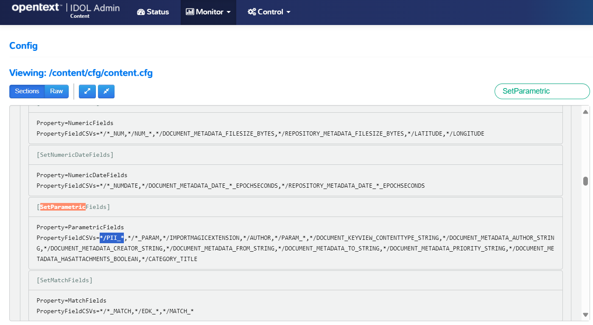

# Deploy with modifications

This section walks you through key modifications to the `basic-idol` deployment, to configure your system.

---

- [Make each IDOL component accessible](#make-each-idol-component-accessible)
- [Mount a shared folder](#mount-a-shared-folder)
- [Edit an IDOL component configuration file](#edit-an-idol-component-configuration-file)
  - [Copy out configuration files](#copy-out-configuration-files)
  - [Mount external configuration files](#mount-external-configuration-files)
  - [Update the configuration file](#update-the-configuration-file)
  - [Redeploy](#redeploy)
  - [Validate](#validate)
- [Conclusions](#conclusions)
- [Next steps](#next-steps)

---

## Make each IDOL component accessible

By default, in the `basic-idol` deployment, only NiFi and IDOL Find are accessible. The following modification exposes all component ports, for example to see IDOL Admin for Content as you did in the first lesson.

- First, press `Ctrl-C` to stop the current system.

- This modification has already been made and you can use it by referencing a second `.yml` file in your startup command:

  ```
  docker compose -f docker-compose.yml -f docker-compose.expose-ports.yml up
  ```

- When the containers start, you can point to IDOL Admin for Content on http://idol-docker-host:9100/a=admin or IDOL Community on http://idol-docker-host:9030/a=admin.

## Mount a shared folder

Next, you can run another system modification to configure a shared folder where you can easily place documents for ingest.

- First, press `Ctrl-C` to stop the current system.

- Next, create a shared folder location in your Windows system: `C:\OpenText\hotfolder`.  

- Now edit the file `docker-compose.bindmount.yml` to define your own folder location:

    ```diff
    volumes:
      idol-ingest-volume:
        # If running on Windows you may need to specify local driver
    - # driver: local
    +   driver: local
        driver_opts:
          type: none
    -     device: /path/to/idol-ingest/bind
    +     device: /mnt/c/OpenText/hotfolder
    ```

    > NOTE: If you are using WSL, you already know that your Windows paths are accessible from WSL via the `/mnt/` parent directory from the [WSL guide](./SETUP_WINDOWS_WSL.md#file-system-access).

- To run with these changes to the Docker volume `idol-ingest-volume`, you must first remove the existing volume:

    ```
    docker volume rm basic-idol_idol-ingest-volume
    ```

- Finally, launch the modified system with:

    ```
    docker compose -f docker-compose.yml -f docker-compose.expose-ports.yml -f docker-compose.bindmount.yml up -d
    ```

    > NOTE: The `-d` option here sets the system to run in the background. You now will not automatically see log messages in your terminal.  
    > 
    > To view logs, either:
    > - run `docker compose logs` to see the log messages that the `-d` option has suppressed, or
    > - read the [`docker logs` documentation](https://docs.docker.com/reference/cli/docker/container/logs/) for steps to tail logs for a specific container, for example:
    >
    >    ```
    >    docker logs basic-idol-idol-find-1 -f
    >    ```
    >
    > To stop the system in this mode, you must run:
    > ```
    > docker compose -f docker-compose.yml -f docker-compose.expose-ports.yml -f docker-compose.bindmount.yml stop
    > ```

You can now check the mounted volume with:

```
$ docker volume inspect basic-idol_idol-ingest-volume
[
    {
        ...
        "Name": "basic-idol_idol-ingest-volume",
        "Options": {
            "device": "/mnt/c/OpenText/hotfolder",
            "o": "bind",
            "type": "none"
        },
        "Scope": "local"
    }
]
```

## Edit an IDOL component configuration file

Each IDOL component includes a configuration file that you can modify to change how the component runs.  

IDOL containers ship with their configuration files included. Before you can edit these, you must perform some extra steps:

- Copy the configuration files out from the container.
- Mount external configuration files to be read from inside the container.

### Copy out configuration files

With the Docker system running, use the Linux command line to make a local copy of the IDOL container configuration directory:

```
$ cd /opt/idol/idol-containers-toolkit/basic-idol
$ docker cp basic-idol-idol-content-1:/content/cfg content/
Successfully copied 33.8kB to /opt/idol/idol-containers-toolkit/basic-idol/content/
```

Check for a new directory `basic-idol/content/cfg` on your WSL Linux filesystem, containing several `.cfg` files.

> TIP: To explore the contents of a running container manually, you can try:
> 
> ```
> $ docker exec -it basic-idol-idol-content-1 bash
> [idoluser@4ebbcce2b410 content]$ pwd
> /content
> [idoluser@4ebbcce2b410 content]$ ls cfg
> content.cfg  idol.common.cfg  idol_ssl.cfg  original.content.cfg
> [idoluser@4ebbcce2b410 content]$ exit
> exit
> ```

### Mount external configuration files

Edit the file `basic-idol/docker-compose.yml` to mount the external config directory:

```diff
idol-content:
  image: ${IDOL_REGISTRY}/content:${IDOL_SERVER_VERSION}
  extra_hosts: *external-licenseserver-host
+ volumes:
+   - ./content/cfg:/content/cfg # this mounts an external cfg folder
```

### Update the configuration file

Depending on your sample data, enrichment setup and use cases, you can expect to have (and to expose) different metadata properties on your documents. The IDOL index includes specialized field type definitions to optimize query speed and to allow convenient filtering, such as filtering on labels (facets) and numeric ranges.

In this tutorial, you will run an enrichment flow to detect PII (Personally identifiable information), including person names.  

You can update the IDOL Content configuration file to define patterns to match detected person names as a *parametric*-type field. You can also add patterns to match file-size and word-count metadata fields as *numeric* types.

Edit the file `basic-idol/content/cfg/original.content.cfg` to add these new numeric and parametric field name patterns:

```diff
[SetNumericFields]
// Specify which fields are entirely numeric (or a csv of numbers) to be stored for optimised numeric matching
Property=NumericFields
- PropertyFieldCSVs=*/*_NUM,*/NUM_*,*/DOCUMENT_METADATA_FILESIZE_BYTES,*/REPOSITORY_METADATA_FILESIZE_BYTES,*/LATITUDE,*/LONGITUDE
+ PropertyFieldCSVs=*/FILESIZE,*/WORDCOUNT,*/*_NUM,*/NUM_*,*/DOCUMENT_METADATA_FILESIZE_BYTES,*/REPOSITORY_METADATA_FILESIZE_BYTES,*/LATITUDE,*/LONGITUDE

[SetParametricFields]
// Specify which fields contain parametric values to be stored for optimised parametric searching
Property=ParametricFields
- PropertyFieldCSVs=*/*_PARAM,*/IMPORTMAGICEXTENSION,*/AUTHOR,*/PARAM_*,*/DOCUMENT_KEYVIEW_CONTENTTYPE_STRING,*/DOCUMENT_METADATA_AUTHOR_STRING,*/DOCUMENT_METADATA_CREATOR_STRING,*/DOCUMENT_METADATA_FROM_STRING,*/DOCUMENT_METADATA_TO_STRING,*/DOCUMENT_METADATA_PRIORITY_STRING,*/DOCUMENT_METADATA_HASATTACHMENTS_BOOLEAN,*/CATEGORY_TITLE
+ PropertyFieldCSVs=*/PII_*/VALUE,*/*_PARAM,*/IMPORTMAGICEXTENSION,*/AUTHOR,*/PARAM_*,*/DOCUMENT_KEYVIEW_CONTENTTYPE_STRING,*/DOCUMENT_METADATA_AUTHOR_STRING,*/DOCUMENT_METADATA_CREATOR_STRING,*/DOCUMENT_METADATA_FROM_STRING,*/DOCUMENT_METADATA_TO_STRING,*/DOCUMENT_METADATA_PRIORITY_STRING,*/DOCUMENT_METADATA_HASATTACHMENTS_BOOLEAN,*/CATEGORY_TITLE
```

> NOTE: For details on these and other IDOL Content field types, see [IDOL Expert](https://www.microfocus.com/documentation/idol/IDOL_11_6/IDOLServer/Guides/html/English/expert/index.html#IDOLExpert/Fields/Field_Properties.htm#FieldsForSearch).

### Redeploy

Next you stop and start the IDOL Content container to pick up these changes.

```
docker compose -f docker-compose.yml -f docker-compose.expose-ports.yml -f docker-compose.bindmount.yml stop idol-content
docker compose -f docker-compose.yml -f docker-compose.expose-ports.yml -f docker-compose.bindmount.yml up -d
```

### Validate

Open IDOL Admin for Content onto the [configuration view](http://idol-docker-host:9100/a=admin#page/config/SetParametricFields) to see that your change has been applied:



## Conclusions

You are now familiar with key concepts of deploying IDOL containers with modifications, including the key steps to extract, modify and apply IDOL component configuration file changes.

## Next steps

Return to the containers [tutorial](./README.md#ingest-documents-with-nifi).
