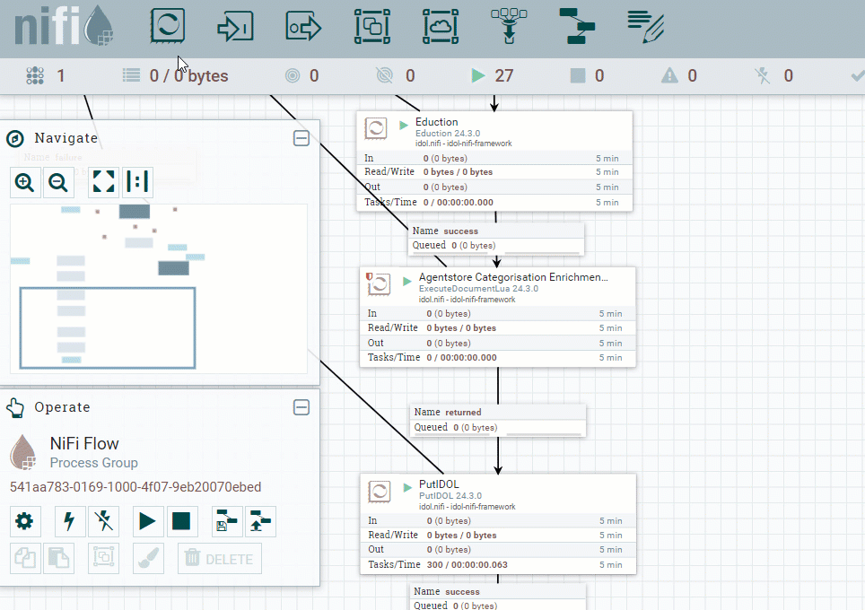
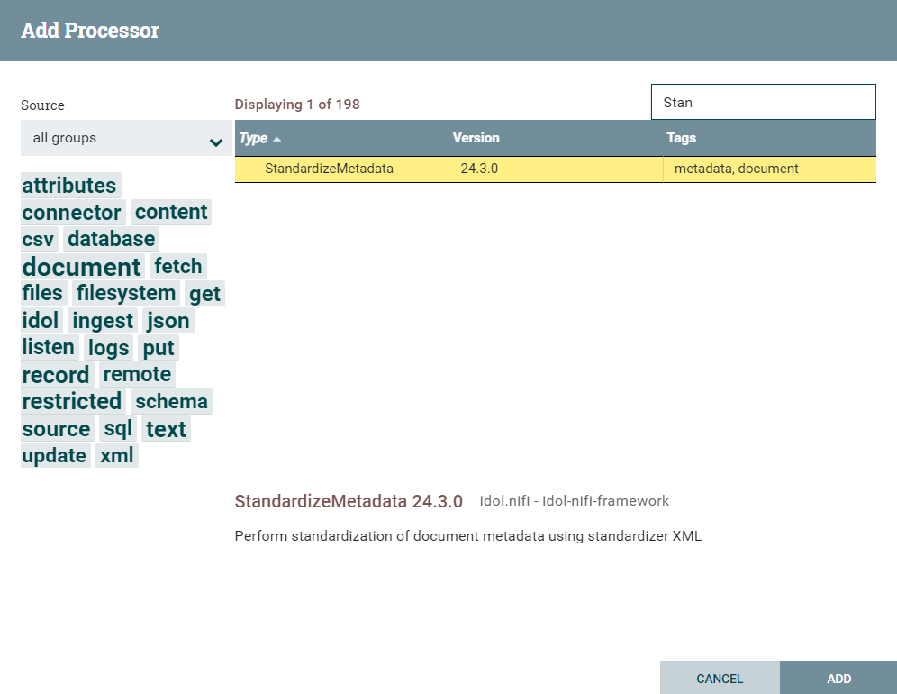
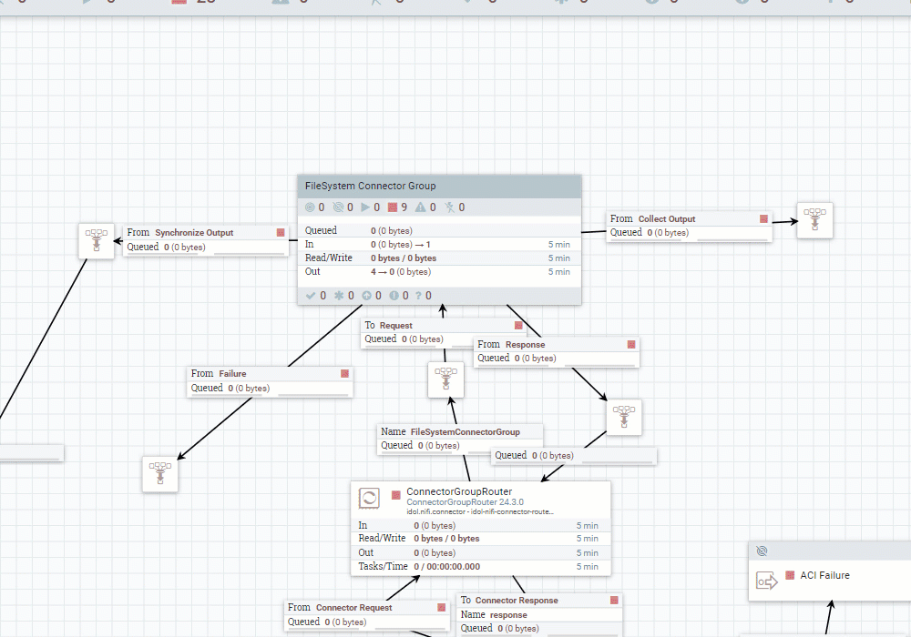
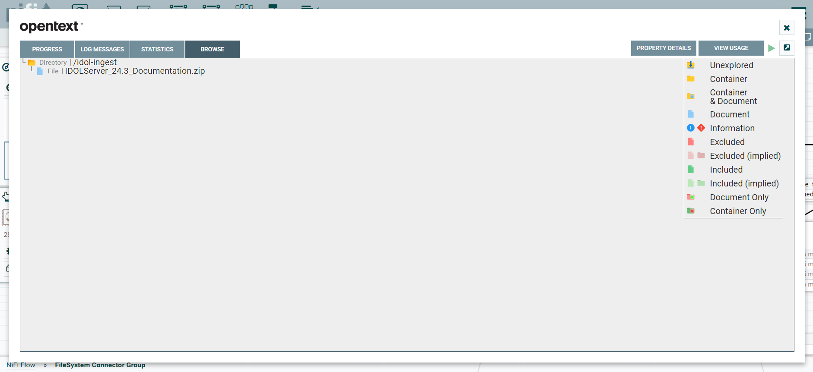

# Modifying the NiFi flow

This section walks through key modifications to the `basic-idol` NiFi flow, to configure your ingest.

---

- [Add a new processor](#add-a-new-processor)
- [Pick up files form the shared folder](#pick-up-files-form-the-shared-folder)
- [Next steps](#next-steps)

---

## Add a new processor

As you have seen, a NiFi flow consists of many modular processors linked together. You will now add a extra step with the *StandardizeMetadata* processor. This processor maps metadata field names (and values), for example to normalize fields for files that come from different repository types.

- Drag the processor icon onto the canvas:
  
  

- Drop the processor icon to open a selection window. Type in the search box to find the **StandardizeMetadata** processor then click **ADD**:
  
  

- Re-route the *flow*, to direct files through the new processor before they are sent to IDOL Content for indexing:
  
  

- Route the *failure* output for the new processor:

  

- Right-click on the new processor and select **Configure**.
  
- Select the **PROPERTIES** tab.

- Set the Idol License Service property:
  
  

> NOTE: To learn more about field standardization in IDOL, see the [IDOL NiFi Ingest Help](https://www.microfocus.com/documentation/idol/IDOL_24_3/NiFiIngest_24.3_Documentation/Help/Content/Reference/Processors/StandardizeMetadata_Advanced.htm).  
 
## Pick up files form the shared folder

As you have seen, the `basic-idol` flow incorporates a connector to ingest files from the filesystem. In the earlier [docker deployment step](./DOCKER_DEPLOY.md#mount-a-shared-folder), you configured your Docker deployment with a shared folder. Now you can verify that the connector has access to that folder.

- Open NiFi and navigate to the **GetFileSystem** processor.
  
  

- Select the **ADVANCED** button to see the contents of the shared folder are correctly picked up:
  
  

## Conclusions

You are now familiar with key concepts of configuring IDOL processors in NiFi.

> NOTE: To read more about configuring IDOL flows in NiFi, see the [IDOL NiFi Ingest Help](https://www.microfocus.com/documentation/idol/IDOL_24_3/NiFiIngest_24.3_Documentation/Help/Content/Walkthrough/Introduction.htm).

## Next steps

Return to the [containers tutorial](PART_III.md#prepare-sample-data-for-ingest).
