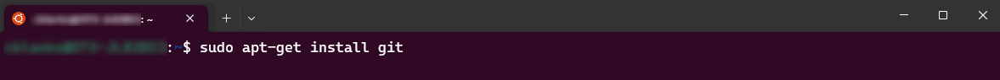

# PART I - Knowledge Discovery containers with Docker

In this lesson, you will:

- Set up your machine for Docker.
- Download the Knowledge Discovery Containers Toolkit.
- Log in to gain access to Knowledge Discovery containers.

---

- [Third-party dependencies](#third-party-dependencies)
  - [Docker](#docker)
  - [Git](#git)
- [Knowledge Discovery containers toolkit](#knowledge-discovery-containers-toolkit)
  - [Obtain a copy of the toolkit](#obtain-a-copy-of-the-toolkit)
  - [Keeping up to date](#keeping-up-to-date)
  - [Log in to the Knowledge Discovery Docker repository](#log-in-to-the-knowledge-discovery-docker-repository)
- [Conclusions](#conclusions)
- [Next step](#next-step)

---

## Third-party dependencies

A containerized deployment of Knowledge Discovery has a few prerequisites:

- Docker: A tool used to automate the deployment of applications. Docker uses virtualization to package applications with their dependencies and configuration files into self-contained units called *containers*. You can easily deploy groups of containers connect them to bring up more complex systems, which is great for more advanced Knowledge Discovery use cases where multiple Knowledge Discovery components work together.

- Git: The version control system required to download the Knowledge Discovery configuration tool for use with Docker.

### Docker

Docker has both free and premium tiers. To run the free tier requires a Linux system. If you work on Windows you have a few options, including:

- Set up a cloud virtual environment, for example, using AWS.
- Set up a local virtual environment, for example, using VirtualBox.
- Set up WSL, a feature of Microsoft Windows that allows developers to run a Linux environment without the need for a separate virtual machine or dual booting.

For this guide, we recommend that you configure WSL and set up a local Linux environment. This option is the quickest and easiest setup to support your own learning.

[Setup](./SETUP_UBUNTU_WSL.md).

With WSL configured, you can now install Docker.

[Setup](./SETUP_DOCKER_WSL.md).

### Git

To install Git on your WSL system, open a new Ubuntu tab in Windows Terminal and run:

```sh
sudo apt-get install git
```



The first thing you should do when you install Git is to set your user name and email address. This is important because every Git commit uses this information:

```sh
git config --global user.name "John Doe"
git config --global user.email johndoe@example.com
```

> NOTE: Please read the [Git getting started guide](https://git-scm.com/book/en/v2/Getting-Started-First-Time-Git-Setup) for more details on recommended usage.

## Knowledge Discovery containers toolkit

### Obtain a copy of the toolkit

Prepare a working directory from the Linux command line:

```sh
sudo mkdir /opt/idol
sudo chown $USER /opt/idol
cd /opt/idol
```

Pull the repository from GitHub:

```sh
git clone https://github.com/opentext-idol/idol-containers-toolkit.git
```

### Keeping up to date

The Containers Toolkit is actively developed and new releases will appear regularly, which you can download, or "pull", with Git.

Before pulling changes to your local system, always ensure you have committed your local changes.

> TIP: If you don't already have a preferred tool for source control, VS Code has good integrated support for Git. See [Using Git source control in VS Code](https://code.visualstudio.com/docs/sourcecontrol/overview#_git-support).

### Log in to the Knowledge Discovery Docker repository

Official Knowledge Discovery software containers are distributed in a Docker repository. A personal key is required to access them. To request a key, contact OpenText support from the [Software Entitlements Portal](https://sld.microfocus.com/mysoftware/index).

Store your API key in a text file in your Linux home directory, for example `idol_docker_key.txt`, then log in with:

```sh
$ cat ~/idol_docker_key.txt | docker login --username microfocusidolreadonly --password-stdin

Login Succeeded
```

## Conclusions

You now understand how to set up a system for Docker and you have access to the Knowledge Discovery component containers.

## Next step

You're ready to get started. Go to [Part II](./PART_II.md).
