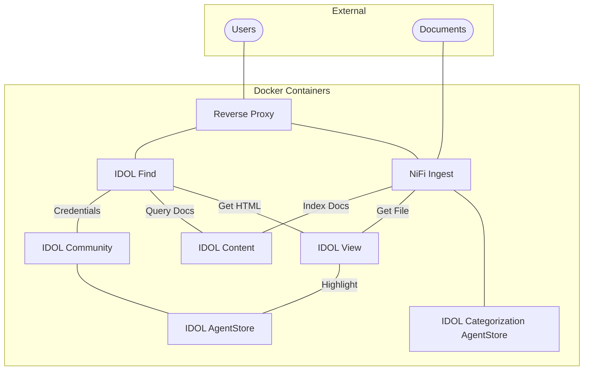
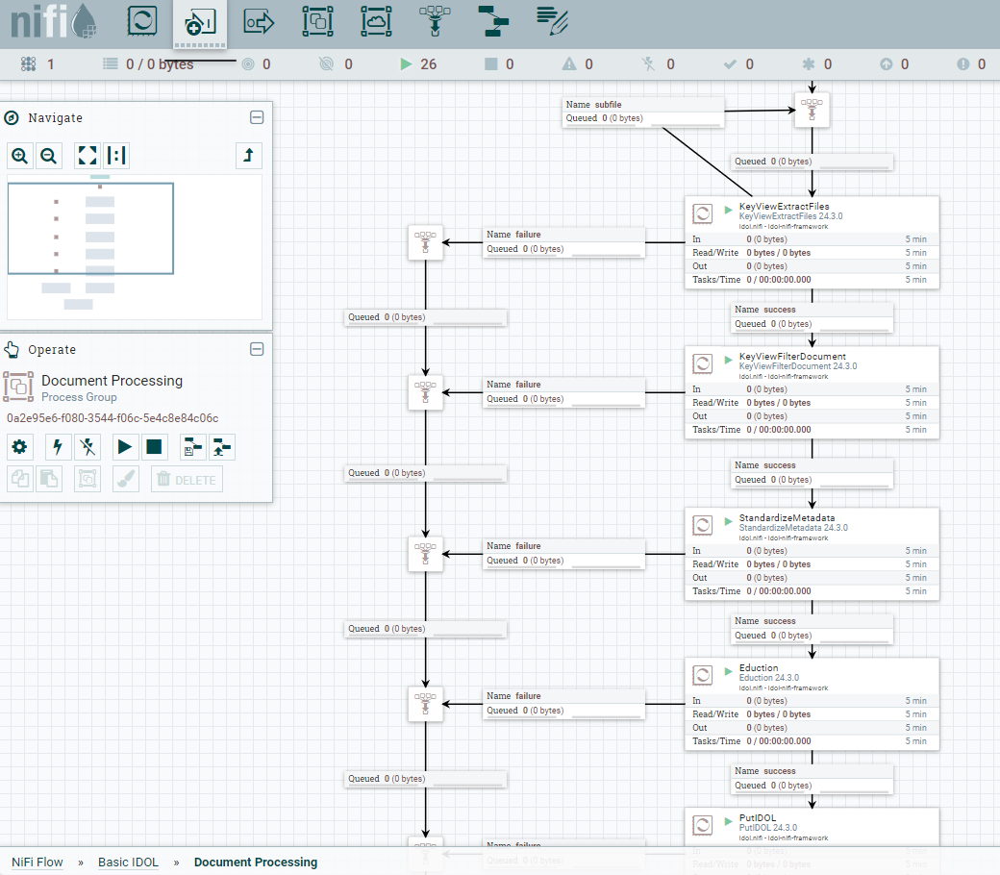

# PART II - Configure and run the `basic-idol` deployment

In this lesson, you will:

- Reconfigure IDOL License Server for remote access.
- Deploy your first end-to-end IDOL system, from ingest with NiFi to search with IDOL Find.

---

- [Reconfigure IDOL License Server](#reconfigure-idol-license-server)
  - [Allow remote access](#allow-remote-access)
  - [Verify remote access](#verify-remote-access)
- [Deploy IDOL containers](#deploy-idol-containers)
  - ["Basic" IDOL](#basic-idol)
  - [Setup](#setup)
  - [Deploy](#deploy)
- [First look at NiFi](#first-look-at-nifi)
- [First look at Find](#first-look-at-find)
- [Conclusions](#conclusions)
- [Next step](#next-step)

---

## Reconfigure IDOL License Server

IDOL components running in Docker containers need access to an external License Server in exactly the same as natively-running IDOL components. You can use the instance you set up in the first lesson.

### Allow remote access

In a containerized deployment, IDOL License Server receives requests from external machines. The default configuration locks the server down to accept requests from `localhost` only, so you need to modify it to add the additional host name. The following configuration assumes you use the hostname `idol-docker-host` for your WSL environment.

Edit the file `idol.common.cfg` under `C:\OpenText\LicenseServer_24.3.0_WINDOWS_X86_64`, then restart License Server:

```diff
[AdminRole]
StandardRoles=admin,servicecontrol,query,servicestatus
- Clients=localhost
+ Clients=localhost,idol-docker-host

[QueryRole]
StandardRoles=query,servicestatus
- Clients=localhost
+ Clients=localhost,idol-docker-host
```

> NOTE: For full details on setting client access, please read the [License Server Reference](https://www.microfocus.com/documentation/idol/IDOL_24_3/LicenseServer_24.3_Documentation/Help/Content/Configuration/AuthorizationRoles/_ACI_Clients.htm).

### Verify remote access

The system running IDOL License Server must be accessible (on port `20000`, by default) from the system running Docker. In your WSL environment, test access from the Linux command line, as follows.

```
$ curl $(hostname).local:20000/a=getversion
<?xml version='1.0' encoding='UTF-8' ?>
<autnresponse xmlns:autn='http://schemas.autonomy.com/aci/'>
  <action>GETVERSION</action>
  <response>SUCCESS</response>
  <responsedata>...</responsedata>
</autnresponse>
```

## Deploy IDOL containers

Go to your toolkit location from your Linux command line. For example, type `cd /opt/idol/idol-containers-toolkit`.  

This repository contains an official collection of tools to allow you to set up and use IDOL Docker systems.  It consists of directories of Docker *compose* files, plus (where required) build contexts for the servers used in the systems.

> NOTE: To read more about IDOL containerized deployments using Docker (and Kubernetes), please see the project on [GitHub](https://github.com/opentext-idol/idol-containers-toolkit).

### "Basic" IDOL

The `basic-idol` directory includes files to define a minimal end-to-end IDOL system with a single Content engine available for indexing, an IDOL-enabled NiFi instance for file ingest, and an IDOL Find for queries, as well as some supporting components, including IDOL Community for access control.



> NOTE: Apache NiFi is an open source tool built to automate the flow of data between systems. In IDOL, it is used primarily for ingestion (ETL = Extraction, Transform and Loading). NiFi has an intuitive drag & drop interface for configuration and is highly scalable. IDOL ships components that are easily embedded into a NiFi flow as modular processors. 

### Setup

Before you continue, you need to edit some of the container toolkit files.

To edit files under WSL Linux, we recommend [VS Code](https://code.visualstudio.com/). To open the `basic-idol` folder contents for editing, type:
```
$ cd /opt/idol/idol-containers-toolkit/basic-idol
$ code .
```

Edit the `.env` file in `/opt/idol/idol-containers-toolkit/basic-idol` to set the IP address of your IDOL License Server. For example:

```diff
# External licenserver host
- LICENSESERVER_IP=
+ LICENSESERVER_IP=172.18.96.1
```

> NOTE: You must set this configuration to the IP address and not the hostname. If you are using WSL, you already found your Windows (host) IP address in the [WSL guide](./SETUP_WINDOWS_WSL.md#network-access).

Also update the IDOL version to the latest, currently 24.3:

```diff
# Version of IDOL images to use
- IDOL_SERVER_VERSION=23.3
+ IDOL_SERVER_VERSION=24.3
```

> NOTE: If you upgrade in the future, you must ensure that the version of your external IDOL License Server matches the version of your containers.

Finally, update the file `docker-compose.yml` to update an environment variable:

```diff
idol-nifi:
  image: ${IDOL_REGISTRY}/nifi-minimal:${IDOL_SERVER_VERSION} # choose nifi-minimal or nifi-full
  environment:
    - NIFI_WEB_PROXY_CONTEXT_PATH=/idol-nifi
    - NIFI_WEB_HTTP_PORT=8081
+   - NIFI_SENSITIVE_PROPS_KEY=my_nifi_sensitive_props_key
```

> NOTE: To understand when to choose `nifi-full` over `nifi-minimal`, please see the [advanced ingest tutorials](../../README.md#ingest-and-enrichment). 

### Deploy

To launch the system, type the following commands:

```
cd /opt/idol/idol-containers-toolkit/basic-idol
docker compose up
```


## First look at NiFi

When the system is running, open NiFi on http://idol-docker-host:8080/idol-nifi/nifi/.  

The NiFi container comes with a pre-loaded ingest flow, which will:

1. Capture files from disk using the IDOL FileSystem Connector.
1. Extract any sub-files using KeyView.
1. Filter (that is, extract) content (that is, text) from files using KeyView.
1. Identify possible PII from that text using IDOL Eduction.
1. Categorize each file based on the text content.
1. Index the documents into IDOL Content.



> NOTE: Not shown in the above screenshot, this NiFi flow also includes a FileSystem Connector Group, which facilitates the capture of files from disk for both the initial indexing and later on-demand viewing, for example when a user wants to open a document in IDOL Find.

## First look at Find

Log in to Find on http://idol-docker-host:8080/find/. The default credentials are `admin` / `admin`.  

It is empty for now, so you can move on to the next section.

## Conclusions

You now understand how to deploy and run IDOL components in containers. You have an initial understanding of a NiFi ingest flow.

## Next step

You are ready to go to [Part III](./PART_III.md).
