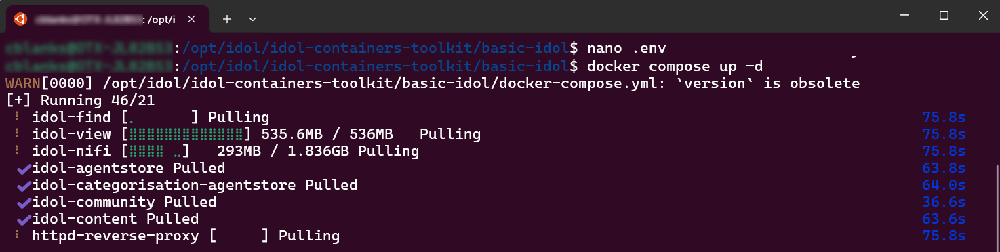
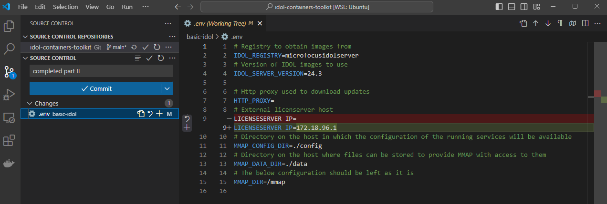

# PART II - Configure and run the `basic-idol` deployment

In this lesson, you will:

- Reconfigure IDOL License Server for remote access.
- Deploy your first end-to-end IDOL system, from ingest with NiFi to search with IDOL Find.

---

- [Reconfigure IDOL License Server](#reconfigure-idol-license-server)
  - [Allow remote access](#allow-remote-access)
  - [Verify remote access](#verify-remote-access)
- [Deploy IDOL containers](#deploy-idol-containers)
  - ["Basic" IDOL](#basic-idol)
  - [Setup](#setup)
  - [Deploy](#deploy)
- [First look at NiFi](#first-look-at-nifi)
- [First look at Find](#first-look-at-find)
- [Conclusions](#conclusions)
- [Next step](#next-step)

---

## Reconfigure IDOL License Server

IDOL components running in Docker containers need access to an external License Server in exactly the same way as natively-running IDOL components. You can use the instance you set up in the previous lesson.

### Allow remote access

In a containerized deployment, IDOL License Server receives requests from external machines. The default configuration locks the server down to accept requests from `localhost` only, so you need to modify it to add additional host names as required. The following configuration assumes you use the host name `idol-docker-host` for your WSL environment.

Edit the file `idol.common.cfg` under `C:\OpenText\LicenseServer_24.4.0_WINDOWS_X86_64`, then restart License Server:

```diff
[AdminRole]
StandardRoles=admin,servicecontrol,query,servicestatus
- Clients=localhost
+ Clients=localhost,idol-docker-host

[QueryRole]
StandardRoles=query,servicestatus
- Clients=localhost
+ Clients=localhost,idol-docker-host
```

> NOTE: For full details on setting client access, please read the [License Server Reference](https://www.microfocus.com/documentation/idol/IDOL_24_4/LicenseServer_24.4_Documentation/Help/Content/Configuration/AuthorizationRoles/_ACI_Clients.htm).

### Verify remote access

The system running IDOL License Server must be accessible (on port `20000`, by default) from the system running Docker. In your WSL environment, test access from the Linux command line, as follows.

```bsh
$ curl $(hostname).local:20000/a=getversion
<?xml version='1.0' encoding='UTF-8' ?><autnresponse xmlns:autn='http://schemas.autonomy.com/aci/'><action>GETVERSION</action><response>SUCCESS</response><responsedata>...
```

> TIP: Install an XML formatter to better display the server responses. See this [tip](../../appendix/TIPS.md#xml-formatting) for details.

## Deploy IDOL containers

Go to your toolkit location from your Linux command line. For example, type `cd /opt/idol/idol-containers-toolkit`.

This repository contains an official collection of tools to allow you to set up and use IDOL Docker systems. It consists of directories of Docker *compose* files, plus (where required) build contexts for the servers used in the systems.

> NOTE: To read more about IDOL containerized deployments using Docker (and Kubernetes), please see the project on [GitHub](https://github.com/opentext-idol/idol-containers-toolkit).

### "Basic" IDOL

The `basic-idol` directory includes files to define a minimal end-to-end IDOL system with a single Content engine available for indexing, an IDOL-enabled NiFi instance for file ingest, and an IDOL Find for queries, as well as some supporting components, including IDOL Community for access control.


> NOTE: Apache NiFi is an open source tool built to automate the flow of data between systems. With IDOL, it is used primarily for ingestion (ETL = Extraction, Transform and Loading). NiFi has an intuitive drag & drop interface for configuration and is highly scalable. IDOL ships components that are easily embedded into a NiFi flow as modular processors.  For full details read the [documentation](https://www.microfocus.com/documentation/idol/IDOL_24_4/NiFiIngest_24.4_Documentation/Help/Content/_FT_SideNav_Startup.htm).

### Setup

Before you continue, you need to edit some of the container toolkit files.

To edit files under WSL Linux, we recommend [VS Code](https://code.visualstudio.com). To open the `basic-idol` folder contents for editing, type:

```sh
cd /opt/idol/idol-containers-toolkit/basic-idol
code .
```

Make the following changes:

1. Edit the `.env` file in `/opt/idol/idol-containers-toolkit/basic-idol` to set the IP address of your IDOL License Server. For example:

    ```diff
    # External licenserver host
    - LICENSESERVER_IP=
    + LICENSESERVER_IP=172.18.96.1
    ```

    > NOTE: You must set this configuration to the IP address and not the host name. If you are using WSL, you already found your Windows (host) IP address in the [WSL guide](./SETUP_WINDOWS_WSL.md#network-access).

1. Check the target IDOL version.  The same `.env` file is used to specify the IDOL version, currently 24.4:

    ```ini
    # Version of IDOL images to use
    IDOL_SERVER_VERSION=24.4
    ```

    > NOTE: If you upgrade in the future, you must ensure that the version of your external IDOL License Server matches the version of your containers.

### Deploy

To launch the system, run the following commands from Ubuntu:

```sh
cd /opt/idol/idol-containers-toolkit/basic-idol
docker compose up -d
```



> NOTE: Ignore the deprecation warnings about the `version` attribute.

Monitor the start of the NiFi container with:

```sh
docker logs basic-idol-idol-nifi-1 -f
```

Wait for the log message "NiFi has started".

> NOTE: For more details read the [`docker logs` documentation](https://docs.docker.com/reference/cli/docker/container/logs/).

## First look at NiFi

When the system is running, open NiFi on <http://idol-docker-host:8001/nifi/>.


Double-click the "Basic IDOL" tile to enter the processor group, which contains two sub-groups:

1. **Connectors** contains the processors necessary to connect to our source repositories. In the `basic-idol` example, this means ingesting files from disk.
1. **Document Processing** encapsulates the steps needed to extract and enrich ingested files before indexing into IDOL Content.

Double-click the **Document Processing** tile:


> NOTE: The breadcrumbs in the footer of the NiFi window help you keep track on where you are in the process group hierarchy.

The document processing flow will:

1. Iteratively extract any sub-files using *KeyViewExtractFiles*.
1. Filter (that is, extract) content (that is, text) from files using *KeyViewFilterDocument*.
1. Normalize field names from different repository types, with *StandardizeMetadata*.
1. Identify possible PII from that text using *Eduction*.
1. Index the documents into IDOL Content using *PutIDOL*.


Below this in the flow are clean-up processors, which will be discussed in another lesson.

## First look at Find

Log in to Find on <http://idol-docker-host:8080/find/>. The default credentials are `admin` / `admin`.

It is empty for now, so you can move on to the next section.

## Conclusions

You now understand how to deploy and run IDOL components in containers. You have an initial understanding of a NiFi ingest flow and you have IDOL Find running.

Now is a good time to commit your changes to the `idol-containers-toolkit` environment file:



> TIP: Continue to commit your changes as you step through the tutorial.

## Next step

Next, you are ready to customize your deployment for your data. Go to [Part III](./PART_III.md).
