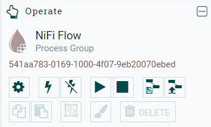
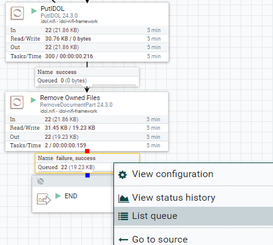
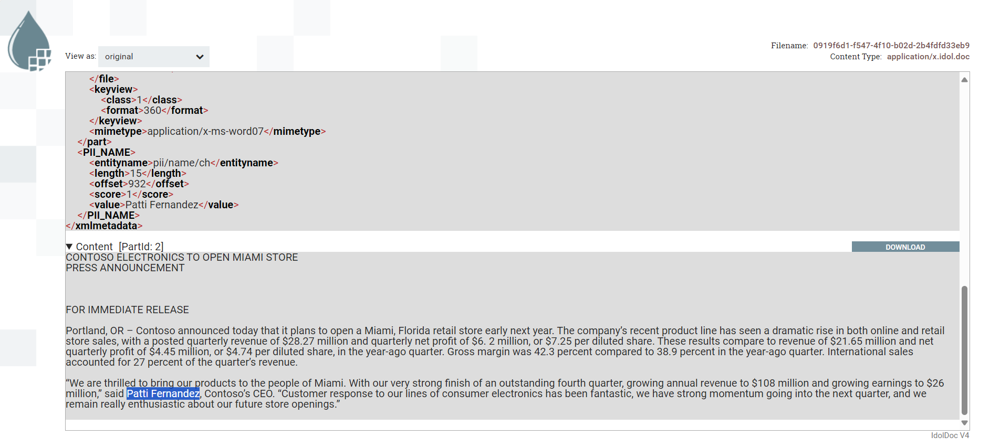
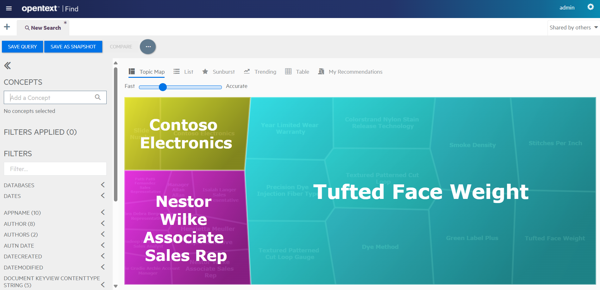
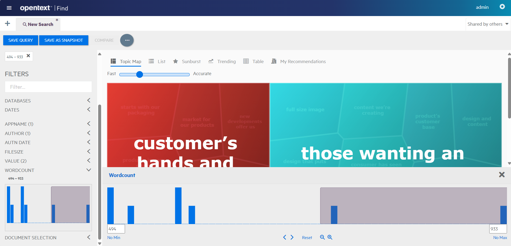
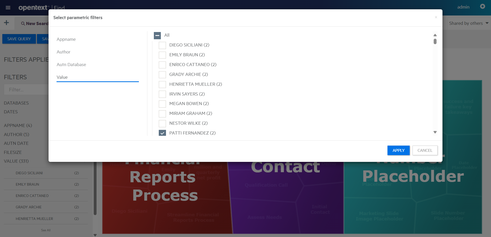
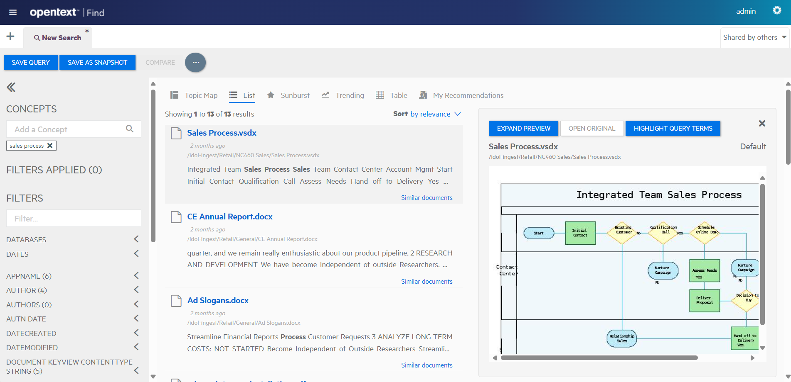

# PART III - Modify the deployment for your data

In this lesson, you will:

- Make changes to your Docker deployment, including learning how to edit a containerized IDOL component configuration file.
- Modify your NiFi flow to add an additional processor.
- Ingest some sample enterprise documents.
- Edit your IDOL Find configuration file to better explore those documents.

---

- [Modify IDOL container deployment](#modify-idol-container-deployment)
- [Ingest documents with NiFi](#ingest-documents-with-nifi)
  - [Update the flow](#update-the-flow)
  - [Prepare sample data for ingest](#prepare-sample-data-for-ingest)
  - [Run ingest](#run-ingest)
- [Explore documents in IDOL Find](#explore-documents-in-idol-find)
- [Edit the IDOL Find configuration file](#edit-the-idol-find-configuration-file)
  - [Copy out configuration files](#copy-out-configuration-files)
  - [Mount external configuration files](#mount-external-configuration-files)
  - [Update the configuration file](#update-the-configuration-file)
  - [Redeploy and validate](#redeploy-and-validate)
- [Stop, Start, Up or Down](#stop-start-up-or-down)
- [Conclusions](#conclusions)
- [Next steps](#next-steps)

---

## Modify IDOL container deployment

Remember that, to edit files under WSL Linux, we recommend [VS Code](https://code.visualstudio.com/). To open the `basic-idol` folder contents for editing, type:

```
$ cd /opt/idol/idol-containers-toolkit/basic-idol
$ code .
```

The default `basic-idol` system is *almost* exactly what you need, but you can make some modifications to help you understand the system, including mounting a shared folder where you can copy sample data to index.

Follow these [docker deployment steps](./DOCKER_DEPLOY.md) then return here.

## Ingest documents with NiFi

With your IDOL system now running, you are almost ready to start ingesting data. First, you can look closer at the NiFi flow.

### Update the flow

Open NiFi at http://idol-docker-host:8080/idol-nifi/nifi/ and stop everything: 

- On the **Operate** tile, click the stop icon:
  
  

Again, the default system is *almost* exactly what you need. However, again you can make some modifications, including to add a new processor.

Follow these [steps](./NIFI_INGEST.md) then return here.

### Prepare sample data for ingest

This repository includes a `data` folder containing some sample enterprise files to ingest. Copy the directory `Retail` into your shared folder `C:\OpenText\hotfolder`.

### Run ingest

Open NiFi at http://idol-docker-host:8080/idol-nifi/nifi/ and start everything: 

- From the top-level **NiFi Flow** canvas, on the **Operate** tile, click the play icon:
  
  

Monitor some of the files as they pass from processor to processor:

- Right click any link, then click **List queue**:
    

- Click the eye icon for any queued document:
    

- A new tab opens, showing the document metadata and content for this file, including any PII detections:
    

> TIP: If you cannot open a queued document, you might need to reconfigure your setup. To monitor documents flowing through NiFi, you must connect to NiFi by using an explicit IP address, not `localhost`. If you are using WSL and following this tutorial to the letter, you will have no problem. You have already found your WSL (guest) IP address in the [WSL guide](./SETUP_WINDOWS_WSL.md#network-access) and possibly set a friendly hostname for it (`idol-docker-host`) in your Windows `hosts` file.

## Explore documents in IDOL Find

Log in to Find on http://idol-docker-host:8080/find/. The default credentials are `admin` / `admin`.  

> NOTE: To create your own users, go to IDOL Community http://idol-docker-host:9030/action=admin#page/users. Find users need one or more of the "FindAdmin", "FindBI" and "FindUser" roles. See the [Find Administration Guide](https://www.microfocus.com/documentation/idol/IDOL_24_3/Find_24.3_Documentation/admin/Content/User_Roles.htm) for details.

The initial view of the topic map shows a summary of the key terms in your document set:



Filter by metadata, for example:

- application name,

- word count, or
  
  

- educed name value

  

Search for *sales process* to retrieve relevant documents:



In the **List** tab, click on an item in the result list to show a near-native HTML rendering of the original document. In this way, IDOL allows you to view documents directly in the Find application, without having to have the viewing software installed for each file type in your index.

You can explore some of the other tabs and filters to get a feeling for using the Find interface.

> NOTE: To learn more about Find, see the [Find Administration Guide](https://www.microfocus.com/documentation/idol/IDOL_24_3/Find_24.3_Documentation/admin/Content/Introduction.htm).

## Edit the IDOL Find configuration file

You have already modified an IDOL component configuration file. You used IDOL Content as an example and this process applies to all IDOL servers. However, IDOl Find is a bit different. Find (and other UIs you will see in later lessons) is a Java application, with a `.json` file as the primary means of modifying its behavior.

### Copy out configuration files

With the Docker system running, use the Linux command line to make a local copy of the IDOL container configuration directory:

```
$ cd /opt/idol/idol-containers-toolkit/basic-idol
$ mkdir find
$ docker cp basic-idol-idol-find-1:/opt/find/home/config_basic.json find/
Successfully copied 10.8kB to /opt/idol/idol-containers-toolkit/basic-idol/find/
```

### Mount external configuration files

Edit the file `basic-idol/docker-compose.yml` to mount the external config directory:

```diff
idol-find:
  image: ${IDOL_REGISTRY}/find:${IDOL_SERVER_VERSION}
  environment:
    - IDOL_UI_CFG=config_basic.json # this controls the configuration of Find
+ volumes:
+   - ./find/config_basic.json:/opt/find/home/config_basic.json:ro # this mounts an external cfg file
```

### Update the configuration file

You might have noticed that Find automatically displays any parametric- and numeric-type fields found in the source documents. To change the behavior of this display, you can edit the configuration file `fieldsInfo` section.

One common change is to provide a friendly name for a given field. For example, look at the `PII_NAME/VALUE` field, which is shown as just **VALUE** by default in Find. Use the following example to add an entry for it:

```diff
"fieldsInfo" : {
- }
+ },
+ "educedPersonName" : {
+   "advanced" : true,
+   "names" : [ "PII_NAME/VALUE" ]
+ }
```

> NOTE: For full options on the `fieldsInfo` configuration section, see the [Find Administration Guide](https://www.microfocus.com/documentation/idol/IDOL_24_3/Find_24.3_Documentation/admin/Content/ConfigFile/ConfigureFriendlyNamesParametric.htm).

### Redeploy and validate

Next you stop and start the IDOL Find container to pick up these changes.

```
docker compose -f docker-compose.yml -f docker-compose.expose-ports.yml -f docker-compose.bindmount.yml stop idol-find
docker compose -f docker-compose.yml -f docker-compose.expose-ports.yml -f docker-compose.bindmount.yml up -d
```

Open IDOL Find and log in again to see the field name under **FILTERS** has changed to **EDUCED PERSON NAME**.

> NOTE: For details on other available configuration options, see the [Find Administration Guide](https://www.microfocus.com/documentation/idol/IDOL_24_3/Find_24.3_Documentation/admin/Content/Introduction.htm).

> NOTE: The Find source code is available on [GitHub](https://github.com/opentext-idol/find), where you can find detailed instructions to set up your own development environment to build your own custom changes into the application.

## Stop, Start, Up or Down

To finish, here is a recap of how to stop and start your docker system:

- To stop your containers (without destroying anything):

    ```
    docker compose -f docker-compose.yml -f docker-compose.expose-ports.yml -f docker-compose.bindmount.yml stop
    ```

- To rebuild (if changes are detected) and start containers (in the background):

    ```
    docker compose -f docker-compose.yml -f docker-compose.expose-ports.yml -f docker-compose.bindmount.yml up -d
    ```

> NOTE: For full details on the verbs available for `docker compose`, see the [docker documentation](https://docs.docker.com/compose/reference/).

## Conclusions

You now understand how to modify IDOL containers deployments. You can update container configuration files for IDOL components including Find. You have updated a NiFi ingest chain to ingest documents and can search for your documents in Find.

## Next steps

Explore some advanced IDOL configurations, in the [showcase section](../../README.md#advanced-lessons).
