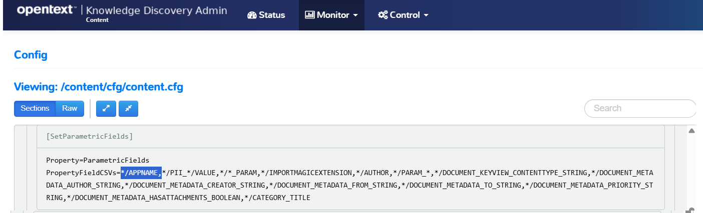

# PART III - Modify the deployment for your data

In this lesson, you will:

- Learn how to keep track of multi-file docker configurations.
- Open ports to make each Knowledge Discovery component accessible.
- Mount a shared folder for document ingestion.
- Mount a containerized Knowledge Discovery component configuration file to make and preserve edits.

---

- [Modify Knowledge Discovery container deployment](#modify-knowledge-discovery-container-deployment)
- [Keeping track of compose files](#keeping-track-of-compose-files)
- [Make selected Knowledge Discovery component ports accessible](#make-selected-knowledge-discovery-component-ports-accessible)
- [Mount a shared folder for ingest](#mount-a-shared-folder-for-ingest)
  - [Filename format encoding](#filename-format-encoding)
- [Modify Knowledge Discovery component configurations](#modify-knowledge-discovery-component-configurations)
  - [Updating configuration files](#updating-configuration-files)
    - [Update to include file metadata](#update-to-include-file-metadata)
  - [Redeploy and validate](#redeploy-and-validate)
- [Conclusions](#conclusions)
- [Next steps](#next-steps)

---

## Modify Knowledge Discovery container deployment

Remember that, to edit files under WSL Linux, we recommend [VS Code](https://code.visualstudio.com). To open the `basic-idol` folder contents for editing, type:

```sh
cd /opt/idol/idol-containers-toolkit/basic-idol
code .
```

The default `basic-idol` system is *almost* exactly what we need now... but you can make some modifications to help you understand the system, including mounting a shared folder where you can copy sample data to index.

## Keeping track of compose files

You will find that you need to reference your list of `.yml` files whenever you run commands for your system with `docker compose`, which can be a source of confusion. To simplify things, I recommend creating a `deploy.sh` script, for example:

```sh
touch deploy.sh
chmod +x deploy.sh
```

Add the following content:

```sh
docker compose \
  -f docker-compose.yml \
  "$@"
```

Now, you can use this to conveniently control your deployment with the standard `docker compose` options, for example:

- Start all containers (and rebuild any changes): `./deploy.sh up -d`
- Stop all containers (without destroying anything): `./deploy.sh stop`
- Stop one containers: `./deploy.sh stop idol-content`
- Take down all containers: `./deploy.sh down`

> NOTE: For full details on the verbs available for `docker compose`, see the [docker documentation](https://docs.docker.com/compose/reference/).

## Make selected Knowledge Discovery component ports accessible

By default, in the `basic-idol` deployment, only the NiFi and Knowledge Discovery Find use interfaces are accessible. The following modification exposes all component ports, for example allowing you to see the admin interface for Content as you did in the first lesson.

- First, stop the current system with:

    ```sh
    ./deploy.sh stop
    ```

- This modification has already been made for us and can be used by referencing a second `.yml` file in the `deploy.sh` script:

    ```diff
    docker compose \
      -f docker-compose.yml \
    + -f docker-compose.expose-ports.yml \
      "$@"
    ```

    > NOTE: Docker compose allows server configurations to be slit across files. This can be done group together optional functionality for easy enabling and disabling. This additional file includes modifiers to expose ports, *e.g.*:
    >
    > ```yml
    > idol-content:
    > ports:
    >   - 9100-9102:9100-9102
    > ```

- Restart your system with:

    ```sh
    ./deploy.sh up -d
    ```

When the containers start, you can point to the admin interface for Content on <http://idol-docker-host:9100/a=admin>.

## Mount a shared folder for ingest

Next, you can run another system modification to configure a shared folder where you can place documents for ingest.

- First, stop and destroy the current system with:

    ```sh
    ./deploy.sh down
    ```

- Next, create a shared folder location in your Windows system: `C:\OpenText\hotfolder`.

- Now edit the file `docker-compose.bindmount.yml` to define your own folder location:

    ```diff
    volumes:
      idol-ingest-volume:
    - # driver: local
    +   driver: local
        driver_opts:
          type: none
    -     device: /path/to/idol-ingest/bind
    +     device: /mnt/c/OpenText/hotfolder
          o: bind
    ```

    > NOTE: If you are using WSL, you already know that your Windows paths are accessible from WSL via the `/mnt/` parent directory from the [WSL guide](./SETUP_UBUNTU_WSL.md#file-system-access).

- To run with these changes to the Docker volume `idol-ingest-volume`, you must first remove the existing volume:

    ```sh
    docker volume rm basic-idol_idol-ingest-volume
    ```

- Modify your `deploy.sh` script to make use of the additional `.yml` file:
  
    ```diff
    docker compose \
      -f docker-compose.yml \
      -f docker-compose.expose-ports.yml \
    + -f docker-compose.bindmount.yml \
      "$@"
    ```

- Finally, launch the modified system with:

    ```sh
    ./deploy.sh up -d
    ```

- You can now check the mounted volume with:

    ```sh
    $ docker volume inspect basic-idol_idol-ingest-volume
    [
        {
            ...
            "Name": "basic-idol_idol-ingest-volume",
            "Options": {
                "device": "/mnt/c/OpenText/hotfolder",
                "o": "bind",
                "type": "none"
            },
            "Scope": "local"
        }
    ]
    ```

### Filename format encoding

Depending on your environment, you may see issues with filenames containing unicode characters that stop you being able to ingest content from this file share.

When you mount a disk for ingest with the FileSystem Connector, depending on your environment you may see issues with file names containing unicode characters that stop you being able to ingest content.

- Verify the locale of your `idol-nifi` container:

    ```sh
    $ cd /opt/idol/idol-containers-toolkit/basic-idol
    $ docker exec -it basic-idol-idol-nifi-1 bash
    [nifi@912b67752a6e nifi-current]$ locale
    LANG=C.utf8
    ...
    [nifi@912b67752a6e nifi-current]$ exit
    ```

- If the system is not setup with a UTF-8 locale, like `C.utf8` shown above, make the following change  your docker compose file:

    ```diff
    idol-nifi:
      <<: *common-server
      image: ${IDOL_REGISTRY}/nifi-minimal:${IDOL_SERVER_VERSION} # choose > nifi-minimal or nifi-full
      environment:
    +   - LANG=C.UTF-8
    +   - LC_ALL=C.UTF-8
    ```

- Restart your NiFi container to apply the changes:

    ```sh
    cd /opt/idol/idol-containers-toolkit/basic-idol
    ./deploy.sh down idol-nifi
    ./deploy.sh up -d
    ```

## Modify Knowledge Discovery component configurations

Each Knowledge Discovery component includes a configuration file that you can modify to change how the component runs.

Knowledge Discovery containers ship with their configuration files included. In order to persist any edits to these files, you must extract the configuration files outside the container. Follow these steps to do so, for `idol-content`, then return here.

Get [started](../../admin/CONTAINER_STATE.md#preserve-a-knowledge-discovery-component-configuration).

### Updating configuration files

Knowledge Discovery components are highly configurable. Most configuration settings are made via the `.cfg` files you have already seen.

Each component has dedicated documentation to describe available configuration settings, *e.g.* read the [documentation](https://www.microfocus.com/documentation/idol/knowledge-discovery-25.2/Content_25.2_Documentation/Help/Content/Configuration/_ACI_Config.htm) for Knowledge Discovery Content. These include settings that effect authorization, encryption, caching for efficiency savings and scheduling for maintenance task, to name a few.

A common area for configuration change relates to how you index your data. The Knowledge Discovery index includes specialized field type definitions to optimize query speed and/or to allow convenient filtering, such as filtering on labels ("parametrics" or "facets"), numeric ranges, dates, *etc.*

> NOTE: For full details on Knowledge Discovery index field types, see the [Expert](https://www.microfocus.com/documentation/idol/knowledge-discovery-25.2/IDOLServer_25.2_Documentation/Guides/html/expert/Content/IDOLExpert/Fields/Field_Properties.htm) documentation.

#### Update to include file metadata

Depending on your data, enrichment setup and use cases, you can expect to have different metadata properties on your documents.

The sample files we are using in this tutorial are Microsoft Office formats, which have some useful metadata fields baked in.

One is **APPNAME**, which we would like to be able to filter on. To enable this, add an additional pattern to the *parametric*-type field list.

Edit the file `basic-idol/content/cfg/original.content.cfg`:

```diff
[SetParametricFields]
- PropertyFieldCSVs=,*/PII_*/VALUE*/*_PARAM,*/IMPORTMAGICEXTENSION,*/AUTHOR,*/PARAM_*,*/DOCUMENT_KEYVIEW_CONTENTTYPE_STRING,*/DOCUMENT_METADATA_AUTHOR_STRING,*/DOCUMENT_METADATA_CREATOR_STRING,*/DOCUMENT_METADATA_FROM_STRING,*/DOCUMENT_METADATA_TO_STRING,*/DOCUMENT_METADATA_PRIORITY_STRING,*/DOCUMENT_METADATA_HASATTACHMENTS_BOOLEAN,*/CATEGORY_TITLE
+ PropertyFieldCSVs=*/APPNAME,*/PII_*/VALUE,*/*_PARAM,*/IMPORTMAGICEXTENSION,*/AUTHOR,*/PARAM_*,*/DOCUMENT_KEYVIEW_CONTENTTYPE_STRING,*/DOCUMENT_METADATA_AUTHOR_STRING,*/DOCUMENT_METADATA_CREATOR_STRING,*/DOCUMENT_METADATA_FROM_STRING,*/DOCUMENT_METADATA_TO_STRING,*/DOCUMENT_METADATA_PRIORITY_STRING,*/DOCUMENT_METADATA_HASATTACHMENTS_BOOLEAN,*/CATEGORY_TITLE
```

### Redeploy and validate

Next you stop and start the Knowledge Discovery Content container to pick up these changes.

```sh
./deploy.sh stop idol-content
./deploy.sh up -d
```

Open the admin interface for Content onto the [configuration view](http://idol-docker-host:9100/a=admin#page/config/SetParametricFields) to see that your change has been applied:



## Conclusions

You are now familiar with key concepts of deploying Knowledge Discovery containers with modifications, including the key steps to extract, modify and apply Knowledge Discovery component configuration file changes.

## Next steps

Next, you are ready to ingest your data. Go to [Part IV](./PART_IV.md).
