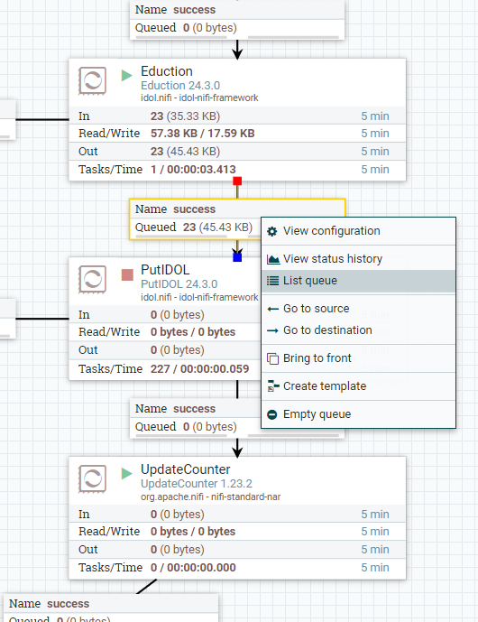
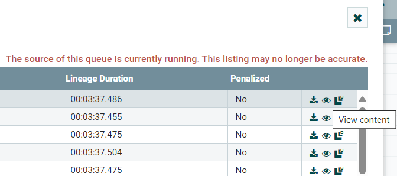
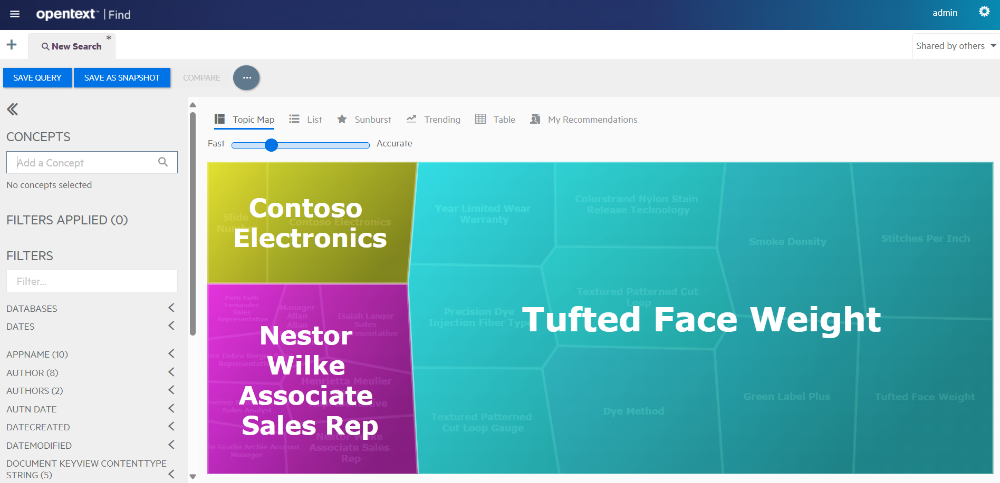
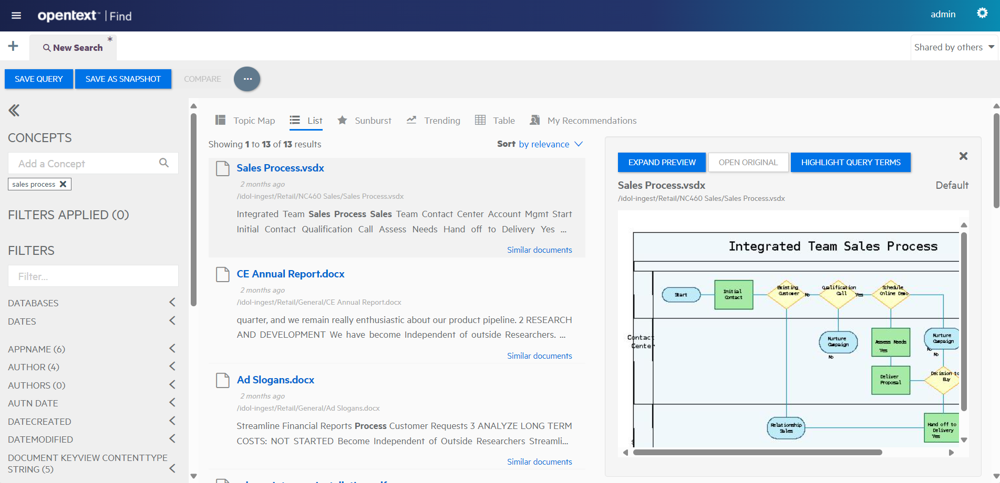

# PART IV - Ingest your documents for search

In this lesson, you will:

- Prepare some sample documents for ingest
- Learn the steps of an ingest flow.
- Edit your Knowledge Discovery Find configuration file.
- Explore those indexed documents.

---

- [Ingest documents with NiFi](#ingest-documents-with-nifi)
  - [Prepare sample data for ingest](#prepare-sample-data-for-ingest)
  - [Follow the ingestion](#follow-the-ingestion)
  - [See your documents in Knowledge Discovery Content](#see-your-documents-in-knowledge-discovery-content)
  - [Understanding ingest](#understanding-ingest)
- [Explore documents in Knowledge Discovery Find](#explore-documents-in-knowledge-discovery-find)
  - [Filter by metadata](#filter-by-metadata)
  - [Search](#search)
- [Edit the Knowledge Discovery Find configuration file](#edit-the-knowledge-discovery-find-configuration-file)
  - [Update the configuration file](#update-the-configuration-file)
  - [Redeploy and validate](#redeploy-and-validate)
- [Conclusions](#conclusions)
- [Next steps](#next-steps)

---

## Ingest documents with NiFi

With your Knowledge Discovery system now running and configured, you are now ready to start ingesting data.

### Prepare sample data for ingest

This repository includes a `data` folder containing some sample enterprise files to ingest. Copy the directory `Retail` into your shared folder `C:\OpenText\hotfolder`.

### Follow the ingestion

Open NiFi at <http://idol-docker-host:8001/nifi/> (using the direct link this time, rather than the reverse proxy) and note that the processors are automatically started.

Monitor some of the files as they pass from processor to processor:

- To stop a processor to temporarily block some files in the queue, right-click on the processor tile, then click **Stop**:

    

- Right-click the link comping in to that processor, then click **List queue**:

    

- Click the **eye icon** for any queued document:

    

- A new tab opens, showing the document metadata and content for this file, including any PII detections:

    

    > TIP: To monitor documents flowing through NiFi, you must connect to NiFi by using an explicit IP address, as instructed in this tutorial, not using `localhost`. If you are using WSL and following this tutorial to the letter, you will have no problem. You have already found your WSL (guest) IP address in the [WSL guide](./SETUP_UBUNTU_WSL.md#network-access) and possibly set a friendly host name for it (`idol-docker-host`) in your Windows `hosts` file.

If you stopped a processor, restart it (right-click, then **Start**) to allow those queued files to be processed.

### See your documents in Knowledge Discovery Content

As in the first lesson, use the admin interface for Content to view the data index.

Use [test action](http://idol-docker-host:9100/a=admin#page/console/test-action) to run a query on the data.

This query to search for documents related to "retail sales" and return a contextual summary of each document:

```url
action=query&text=retail%20sales&summary=context&print=none
```


### Understanding ingest

Now is a good point to pause and review what we've done for clarity. How did your files actually get from your filesystem to Knowledge Discovery Content?

1. In the previous lesson, you configured a mounted disk that is visible to the container running NiFi at `/idol-ingest`.

   - The `docker-compose.bindmount.yml` file defines the local directory for a volume:

      ```yml
      volumes:
        idol-ingest-volume:
          driver_opts:
            device: /mnt/c/OpenText/hotfolder
      ```

   - That volume is mounted into the NiFi container in `docker-compose.yml`:

      ```yml
      services:
        idol-nifi:
          volumes:
            - idol-ingest-volume:/idol-ingest
      ```

1. In the "Basic IDOL" NiFi flow, the FileSystem Connector is pre-configured to look at this mounted folder for files.

    - Navigate to the "GetFileSystem" processor to view its configuration:
      

    - Click **ADVANCED** and go to the **BROWSE** tab to see the connector's view of that folder:
      

1. After flowing through the various Knowledge Discovery processors in NiFi, files get to the "PutIDOL" processor, which sends them to Knowledge Discovery Content (in batches) to the container with hostname `idol-content` on port `9100`.

    - The container host is defined in `docker-compose.yml`, which also points to the mounted configuration directory:

      ```yml
      services:
        idol-content: 
          volumes:
            - ./content/cfg:/content/cfg
      ```

    - The Knowledge Discovery Content configuration file `content/cfg/original-content-cfg` defines the server port:

      ```ini
      [Server]
      Port=9100
      ```

    - The **PutIDOL** processor properties reference this port, as well as the target **Default** database:

      

> NOTE: Explore options for NiFi further with the [ingest guides](../../ingest/README.md).

## Explore documents in Knowledge Discovery Find

Log in to Find on <http://idol-docker-host:8000/> (using the direct link this time, rather than the reverse proxy). The default credentials are `admin` / `admin`.

> NOTE: To create your own users, go to Knowledge Discovery Community <http://idol-docker-host:9030/action=admin#page/users>. Find users need one or more of the "FindAdmin", "FindBI" and "FindUser" roles. See the [Find Administration Guide](https://www.microfocus.com/documentation/idol/knowledge-discovery-25.2/Find_25.2_Documentation/admin/Content/User_Roles.htm) for details.

The initial view of the topic map shows a summary of the key terms in your document set:



### Filter by metadata

For example:

- application name, or

  

- word count
  
  

### Search

For example, for "sales process" to retrieve relevant documents:



In the **List** tab, click on an item in the result list to show a near-native HTML rendering of the original document. In this way, Knowledge Discovery allows you to view documents directly in the Find application, without having to have the viewing software installed for each file type in your index.

You can explore some of the other tabs and filters to get a feeling for using the Find interface.

> NOTE: To learn more about Find, see the [Find Administration Guide](https://www.microfocus.com/documentation/idol/knowledge-discovery-25.2/Find_25.2_Documentation/admin/Content/Introduction.htm).

## Edit the Knowledge Discovery Find configuration file

You have already modified a Knowledge Discovery component configuration file. You used Knowledge Discovery Content as an example and this process applies to all Knowledge Discovery servers. However, Knowledge Discovery Find is a bit different.

Follow these steps to mount the application data, including configuration files outside the container, then return here.

Get [started](../../admin/CONTAINER_STATE.md#preserve-find-state).

### Update the configuration file

You might have noticed that Find automatically displays any *parametric*- and *numeric*-type fields found in the source documents. To change the behavior of this display, you can edit the configuration file `fieldsInfo` section of the primary configuration file `find/home/config.json`.

One common change is to provide a friendly name for a given field. For example, look at the `PII_NAME/VALUE` field, which is shown as just **VALUE** by default in Find. Use the following example to add an entry for it:

```diff
"fieldsInfo" : {
  ...
  "longitude" : {
    "type" : "number",
    "advanced" : true,
    "names" : [ "NODE_PLACE/LON", "LON" ],
    "values" : [ ]
+ },
+ "educed_person_name" : {
+   "advanced" : true,
+   "names" : [ "PII_NAME/VALUE" ]
  }
}
```

> NOTE: For full options on the `fieldsInfo` configuration section, see the [Find Administration Guide](https://www.microfocus.com/documentation/idol/knowledge-discovery-25.2/Find_25.2_Documentation/admin/Content/ConfigFile/ConfigureFriendlyNamesParametric.htm).

### Redeploy and validate

Next you stop and start the Knowledge Discovery Find container to pick up these changes.

```sh
./deploy.sh stop idol-find
./deploy.sh up -d
```

Open Knowledge Discovery Find and log in again to see the field name under **FILTERS** has changed to **EDUCED PERSON NAME**.


> NOTE: For details on other available configuration options, see the [Find Administration Guide](https://www.microfocus.com/documentation/idol/knowledge-discovery-25.2/Find_25.2_Documentation/admin/Content/Introduction.htm).
>
> The Knowledge Discovery Find source code is available on [GitHub](https://github.com/opentext-idol/find), where you can find detailed instructions to set up your own development environment to build your own custom changes into the application.

## Conclusions

You have now set up and used an end-to-end Knowledge Discovery system.

You have explored a NiFi ingest chain to ingest documents and can search for your documents in Find.

> REMINDER: To stop (but not destroy) your Knowledge Discovery deployment, run:
>
> ```sh
> /opt/idol/idol-containers-toolkit/basic-idol/deploy.sh stop
> ```

## Next steps

Explore some advanced Knowledge Discovery configurations, in the [showcase section](../../README.md#showcase-lessons).
