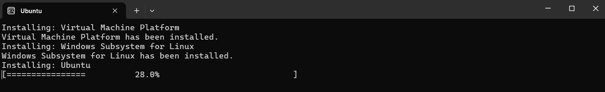
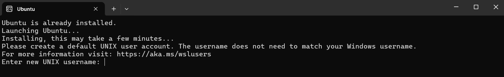
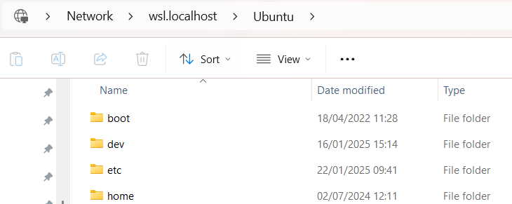
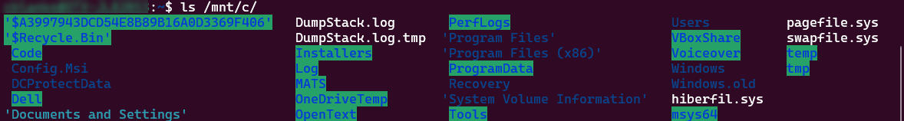
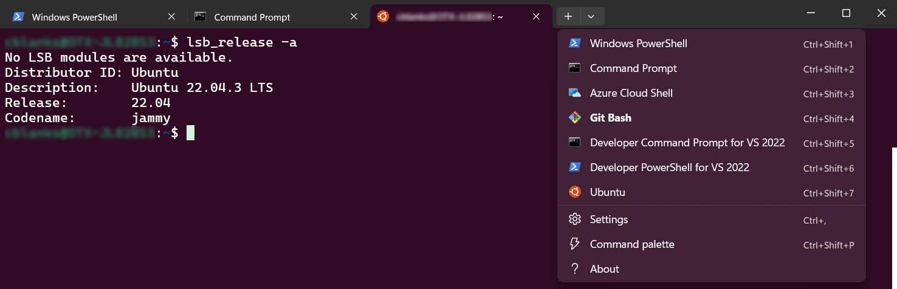

# Set up your Windows system for Ubuntu

Set up WSL (Windows Subsystem for Linux), a feature of Microsoft Windows that allows developers to run a Linux environment without the need for a separate virtual machine or dual booting.

> NOTE: The steps below are summarized from <https://learn.microsoft.com/en-us/windows/wsl/install>.

---

- [Prerequisites](#prerequisites)
- [Install WSL](#install-wsl)
  - [Verify installed version](#verify-installed-version)
- [Communications between Windows and WSL](#communications-between-windows-and-wsl)
  - [File system access](#file-system-access)
  - [Network access](#network-access)
    - [Access Windows host from WSL guest](#access-windows-host-from-wsl-guest)
    - [Access WSL guest from Windows host](#access-wsl-guest-from-windows-host)
- [Next steps](#next-steps)

---

## Prerequisites

You must be running Windows 11 or Windows 10 (Build 19041 or higher) to use the steps below. If you are on earlier versions please see the [manual install page](https://learn.microsoft.com/en-us/windows/wsl/install-manual).

## Install WSL

Open PowerShell or Windows Command Prompt in administrator mode by right-clicking and selecting **Run as administrator**.

> TIP: For existing users of WSL, you might need to specify that you want to use WSL version 2. Run the command:
>
> ```cmd
> wsl --set-default-version 2
> ```

Type the following command to install the Ubuntu distribution of Linux:

```cmd
wsl --install
```



When complete you will be prompted to *restart your machine*.

After rebooting, a command window will pop up automatically, prompting you to create a username and password:



You are now logged in to Ubuntu running on your Windows box.

> NOTE: For optional post-install steps, see the official [best practices guide](https://learn.microsoft.com/en-us/windows/wsl/setup/environment).

### Verify installed version

From PowerShell, run the following command to verify your setup:

```cmd
> wsl -l -v
  NAME      STATE           VERSION
* Ubuntu    Running         2
```

> TIP: If your version is `1`, rather than `2`, run the following PowerShell command to convert your instance with the following command, which takes you system's name as input:
>
> ```cmd
> wsl --set-version Ubuntu 2
> ```

## Communications between Windows and WSL

Get a notebook ready, you will need to keep track of the following information about connectivity between host and guest.

### File system access

To view your guest Ubuntu file system from Windows, go to `\\wsl.localhost\Ubuntu`.



To view your host Windows file system from Ubuntu, go to `/mnt/c/`.



> TIP: For an improved experience working from the command line on Windows, try [Windows Terminal](https://learn.microsoft.com/en-us/windows/terminal/install):
>
> 

### Network access

#### Access Windows host from WSL guest

To find your Windows IP address as seen from WSL, run the following command from the Ubuntu command line:

```sh
$ ping $(hostname).local -c 1
PING MY_HOSTNAME.opentext.net (172.18.96.1) 56(84) bytes of data.
```

Client apps running on WSL Ubuntu can communicate with servers running on Windows at this IP address (that is, `172.18.96.1`).

#### Access WSL guest from Windows host

To find your WSL IP address as seen from Windows, run the following commands from the Ubuntu command line:

```sh
$ sudo apt-get install net-tools
$ ifconfig | grep -A1 eth0 | grep "inet "
    inet 172.18.109.25  netmask 255.255.240.0  broadcast 172.18.111.255
```

Client apps running on Windows can communicate with servers running on WSL Ubuntu at this IP address (that is, `172.18.109.25`).

> TIP: For convenience, you may want to set this IP address to a named host in your Windows `hosts` file. With administrator privileges, edit `C:\Windows\System32\drivers\etc\hosts` as follows:
>
> ```ini
> # IDOL Tutorial
> 172.18.109.25 idol-docker-host    # WSL
> ```
>
> Save and close the `hosts` file.

## Next steps

Return to the containers [tutorial](./PART_I.md#docker).

