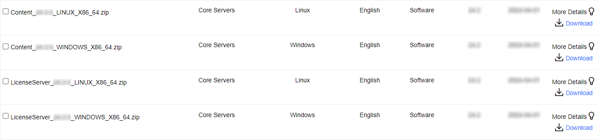

# Obtain IDOL software

We will walk through steps to obtain IDOL software and generate your own license key.

---

- [Generate an IDOL license key](#generate-an-idol-license-key)
- [Download IDOL components](#download-idol-components)
- [Conclusions](#conclusions)
- [Next steps](#next-steps)

---

You can obtain software and licenses from the [Software Licensing and Downloads](https://sld.microfocus.com/mysoftware/index) portal.

## Generate an IDOL license key

1. Under the *Entitlements* tab, search for *IDOL*.
1. Select from your available environment types, *e.g.* choose "EVALUATION".
1. Scroll to the bottom and click `Activate` next to your *IDOL SW license* under the Action column.

    

1. On the "License Activation" screen, at the bottom left, select the check box, choose your preferred version (the latest is 24.3), then fill in the quantity to activate:

   

1. Above this section, fill in the requested details, including the MAC address and host name of the machine where you will install IDOL License Server:

   

    > NOTE: IDOL License Server listens for HTTP requests from other IDOL components to provide them license seats.  The default port is `20000` but you are free to change this.

    > TIP: To obtain your MAC address and host name on Windows, open a command prompt and enter `ipconfig /all`.  Now look for the "Host Name" and "Physical Address" fields:
    >
    > 
    >
    > On Linux the equivalent command is [`ifconfig`](https://manpages.org/ifconfig).

1. Click "Next", then confirm your details and click "Submit".  You will soon received your key, which is a `.dat` file, at your registered email address.

## Download IDOL components

1. Under the *Downloads* tab, select your product, product name and version from the dropdowns:

    

1. From the list of available files, select and download the following (depending on your operating system), *e.g.*

   - `LicenseServer_24.3.0_WINDOWS_X86_64.zip` or `LicenseServer_24.3.0_LINUX_X86_64.zip`, and
   - `Content_24.3.0_WINDOWS_X86_64.zip` or `Content_24.3.0_LINUX_X86_64.zip`.

    

## Conclusions

You are now familiar with the software download portal and can generate keys and access software.

## Next steps

Return to the main [tutorial](./README.md#setup).
