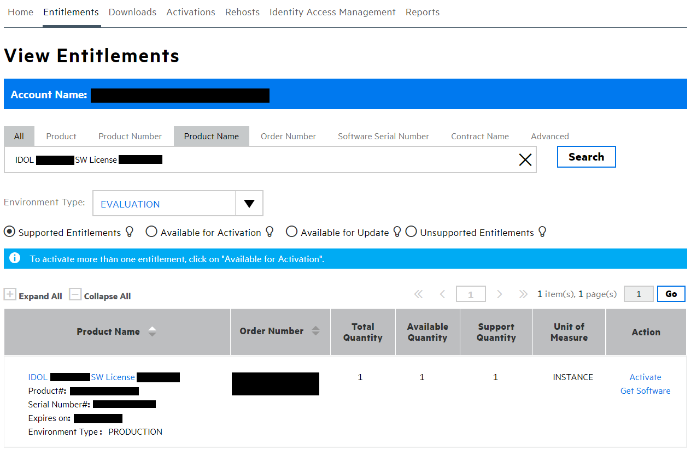
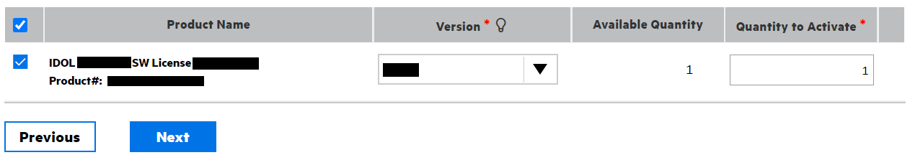
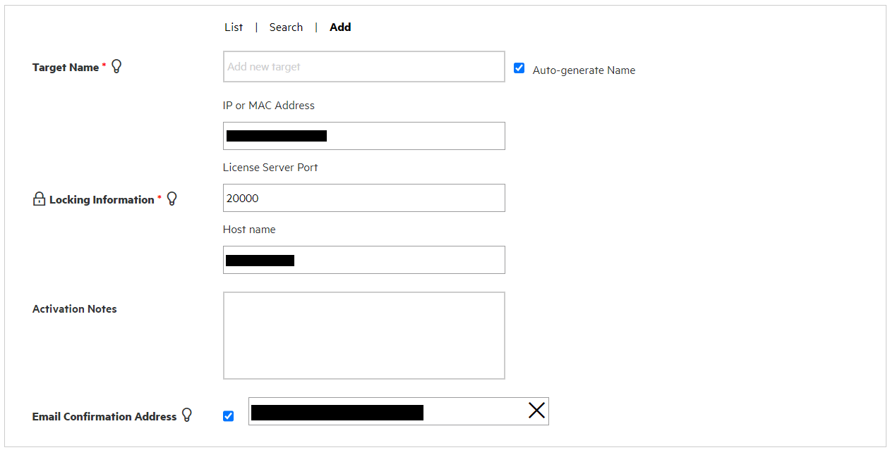
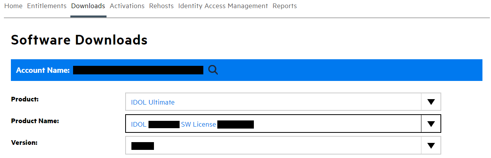
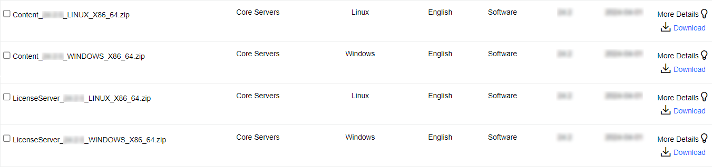

# Obtain Knowledge Discovery software

We will walk through steps to obtain Knowledge Discovery software and generate your own license key.

---

- [Generate a Knowledge Discovery license key](#generate-a-knowledge-discovery-license-key)
- [Download Knowledge Discovery components](#download-knowledge-discovery-components)
- [Conclusions](#conclusions)
- [Next steps](#next-steps)

---

You can obtain software and licenses from the [Software Licensing and Downloads](https://sld.microfocus.com/mysoftware/index) portal.

## Generate a Knowledge Discovery license key

1. Under the *Entitlements* tab, search for *IDOL*.
1. Select from your available environment types, *e.g.* choose "EVALUATION".
1. Scroll to the bottom and click `Activate` next to your *IDOL SW license* under the Action column.

    

1. On the "License Activation" screen, at the bottom left, select the check box, choose your preferred version (the latest is 25.2), then fill in the quantity to activate:

   

1. Above this section, fill in the requested details, including the MAC address and host name of the machine where you will install Knowledge Discovery License Server:

   

    > NOTE: Knowledge Discovery License Server listens for HTTP requests from other Knowledge Discovery components to provide them license seats. The default port is `20000` but you are free to change this.
    >
    > To obtain your host name and [MAC address](https://en.wikipedia.org/wiki/MAC_address) on Windows, open a command prompt and enter `ipconfig /all`.
    >
    > Copy the value of "Host Name" at the top of the response:
    >
    > ```sh
    > > ipconfig /all
    >
    > Windows IP Configuration
    >
    > Host Name . . . . . . . . . . . . : OTX-JL82BS3
    > ```
    >
    > Scrolling down, there may be more than one physical address to choose from. Copy the value of the "Physical Address" field for the "Wireless LAN adapter Wi-Fi":
    >
    > ```sh
    > > ipconfig /all
    > ...
    > Wireless LAN adapter Wi-Fi:
    > ...
    > Physical Address. . . . . . . . . : 8C-17-59-DD-ED-52
    > ...
    > ```

1. Click "Next", then confirm your details and click "Submit". You will soon received your key, which is a `.dat` file, at your registered email address.

## Download Knowledge Discovery components

1. Under the *Downloads* tab, select your product, product name and version from the dropdowns:

    

1. From the list of available files, select and download the following (depending on your operating system), *e.g.*

   - `LicenseServer_25.2.0_WINDOWS_X86_64.zip` or `LicenseServer_25.2.0_LINUX_X86_64.zip`, and
   - `Content_25.2.0_WINDOWS_X86_64.zip` or `Content_25.2.0_LINUX_X86_64.zip`.

    

## Conclusions

You are now familiar with the software download portal and can generate keys and access software.

## Next steps

Return to the main [tutorial](./README.md#setup).
