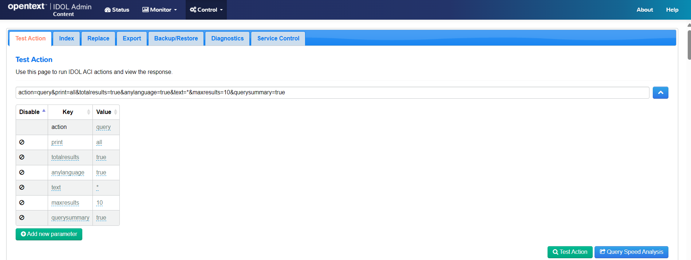

# IDOL introduction

In this lesson, you will start to get familiar with key concepts of an IDOL system. You will:

- Obtain install media and generate a license key.
- Install IDOL License Server and IDOL Content.
- Use the IDOL Admin user interface to index and query sample data.

---

- [Setup](#setup)
  - [Install](#install)
  - [Configure](#configure)
- [Run IDOL](#run-idol)
  - [IDOL License Server](#idol-license-server)
    - [Optionally run as a service](#optionally-run-as-a-service)
  - [IDOL Content](#idol-content)
- [Use IDOL](#use-idol)
  - [Open IDOL Admin](#open-idol-admin)
  - [Create a new database](#create-a-new-database)
  - [Load sample documents](#load-sample-documents)
  - [Explore the documents](#explore-the-documents)
- [Conclusions](#conclusions)
- [Next steps](#next-steps)

---

## Setup

Follow [these steps](./GET_IDOL.md) to obtain IDOL software and your license key, then return here.

### Install

1. Extract your downloaded files into a new working folder (the following guide assumes this is `C:\OpenText` on Windows) to give you:
   - `C:\OpenText\LicenseServer_24.3.0_WINDOWS_X86_64`, and
   - `C:\OpenText\Content_24.3.0_WINDOWS_X86_64`
  
1. Copy your license key `.dat` file into `C:\OpenText\LicenseServer_24.3.0_WINDOWS_X86_64` and rename it to `licensekey.dat`.

1. On Windows, you might need to install the included Visual C++ Redistributable package. In the same IDOL Content Server folder, right-click on `vcredist.exe`, then select 'Run as administrator'.

    > HINT: If you see a version conflict error here, you might need to first uninstall any existing version.

### Configure

In each IDOL component directory, you will see an executable and a configuration file with the same name, for example, `content.exe` and `content.cfg`. You can modify this configuration file to change how the component runs.  

> NOTE: When you make any configuration changes, you must restart the component to load these changes.

Before you start Content, make the following change to the `content.cfg` file to open access to the service port and allow you to use the IDOL Admin user interface:

```diff
[Service]
ServicePort=9102
- Access-Control-Allow-Origin=http://localhost:9100
+ Access-Control-Allow-Origin=*
```

> NOTE: Each IDOL component contains config sections for licensing, ports for communication and logging, as well as specialist configuration options that only apply to that specific component. For full details on the options for a particular component, see the corresponding Reference. For example, the [IDOL Content Component Reference](https://www.microfocus.com/documentation/idol/IDOL_24_3/Content_24.3_Documentation/Help/Content/_ACI_Welcome.htm).

## Run IDOL

You are now ready to launch your IDOL applications.

### IDOL License Server

First you start IDOL License Server. Go to `C:\OpenText\LicenseServer_24.3.0_WINDOWS_X86_64`, and double-click `licenseserver.exe`.

This action opens a terminal window. To confirm IDOL License Server is running you can:

- check the `logs/application.log`, looking for success statements like:

  ```log
  27/07/2024 06:13:32 [0] 30-Normal: ACI Server validated operations key.
  ...
  27/07/2024 06:13:32 [0] 00-Always: ACI Server attached to port 20000
  ```

- call the API. For example, click <http://localhost:20000/action=getversion> to see an XML response in your web browser:

  ```xml
  <autnresponse xmlns:autn="http://schemas.autonomy.com/aci/">
    <action>GETVERSION</action>
    <response>SUCCESS</response>
    <responsedata>
      <autn:version>24.3.0</autn:version>
      ...
    </responsedata>
  </autnresponse>
  ```

> NOTE: To explore the API calls available for IDOL License Server, see the [License Server Reference](https://www.microfocus.com/documentation/idol/IDOL_24_3/LicenseServer_24.3_Documentation/Help/Content/Actions/_ACI_Actions.htm).

If License Server is not running, check that:

- port 20000 in not already use.
  
- your `licensekey.dat` file exists in the `C:\OpenText\LicenseServer_24.3.0_WINDOWS_X86_64` folder.
  
If you are reusing an existing License Server, try deleting the `license` and `uid` folders, before starting again.

#### Optionally run as a service

It can be convenient to configure IDOL License Server to run as a service, for example so it will start up on system boot.

To set up License Server as a service, follow [these steps](../../appendix/IDOL_SERVICE.md).

### IDOL Content

With IDOL License Server running, you can now start IDOL Content. Go to `C:\OpenText\Content_24.3.0_WINDOWS_X86_64`, and double-click `content.exe`.

This action opens a terminal window. To confirm IDOL Content is running, you can:

- check the `logs/application.log`, looking for success statements like:

  ```log
  27/06/2024 06:15:32 [1] 00-Always: Your license expires in 223 days
  ...
  27/07/2024 06:15:33 [0] 00-Always: ACI Server attached to port 9100
  ```

- call the API. For example click <http://localhost:9100/action=getversion> to see an XML response in your web browser:

  ```xml
  <autnresponse xmlns:autn="http://schemas.autonomy.com/aci/">
    <action>GETVERSION</action>
    <response>SUCCESS</response>
    <responsedata>
      <autn:version>24.3.0</autn:version>
      ...
    </responsedata>
  </autnresponse>
  ```

If IDOL Content is not running:

- Verify the host and port in use for License Server. If your License Server uses a port other than 20000, or you have installed License Server on another machine, update the host and port in `C:\OpenText\Content_24.3.0_WINDOWS_X86_64\idol.common.cfg`:
  
  ```ini
  [License]
  LicenseServerHost=localhost
  LicenseServerACIPort=20000
  ```

If you are reusing an existing IDOL Content, try deleting the `license` and `uid` folders, before starting again.

## Use IDOL

### Open IDOL Admin

Each IDOL component includes a web app called IDOL Admin, which offers common and component-specific feature. To open IDOL Admin for Content, click <http://localhost:9100/action=admin>.


This feature-rich UI allows you to monitor the running component, from logs and system usage to configuration settings and queue tasks.

Under the **Control** menu you can also see options to operate the component, for example to manage indexed data and to perform maintenance tasks.

### Create a new database

In IDOL Admin for Content, under the **Control** menu, select **Databases**.

For IDOL, a database means a logical group of indexed documents. You can create a new one to hold some demo documents.

- Click **Add New Database**.
- Name the database **Demo**.
- Click **Add**.


> NOTE: Read more about database creation in the [IDOL Server Administration Guide](https://www.microfocus.com/documentation/idol/IDOL_24_3/Content_24.3_Documentation/Help/Content/Part%20-%20Administration/Administration/Create_a_New_Databas.htm?Highlight=Database).

### Load sample documents

In IDOL Admin for Content, under the **Control** menu, select **Console**.

Open the **Index** tab, then under **What data do you want to index?**, select **Text**.


The example document shown here gives us a first look at the IDOL *IDX* document index format. This format defines a unique reference field, some metadata fields, as well as a block of plain text, the `DRECONTENT`.

> NOTE: For more detail on the `.idx` format, see the [IDOL Server Administration Guide](https://www.microfocus.com/documentation/idol/IDOL_24_3/Content_24.3_Documentation/Help/Content/Appendixes/IDX/IDX_Format.htm?Highlight=DREREFERENCE).

The `demo.idx` file, in the same directory as this README, contains a small sample of IDOL documents. These documents were generated by ChatGPT with the prompt "*Using the IDOL IDX format, generate 10 example documents representing office documents*."  

In IDOL Admin, replace the example document in the text box with the contents of the `demo.idx` file, then click **Next**.

Choose the **Demo** database you just created, then click **Next**.


Retain the default settings for **Kill Duplicates**, then click **Next**. You can read more about KillDuplicates in the [IDOL Server Reference](https://www.microfocus.com/documentation/idol/IDOL_24_3/Content_24.3_Documentation/Help/Content/Index%20Actions/IndexData/Parameters/_IX_KillDuplicates.htm).

Under **Summary**, click **Index**.  


After the index processing is complete, click **Sync** to finalize indexing and make the documents available to search.

### Explore the documents

In IDOL Admin, in the **Control** menu, select **Console**.

On the **Test Action** tab, note the example query action, then click **Test Action** to run it.  

By default, this returns the six most recently indexed documents.

To do something a bit more interesting, modify the query as shown in this screenshot to `action=query&print=all&totalresults=true&anylanguage=true&text=*&maxresults=10&querysummary=true`:



Clicking **Test Action** again now shows 10 documents, as well as a summary of the most common terms in them.


In this way you can start to explore your indexed documents. Here is one more example to query one of these common terms to find the related documents.


> NOTE: For full details on the available query options with IDOL Content, see the [IDOL Server Administration Guide](https://www.microfocus.com/documentation/idol/IDOL_24_3/Content_24.3_Documentation/Help/Content/Part%20-%20Results/Retrieval/Retrieval.htm)

## Conclusions

You now understand how to license and run IDOL Content and the basics of indexing and searching for data.

## Next steps

Try the next tutorial, which introduces containerized deployment for easy multi-component installation [here](../containers/README.md).
