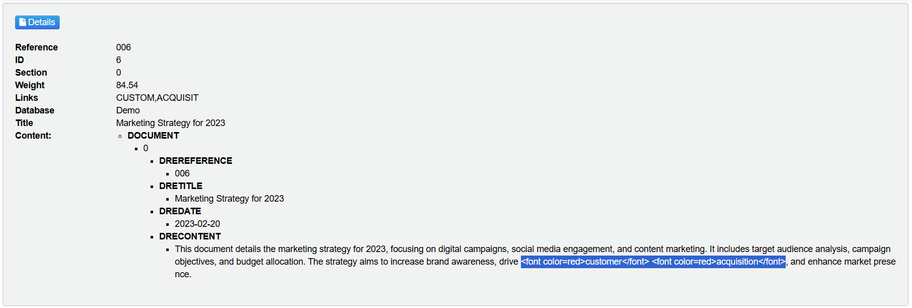

# Knowledge Discovery introduction

In this lesson, you will start to get familiar with key concepts of a Knowledge Discovery system. You will:

- Obtain install media and generate a license key.
- Install Knowledge Discovery License Server and Knowledge Discovery Content.
- Use the Knowledge Discovery Admin user interface to index and query sample data.

---

- [Setup](#setup)
  - [Install](#install)
  - [Configure](#configure)
- [Run Knowledge Discovery](#run-knowledge-discovery)
  - [Knowledge Discovery License Server](#knowledge-discovery-license-server)
    - [Troubleshooting license server](#troubleshooting-license-server)
    - [Optionally run as a service](#optionally-run-as-a-service)
  - [Knowledge Discovery Content](#knowledge-discovery-content)
    - [Troubleshooting content server](#troubleshooting-content-server)
- [Use Knowledge Discovery](#use-knowledge-discovery)
  - [Open Knowledge Discovery Admin](#open-knowledge-discovery-admin)
  - [Create a new database](#create-a-new-database)
  - [Load sample documents](#load-sample-documents)
  - [Explore the documents](#explore-the-documents)
    - [Basic query](#basic-query)
    - [Highlight matches](#highlight-matches)
    - [Query summary](#query-summary)
- [Conclusions](#conclusions)
- [Next steps](#next-steps)

---

## Setup

Follow [these steps](./GET_KD.md) to obtain Knowledge Discovery software and your license key, then return here.

### Install

1. Extract your downloaded files into a new working folder (the following guide assumes this is `C:\OpenText` on Windows) to give you:
   - `C:\OpenText\LicenseServer_25.2.0_WINDOWS_X86_64`, and
   - `C:\OpenText\Content_25.2.0_WINDOWS_X86_64`
  
1. Copy your license key `.dat` file into `C:\OpenText\LicenseServer_25.2.0_WINDOWS_X86_64` and rename it to `licensekey.dat`.

1. On Windows, you might need to install the included Visual C++ Redistributable package. In the same Knowledge Discovery Content Server folder, right-click on `vcredist.exe`, then select 'Run as administrator'.

    > HINT: If you see a version conflict error here, you might need to first uninstall any existing version.

### Configure

In each Knowledge Discovery component directory, you will see an executable and a configuration file with the same name, for example, `content.exe` and `content.cfg`. You can modify this configuration file to change how the component runs.

> NOTE: When you make any configuration changes, you must restart the component to load these changes.

Before you start Content, make the following change to the `content.cfg` file to open access to the service port and allow you to use the Knowledge Discovery Admin user interface:

```diff
[Service]
ServicePort=9102
- Access-Control-Allow-Origin=http://localhost:9100
+ Access-Control-Allow-Origin=*
```

> NOTE: Each Knowledge Discovery component contains config sections for licensing, ports for communication and logging, as well as specialist configuration options that only apply to that specific component. For full details on the options for a particular component, see the corresponding Reference. For example, the [Knowledge Discovery Content Component Reference](https://www.microfocus.com/documentation/idol/knowledge-discovery-25.2/Content_25.2_Documentation/Help/Content/_ACI_Welcome.htm).

## Run Knowledge Discovery

You are now ready to launch your Knowledge Discovery applications.

### Knowledge Discovery License Server

First you start Knowledge Discovery License Server. Go to `C:\OpenText\LicenseServer_25.2.0_WINDOWS_X86_64`, and double-click `licenseserver.exe`.

This action opens a terminal window. To confirm Knowledge Discovery License Server is running you can:

- check the `license.log` file, looking for success statements like:

  ```log
  27/07/2024 06:13:32 LICENSE: Found license key extension file versionkey.dat
  27/07/2024 06:13:32 LICENSE: Using license details from licensekey.dat
  27/07/2024 06:13:32 LICENSE: License for License Server is valid
  ```

- check the `logs/application.log`, looking for success statements like:

  ```log
  27/07/2024 06:13:32 [0] 30-Normal: ACI Server validated operations key.
  ...
  27/07/2024 06:13:32 [0] 00-Always: ACI Server attached to port 20000
  ```

- call the API. For example, click <http://localhost:20000/action=getversion> to see an XML response in your web browser:

  ```xml
  <autnresponse xmlns:autn="http://schemas.autonomy.com/aci/">
    <action>GETVERSION</action>
    <response>SUCCESS</response>
    <responsedata>
      <autn:version>25.2.0</autn:version>
      ...
    </responsedata>
  </autnresponse>
  ```

> NOTE: To explore the API calls available for Knowledge Discovery License Server, see the [License Server Reference](https://www.microfocus.com/documentation/idol/knowledge-discovery-25.2/LicenseServer_25.2_Documentation/Help/Content/Actions/_ACI_Actions.htm).

#### Troubleshooting license server

If License Server is not running, check that:

- port 20000 in not already use.

  > TIP: On Windows, use the command `netstat -na | find "20000"`. If the port is already in use, you will see entries like:
  >
  > ```sh
  > TCP    0.0.0.0:20000          0.0.0.0:0              LISTENING
  > TCP    [::]:20000             [::]:0                 LISTENING
  > ```
  
- your `licensekey.dat` file exists in the `C:\OpenText\LicenseServer_25.2.0_WINDOWS_X86_64` folder.
  
If you are reusing an existing License Server, try deleting the `license` and `uid` folders, before starting again.

#### Optionally run as a service

It can be convenient to configure Knowledge Discovery License Server to run as a service, for example so it will start up on system boot.

To set up License Server as a service on your Windows machine, follow [these steps](../../admin/KD_SERVICE.md#windows).

### Knowledge Discovery Content

With Knowledge Discovery License Server running, you can now start Knowledge Discovery Content. Go to `C:\OpenText\Content_25.2.0_WINDOWS_X86_64`, and double-click `content.exe`.

This action opens a terminal window. To confirm Knowledge Discovery Content is running, you can:

- check the `logs/application.log`, looking for success statements like:

  ```log
  27/06/2024 06:15:32 [1] 00-Always: Your license expires in 223 days
  ...
  27/07/2024 06:15:33 [0] 00-Always: ACI Server attached to port 9100
  ```

- call the API. For example click <http://localhost:9100/action=getversion> to see an XML response in your web browser:

  ```xml
  <autnresponse xmlns:autn="http://schemas.autonomy.com/aci/">
    <action>GETVERSION</action>
    <response>SUCCESS</response>
    <responsedata>
      <autn:version>25.2.0</autn:version>
      ...
    </responsedata>
  </autnresponse>
  ```

#### Troubleshooting content server

If Knowledge Discovery Content is not running:

- Verify the host and port in use for License Server. If your License Server uses a port other than 20000, or you have installed License Server on another machine, update the host and port in `C:\OpenText\Content_25.2.0_WINDOWS_X86_64\idol.common.cfg`:
  
  ```ini
  [License]
  LicenseServerHost=localhost
  LicenseServerACIPort=20000
  ```

If you are reusing an existing Knowledge Discovery Content, try deleting the `license` and `uid` folders, before starting again.

## Use Knowledge Discovery

### Open Knowledge Discovery Admin

Each Knowledge Discovery component includes a web app called Knowledge Discovery Admin, which offers common and component-specific feature. To open the admin interface for Content, click <http://localhost:9100/action=admin>.


This feature-rich UI allows you to monitor the running component, from logs and system usage to configuration settings and queue tasks.

Under the **Control** menu you can also see options to operate the component, for example to manage indexed data and to perform maintenance tasks.

### Create a new database

In the admin interface for Content, under the **Control** menu, select **Databases**.

For Knowledge Discovery, a database means a logical group of indexed documents. You can create a new one to hold some demo documents.

- Click **Add New Database**.
- Name the database **Demo**.
- Click **Add**.


> NOTE: Read more about database creation in the [Knowledge Discovery Server Administration Guide](https://www.microfocus.com/documentation/idol/knowledge-discovery-25.2/Content_25.2_Documentation/Help/Content/Part%20-%20Administration/Administration/Create_a_New_Databas.htm?Highlight=Database).

### Load sample documents

In the admin interface for Content, under the **Control** menu, select **Console**.

Open the **Index** tab, then under **What data do you want to index?**, select **Text**.


The example document shown here gives us a first look at the Knowledge Discovery *IDX* document index format. This format defines a unique reference field, some metadata fields, as well as a block of plain text, the `DRECONTENT`.

> NOTE: For more detail on the `.idx` format, see the [Knowledge Discovery Server Administration Guide](https://www.microfocus.com/documentation/idol/knowledge-discovery-25.2/Content_25.2_Documentation/Help/Content/Appendixes/IDX/IDX_Format.htm?Highlight=DREREFERENCE).

The `demo.idx` file, in the same directory as this README, contains a small sample of Knowledge Discovery documents. These documents were generated by ChatGPT with the prompt "*Using the Knowledge Discovery IDX format, generate 10 example documents representing office documents*."

In the admin interface, replace the example document in the text box with the contents of the `demo.idx` file, then click **Next**.


Choose the **Demo** database you just created, then click **Next**.


Retain the default settings for **Kill Duplicates**, then click **Next**. You can read more about KillDuplicates in the [Knowledge Discovery Server Reference](https://www.microfocus.com/documentation/idol/knowledge-discovery-25.2/Content_25.2_Documentation/Help/Content/Index%20Actions/IndexData/Parameters/_IX_KillDuplicates.htm).

Under **Summary**, click **Index**.


After the index processing is complete, click **Sync** to finalize indexing and make the documents available to search.

### Explore the documents

#### Basic query

In the admin interface, in the **Control** menu, select **Console**.

On the **Test Action** tab, note the example query action, then click **Test Action** to run it.


By default, this returns the six most recently indexed documents.

#### Highlight matches

When you retrieve documents in a query, you may want to know why that document came back. Here is one more example of a query to highlight related terms in the returned documents:

```url
action=query&print=all&totalresults=true&anylanguage=true&text=customer%20acquisition&highlight=terms
```



#### Query summary

To return a summary of the key terms (think "world cloud") from the document set returned by a query, copy and paste the following query:

```url
action=query&print=all&totalresults=true&anylanguage=true&text=*&maxresults=10&querysummary=true
```

Click **Test Action** to run it.

The new response shows 10 documents, as well as a summary of the most common terms in them.


In this way you can start to build an understanding of your indexed documents.

> NOTE: For full details on the available query options with Knowledge Discovery Content, see the [Knowledge Discovery Server Administration Guide](https://www.microfocus.com/documentation/idol/knowledge-discovery-25.2/Content_25.2_Documentation/Help/Content/Part%20-%20Results/Retrieval/Retrieval.htm)

## Conclusions

You now understand how to license and run Knowledge Discovery Content and the basics of indexing and retrieving data.

## Next steps

Check out the [News Spectrum](http://news-spectrum.com/) demo, which uses Knowledge Discovery's query summary to help you review key topics and trends in world news.

Try the next tutorial, which introduces containerized deployment for easy multi-component installation [here](../containers/README.md).
