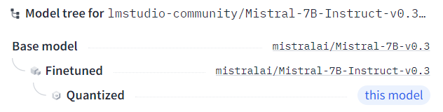
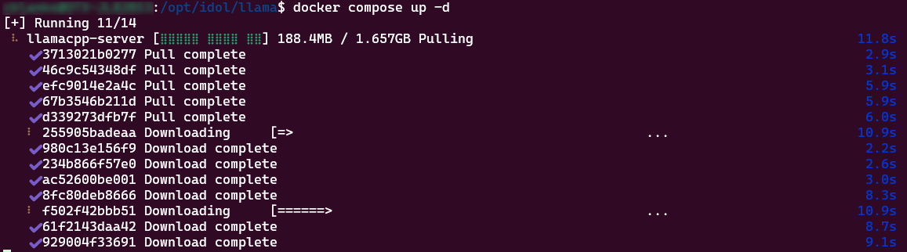

# Set up LLaMA.cpp server

Set up `LLaMA.cpp` as an easy example of a local LLM Server, with optional GPU acceleration.

---

- [Download an LLM](#download-an-llm)
- [LLaMA.cpp server with Docker](#llamacpp-server-with-docker)
- [Start the LLM Server](#start-the-llm-server)
- [Call the LLM Server](#call-the-llm-server)
- [Optionally enable GPU acceleration](#optionally-enable-gpu-acceleration)
- [Next step](#next-step)

---

## Download an LLM

You can choose your favorite LLM, but for this tutorial, you will use "Mistral-7B-Instruct-v0.3-GGUF".  Click to [download](https://huggingface.co/lmstudio-community/Mistral-7B-Instruct-v0.3-GGUF/resolve/main/Mistral-7B-Instruct-v0.3-Q4_K_M.gguf?download=true) the model from Hugging Face with your web browser.

This model is a quantized version of the "Mistral-7B-Instruct-v0.3" LLM, which itself is the result of fine-tuning "Mistral-7B-v0.3" to follow user instructions.  So, it's chosen to be both good at answering your questions and performant on your laptop, even without a GPU.

To view details of the model and it's provenance, go to [Hugging Face](https://huggingface.co/lmstudio-community/Mistral-7B-Instruct-v0.3-GGUF).



## LLaMA.cpp server with Docker

From the Ubuntu command line on WSL, create a new project folder structure:

```sh
mkdir -p /opt/idol/llama/models
touch /opt/idol/llama/docker-compose.yml
```

Move the downloaded LLM file:

```sh
mv /mnt/c/Users/$USER/Downloads/Mistral-7B-Instruct-v0.3-Q4_K_M.gguf /opt/idol/llama/models/
```

Enter the following into your `docker-compose.yml` file:

```yml
services:
  llamacpp-server:
    image: ghcr.io/ggerganov/llama.cpp:server
    ports:
      - 8888:8080
    volumes:
      - ./models:/models
    environment:
      LLAMA_ARG_MODEL: /models/Mistral-7B-Instruct-v0.3-Q4_K_M.gguf
      LLAMA_ARG_ENDPOINT_METRICS: 1  # to disable, either remove or set to 0
      LLAMA_ARG_N_PARALLEL: 2
```

> NOTE: For complete information about LLaMA.cpp server, see the [documentation on GitHub](https://github.com/ggerganov/llama.cpp/blob/master/examples/server/README.md).

## Start the LLM Server

Run the server with Docker compose:

```sh
docker compose up -d
```



Monitor the logs with:

```sh
docker logs llama-llamacpp-server-1 -f
```

Press `Ctrl+C` to stop following the logs.

## Call the LLM Server

From your Ubuntu command prompt on WSL, run the following requests:

- Health check:
  
  `curl http://localhost:8888/health`

  ```json
  {"status":"ok"}
  ```

  > TIP: Install a JSON formatter to better display the server responses.  See this [tip](../../appendix/TIPS.md#json-formatting) for details.

- Check the model is loaded:
  
  `curl http://localhost:8888/v1/models | jq`

  ```json
  {
    "object": "list",
    "data": [
      {
        "id": "/models/Mistral-7B-Instruct-v0.3-Q4_K_M.gguf",
        "object": "model",
        "created": 1724969284,
        "owned_by": "llamacpp",
        "meta": {
          "vocab_type": 1,
          "n_vocab": 32768,
          "n_ctx_train": 32768,
          "n_embd": 4096,
          "n_params": 7248023552,
          "size": 4372054016
        }
      }
    ]
  }
  ```

  > NOTE: The "7B" in the model name stands for 7 billion parameters.

- Get metrics (in Prometheus compatible format):
  
  `curl http://localhost:8888/metrics`
  
  ```ini
  # HELP llamacpp:prompt_tokens_total Number of prompt tokens processed.
  # TYPE llamacpp:prompt_tokens_total counter
  llamacpp:prompt_tokens_total 0
  # HELP llamacpp:prompt_seconds_total Prompt process time
  # TYPE llamacpp:prompt_seconds_total counter
  llamacpp:prompt_seconds_total 0
  ...
  ```

- Prompt a response, for example ask a question:
  
  `curl http://localhost:8888/v1/completions -d '{"prompt": "Answer with a single word. What did the cat sit on?"}' | jq`

  ```json
  {
    "content": "\n\nThe answer is: mat. A cat can sit on a mat, which is a flat, usually rectangular piece of material that is used to cover a floor or part of a floor. This object provides a comfortable surface to sit or walk on and can be made from various materials, such as fabric, rubber, or plastic. It is often used in homes, offices, or other indoor spaces to protect the floor from scratches and dirt or to create a designated area for specific activities, such as yoga or painting. In addition, mats are also commonly used outdoors, for example, on beaches, in parks, or near swimming pools.",
    "id_slot": 0,
    "stop": true,
    "model": "/models/Mistral-7B-Instruct-v0.3-Q4_K_M.gguf",
    ...
  }
  ```

## Optionally enable GPU acceleration

Using an Nvidia T600 card with 4 GB memory, the processing speed metric "predicted tokens per second" is recorded as 11.6.  This compares to 12.1 seconds with CPU only.  That's only a 5% speed increase, so this really is **optional** unless you have a bigger GPU.

To set up GPU acceleration for your server, follow [these steps](./LLAMA_CPP_GPU.md).

## Next step

You now have a responsive, local LLM server.  Return to the [tutorial](./PART_II.md#get-an-answer-from-a-sample-document) to continue.
