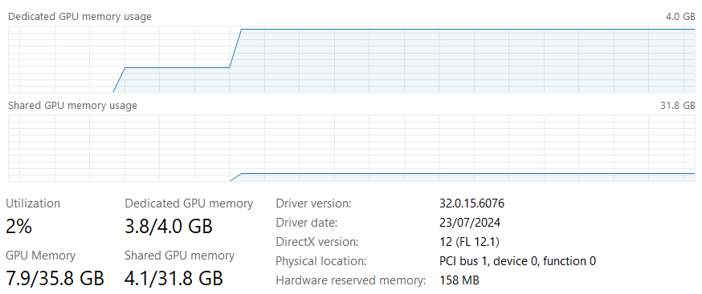

# Set up LLaMA.cpp server with GPU acceleration

Reconfigure [LLaMA.cpp](https://lmstudio.ai/) server for GPU acceleration. 

---

- [Download an LLM](#download-an-llm)
- [LLaMA.cpp server with Docker](#llamacpp-server-with-docker)
- [Start the LLM Server](#start-the-llm-server)
- [Call the LLM Server](#call-the-llm-server)
- [Optimization](#optimization)
- [Next step](#next-step)

---

## Do I need to enable GPU acceleration?

Using an Nvidia T600 card with 4 GB memory, the processing speed metric "predicted tokens per second" is recorded as 11.6.  This compares to 12.1 seconds with CPU only.  That's only a 5% speed increase, so this really is **optional** unless you have a bigger GPU.

## Nvidia Container Toolkit

First, upgrade CUDA for Windows, from https://developer.nvidia.com/cuda-downloads.  

> NOTE: CUDA (Compute Unified Device Architecture) from Nvidia enables general purpose computing on GPUs, which can perform efficient parallel processing to dramatically speed up machine learning algorithms.

Next, install the the container toolkit on Ubuntu under WSL, as instructed in the [official documentation](https://docs.nvidia.com/datacenter/cloud-native/container-toolkit/latest/install-guide.html):

1. Download the repository settings for Nvidia:
  ```
  curl -fsSL https://nvidia.github.io/libnvidia-container/gpgkey | sudo gpg --dearmor -o /usr/share/keyrings/nvidia-container-toolkit-keyring.gpg \
    && curl -s -L https://nvidia.github.io/libnvidia-container/stable/deb/nvidia-container-toolkit.list | \
      sed 's#deb https://#deb [signed-by=/usr/share/keyrings/nvidia-container-toolkit-keyring.gpg] https://#g' | \
      sudo tee /etc/apt/sources.list.d/nvidia-container-toolkit.list
  ```

1. Connect to the new repository:
  ```
  sudo apt-get update
  ```

1. Install the toolkit:
  ```
  sudo apt-get install -y nvidia-container-toolkit
  ```

## Configure Docker for GPU

Configure the Container Toolkit for Docker, then restart the Docker service:

```
sudo nvidia-ctk runtime configure --runtime=docker
sudo systemctl restart docker.service
```

## Modify container settings

Update your `docker-compose.yml` file:

```diff
services:
  llamacpp-server:
+   deploy:
+     resources:
+       reservations:
+         devices:
+           - driver: nvidia
+             capabilities: [gpu]
+   image: ghcr.io/ggerganov/llama.cpp:server-cuda
-   image: ghcr.io/ggerganov/llama.cpp:server
    ports:
      - 8888:8080
    volumes:
      - ./models:/models
    environment:
      LLAMA_ARG_MODEL: /models/Mistral-7B-Instruct-v0.3-Q4_K_M.gguf
      LLAMA_ARG_ENDPOINT_METRICS: 1  # to disable, either remove or set to 0
      LLAMA_ARG_N_PARALLEL: 2
+     LLAMA_ARG_N_GPU_LAYERS: 12
```

To apply a settings change in your `docker-compose.yml` file, you must redeploy the container:

```
docker compose down
docker compose up -d
```

Watch the logs to look for the following lines to tell you the GPU is in use:

```
$ docker logs llama-llamacpp-server-1 -f
...
ggml_cuda_init: found 1 CUDA devices:
  Device 0: NVIDIA T600 Laptop GPU, compute capability 7.5, VMM: yes
llm_load_tensors: ggml ctx size =    0.27 MiB
llm_load_tensors: offloading 12 repeating layers to GPU
llm_load_tensors: offloaded 12/33 layers to GPU
llm_load_tensors:        CPU buffer size =  4169.52 MiB
llm_load_tensors:      CUDA0 buffer size =  2362.81 MiB
```

## Optimization

These `.gguf`-format, quantized LLMs allow for partial "offloading" of processing from CPU to GPU.  The more GPU memory you have available, the more processing "layers" you can offload to speed up the LLM response.

Use Windows Task Manager to check for growth in "Shared GPU memory usage", which indicates your GPU is over capacity.



For optimum speed, find the highest value of `LLAMA_ARG_N_GPU_LAYERS` on your system that doesn't significantly increase the baseline shared memory, observed by setting this parameter to `0`.

## Next step

You now have a more responsive local LLM server.  Return to the [tutorial](./PART_II.md#get-answers-from-your-documents) to continue.
