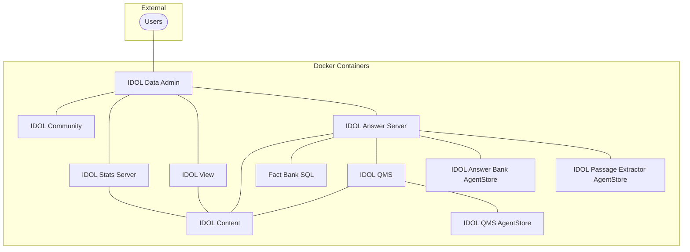

# Configure and run the `data-admin` deployment

In this lesson, you will:

- Explore the `data-admin` IDOL container deployment.
- Configure and run IDOL containers.
- Log in to and configure IDOL Data Admin.

---

- [Answer system types](#answer-system-types)
- [Data Admin](#data-admin)
- [Configure and run the `data-admin` deployment](#configure-and-run-the-data-admin-deployment-1)
  - [Setup](#setup)
  - [Deploy](#deploy)
- [First look at IDOL Data Admin](#first-look-at-idol-data-admin)
  - [IDOL Data Admin settings](#idol-data-admin-settings)
  - [IDOL Data Admin users](#idol-data-admin-users)
- [Conclusions](#conclusions)
- [Next step](#next-step)

---

## Answer system types

IDOL Answer Server has four types of system, supporting different question types.

1. **Answer Bank** is a trusted store of reference questions and answers, which you can add and administer. Use Answer Bank for answers to questions such as:

   - What does error 404 mean?
   - How can I use my phone to send photos of cats?

2. **Fact Bank** is a trusted store of factual information. Use Fact Bank to answer questions such as:

   - What is the population of the USA?
   - What is the average June temperature in Antarctica?

3. **Passage Extractor** links to a store of trusted documents that contain information that might be useful for answering questions, *i.e.* your IDOL Content index. When no trusted answer can be found from Answer Bank or Fact Bank, the Passage Extractor queries IDOL Content for relevant documents. It attempts to extract short sentences or paragraphs that contain pertinent answers. Use a Passage Extractor to answer general questions.

4. **RAG** (Retrieval Augmented Generation) uses a large language model (LLM) to generate answers from trusted documents in your system. When a user asks a question, the RAG module queries IDOL Content for relevant documents. It provides the original question and relevant content from these candidate documents in a prompt to an external LLM, which generates the answer.

    > NOTE: The RAG system performs an equivalent "fallback" function to Passage Extraction and may offer better results depending on the LLM you choose. It may also require GPU to run in good time.

## Data Admin

IDOL Data Admin allows you to set up and maintain an Answer Bank system, a store of reference questions and answers in a dynamic FAQ, to provide concise answers to natural language questions.

> NOTE: Data Admin can also be used to manage an IDOL search system to optimize the search experience for your end users. See the [Data Admin Administration Guide](https://www.microfocus.com/documentation/idol/IDOL_24_3/DataAdmin_24.3_Documentation/admin/Content/Introduction.htm) for details.

## Configure and run the `data-admin` deployment

Within the IDOL Container project, the `data-admin` directory includes files to define an end-to-end IDOL question answering system.  Some of these components will be similar to what you have seen before, with Content, View and Community but here we have in addition Answer Server and its related components, as well as a dedicated user interface called "IDOL Data Admin".



### Setup

First, you need to edit some of the container toolkit files.

> REMINDER: To edit files under WSL Linux, we recommend [VS Code](https://code.visualstudio.com/). 
> 
> To open the `data-admin` folder contents for editing, type:
> ```
> $ cd /opt/idol/idol-containers-toolkit/data-admin
> $ code .
> ```

Edit the `.env` file in `/opt/idol/idol-containers-toolkit/data-admin` to set the IP address of your IDOL License Server. For example:

```diff
# External licenserver host
- LICENSESERVER_IP=
+ LICENSESERVER_IP=172.18.96.1
```

> REMINDER: Just as you did in the containers introduction lesson with `basic-idol`, you must set this configuration to the IP address and not the host name. If you are using WSL, you already found your Windows (host) IP address in the [WSL guide](../../introduction/containers/SETUP_WINDOWS_WSL.md#network-access).

Next, update the startup script for Answer Server `data-admin/answerserver/startup_tasks.sh`:

```diff
- pg_isready -d $DBNAME -h $HOST -p $PORT -U $USER --quiet
+ /usr/pgsql-14/bin/pg_isready -d $DBNAME -h $HOST -p $PORT -U $USER --quiet
```

### Deploy

To launch the system, type the following commands:

```
cd /opt/idol/idol-containers-toolkit/data-admin
docker compose -f docker-compose.yml -f docker-compose.expose-ports.yml up -d
```

It can be more convenient to use a deployment script, as in the [introductory lesson](../../introduction/containers/DOCKER_DEPLOY.md#keeping-track-of-compose-files).  For example:

```
cd /opt/idol/idol-containers-toolkit/data-admin
echo 'docker compose -f docker-compose.yml -f docker-compose.expose-ports.yml "$@"' > deploy.sh
chmod +x deploy.sh
```

As a reminder, you can now control your deployment with the standard `docker compose` options:

- Start all containers (and rebuild any changes): `./deploy.sh up -d`
- Stop all containers (without destroying anything): `./deploy.sh stop`
- Stop one containers: `./deploy.sh stop idol-content`
- Take down all containers: `./deploy.sh down` 

## First look at IDOL Data Admin

When the system is running, point your web browser to http://idol-docker-host:8080/.  

On first logging in, you must enter the temporary credentials: `admin` / `admin`.


> TIP: These temporary default login details can be confirmed as follows:
> 
> ```
> $ docker exec -it data-admin-idol-dataadmin-1 bash
> idoluser@f88770416667 dataadmin]$ cat home/config.json | grep -A 2 defaultLogin
>   "defaultLogin" : {
>     "username" : "admin",
>     "password" : "admin"

### IDOL Data Admin settings

On logging in for the first time, you have the opportunity to review the various components connected to IDOL Data Admin.  

These are already pre-configured except the optional external search engine. Add a search URL and click **ENABLE SEARCH ENGINE**:


> TIP: Try any of the following URL templates:
> - DuckDuckGo: "http://duckduckgo.com/?q=%q"
> - Bing: "http://www.bing.com/search?q=%q"
> - Google: "http://google.com/search?q=%q"
> - Yahoo!: "http://search.yahoo.com/search?q=%q"

Next, scroll up and click **SAVE CHANGES**, then click **Next**.


### IDOL Data Admin users

Remember that your initial login was as a temporary "admin" user.  On the next screen, you must add at least one new administrator-level user, for example called "idol", then log out and log in a that new user.


> NOTE: You can alternatively create your own users from IDOL Community http://idol-docker-host:9030/action=admin#page/users, as you are already familiar with. IDOL Data Admin users need one or more of the "AnswerBankUser", "IDAUser" and "ISOAdmin" roles. See the [Data Admin Administration Guide](https://www.microfocus.com/documentation/idol/IDOL_24_3/DataAdmin_24.3_Documentation/admin/Content/Setup/UserRoles.htm) for details.

## Conclusions

You have an overview understanding of an IDOL question answering system.  You have set up a containerized deployment including the required IDOL components. 

## Next step

Now, you are ready to customize your deployment for your data.  Go to [Part II](./PART_II.md).
