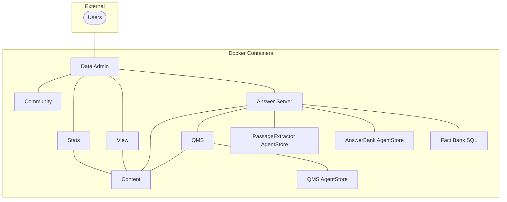

# PART I - Configure and run the `data-admin` deployment

In this lesson, you will:

- Explore the `data-admin` Knowledge Discovery container deployment.
- Configure and run Knowledge Discovery containers.
- Log in to and configure Knowledge Discovery Data Admin.

---

- [Answer system types](#answer-system-types)
- [Data Admin](#data-admin)
- [Introducing the `data-admin` deployment](#introducing-the-data-admin-deployment)
  - [Setup](#setup)
  - [Deploy](#deploy)
- [First look at Knowledge Discovery Data Admin](#first-look-at-knowledge-discovery-data-admin)
  - [Knowledge Discovery Data Admin settings](#knowledge-discovery-data-admin-settings)
  - [Knowledge Discovery Data Admin users](#knowledge-discovery-data-admin-users)
  - [First look at Data Admin](#first-look-at-data-admin)
- [Conclusions](#conclusions)
- [Next step](#next-step)

---

## Answer system types

Knowledge Discovery Answer Server has multiple answering-system types, providing complementary ways to support a range of questions.  In the following tutorial, we will make use of the following systems:

1. **Answer Bank** is a trusted store of reference questions and answers, which you can add and administer. Use Answer Bank for answers to questions such as:

   - What does error 404 mean?
   - How can I use my phone to send photos of cats?

1. **Fact Bank** is a trusted store of factual information. Use Fact Bank to answer questions such as:

   - What is the population of the USA?
   - What is the average June temperature in Antarctica?

1. **RAG** (Retrieval Augmented Generation) uses a Large Language Model (LLM) to generate answers from trusted documents in your system. When a user asks a question, the RAG module queries Knowledge Discovery Content for relevant documents. It provides the original question and relevant content from these candidate documents in a prompt to an external LLM, which generates the answer.

    > NOTE: The RAG system is considered a replacement for the **Passage Extraction** and  **Passage Extraction LLM** and may offer better results depending on the LLM you choose.  All three methods can provide a "fallback" function where a curated answer is not available from Answer Bank or Fact Bank.

1. **Conversation** maintains context across multiple questions, allowing you to set up an interactive virtual assistant.

## Data Admin

Knowledge Discovery Data Admin allows you to set up and maintain an Answer Bank system, a store of reference questions and answers in a dynamic FAQ, to provide concise answers to natural language questions.

> NOTE: Data Admin can also be used to manage a Knowledge Discovery search system to optimize the search experience for your end users. See the [Data Admin Administration Guide](https://www.microfocus.com/documentation/idol/knowledge-discovery-25.2/DataAdmin_25.2_Documentation/admin/Content/Introduction.htm) for details.

## Introducing the `data-admin` deployment

Within the Knowledge Discovery Container project, the `data-admin` directory includes files to define an end-to-end Knowledge Discovery question answering system. Some of these components will be similar to what you have seen before, with Content, View and Community but here we have in addition Answer Server and its related components, as well as a dedicated user interface called "Knowledge Discovery Data Admin".



> NOTE: This out-of-the-box deployment does not contain a NiFi instance for document ingestion. Adding that will involve combining elements you have already seen from `basic-idol` and will be covered in a later lesson.

### Setup

Before you continue, you need to edit some of the container toolkit files.

To edit files under WSL Linux, we recommend [VS Code](https://code.visualstudio.com). To open the `data-admin` folder contents for editing, type:

```sh
cd /opt/idol/idol-containers-toolkit/data-admin
code .
```

Make the following changes:

1. Edit the `.env` file in `/opt/idol/idol-containers-toolkit/data-admin` to set the IP address of your Knowledge Discovery License Server. For example:

    ```diff
    # External licenserver host
    - LICENSESERVER_IP=
    + LICENSESERVER_IP=172.18.96.1
    ```

    > NOTE: You must set this configuration to the IP address and not the host name. If you are using WSL, you already found your Windows (host) IP address in the [WSL guide](../../introduction/containers/SETUP_UBUNTU_WSL.md#access-windows-host-from-wsl-guest).

1. The same `.env` file is used to specify the Knowledge Discovery version(s).  Use the latest, currently 25.2, for the server and add a specific version for the Data Admin user interface, as follows:

    ```ini
    # Version of Knowledge Discovery images to use
    IDOL_SERVER_VERSION=25.2
    IDOL_DATA_ADMIN_VERSION=24.3
    ```

    > NOTE: If you upgrade in the future, you must ensure that the version of your external Knowledge Discovery License Server matches the version of your containers.

1. Edit the file `data-admin/docker-compose.yml` to change the referenced parameter for `idol-dataadmin`:

    ```diff
    idol-dataadmin:
    - image: ${IDOL_REGISTRY}/find:${IDOL_SERVER_VERSION}
    + image: ${IDOL_REGISTRY}/find:${IDOL_DATA_ADMIN_VERSION}
    ```

1. Starting from Knowledge Discovery 25.2, you can now select between NiFi 1 or NiFi 2 images.  Edit the file `data-admin/docker-compose.yml` to select your preferred version:

    ```diff
    idol-nifi:
    - image: ${IDOL_REGISTRY}/nifi-minimal:${IDOL_SERVER_VERSION} # choose nifi-minimal or nifi-full
    + image: ${IDOL_REGISTRY}/nifi-ver2-minimal:${IDOL_SERVER_VERSION} # choose nifi-ver{1,2}-{minimal,full}
    ```

    > NOTE: To continue using NiFi 1, you must change the image name from `nifi-minimal` to `nifi-ver1-minimal`. See the [documentation](https://www.microfocus.com/documentation/idol/knowledge-discovery-25.2/IDOLServer_25.2_Documentation/Guides/html/gettingstarted/Content/Install_Run_IDOL/Containers/Docker/AvailableContainers.htm) for a full list of available containers.

### Deploy

To launch the system, navigate to the project folder:

```sh
cd /opt/idol/idol-containers-toolkit/data-admin
```

It is again recommended to create a deployment script, as in the [introductory lesson](../../introduction/containers/PART_III.md#keeping-track-of-compose-files). For example:

```sh
touch deploy.sh
chmod +x deploy.sh
```

Add the following content:

```sh
docker compose \
  -f docker-compose.yml \
  -f docker-compose.expose-ports.yml \
  "$@"
```

Start the deployment project with:

```sh
./deploy.sh up -d
```

> REMINDER: As before, you can use this helper script to control your deployment with the standard `docker compose` options, *e.g.*:
>
> - Start all containers (and rebuild any changes): `./deploy.sh up > -d`
> - Stop all containers (without destroying anything): `./deploy.sh > stop`
> - Stop one containers: `./deploy.sh stop idol-passageextractor-content`
> - Take down all containers: `./deploy.sh down`

Monitor the start of the Data Admin container with:

```sh
./deploy.sh logs -f idol-dataadmin
```

Wait for the log message "APPLICATION STARTED".

## First look at Knowledge Discovery Data Admin

When the system is running, point your web browser to <http://idol-docker-host:8080/>.

On first logging in, you must enter the temporary credentials: `admin` / `admin`.


> TIP: These temporary default login details can be confirmed as follows:
>
> ```sh
> $ docker exec -it data-admin-idol-dataadmin-1 bash
> [idoluser@9a83b7f44429 dataadmin]$ cat home/config.json | grep -A 2 defaultLogin
>   "defaultLogin" : {
>     "username" : "admin",
>     "password" : "admin"
> [idoluser@9a83b7f44429 dataadmin]$ exit
> exit
> ```

### Knowledge Discovery Data Admin settings

On logging in for the first time, you have the opportunity to review the various components connected to Knowledge Discovery Data Admin.

These are already pre-configured except the optional external search engine. Add a search URL and click **ENABLE SEARCH ENGINE**:


> TIP: Try any of the following URL templates:
>
> - DuckDuckGo: `http://duckduckgo.com/?q=%q`
> - Bing: `http://www.bing.com/search?q=%q`
> - Google: `http://google.com/search?q=%q`
> - Yahoo!: `http://search.yahoo.com/search?q=%q`

Next, scroll up and click **SAVE CHANGES**, confirm, then click **Next**.


### Knowledge Discovery Data Admin users

Remember that your initial login was as a temporary user called "admin". On the next screen, you must add at least one new administrator-level user, for example called "idol", then log out and log in a that new user.


> NOTE: If you prefer, you can alternatively create your own users from [Knowledge Discovery Community](http://idol-docker-host:9030/action=admin#page/users). Knowledge Discovery Data Admin users need one or more of the "AnswerBankUser", "IDAUser" and "ISOAdmin" roles. See the [Data Admin Administration Guide](https://www.microfocus.com/documentation/idol/knowledge-discovery-25.2/DataAdmin_25.2_Documentation/admin/Content/Setup/UserRoles.htm) for details.

### First look at Data Admin

Log out and log in again as your new Administrator-level user, *e.g.* "idol", to see the landing page:


This administrative user interfaces allows you to manage the contents of data indexed in Knowledge Discovery servers to optimize the search experience for your end users. You can set up and maintain reference questions and answers, manage synonyms and create and modify promotions. For full details, read the [documentation](https://www.microfocus.com/documentation/idol/knowledge-discovery-25.2/DataAdmin_25.2_Documentation/admin/Content/Introduction.htm).

## Conclusions

You have an understanding of the components in a Knowledge Discovery question answering system. You have set up a containerized deployment including the Knowledge Discovery Data Admin user interface.

## Next step

Next, you will configure a RAG answer system, integrating with an LLM to answer questions from sample data. Go to [Part II](./PART_II.md).
