# PART II - Answer questions with RAG

The **RAG** process combined a search (retrieval) engine with a large language model (LLM) to generate answers from trusted documents in your system.

In this lesson, you will:

- Install an LLM server and download a local model.
- Configure IDOL Answer Server with a RAG system.
- Ingest a sample document into IDOL Content.
- Get answers from your document using IDOL Data Admin.

---

- [RAG (Retrieval Augmented Generation) with IDOL Answer Server](#rag-retrieval-augmented-generation-with-idol-answer-server)
- [LLM selection and hardware requirements](#llm-selection-and-hardware-requirements)
  - [What's in a name?](#whats-in-a-name)
- [Local LLM setup](#local-llm-setup)
  - [Download an LLM](#download-an-llm)
  - [Set up a local LLM server](#set-up-a-local-llm-server)
  - [Download local tokenizer files](#download-local-tokenizer-files)
    - [Possible errors](#possible-errors)
- [Configure an Answer Server RAG system](#configure-an-answer-server-rag-system)
  - [Considerations for prompt size](#considerations-for-prompt-size)
  - [LLM interaction](#llm-interaction)
- [Get an answer from a sample document](#get-an-answer-from-a-sample-document)
  - [Index a sample document](#index-a-sample-document)
  - [Generate an answer from your documents](#generate-an-answer-from-your-documents)
    - [Possible answer errors](#possible-answer-errors)
    - [Under the hood with RAG](#under-the-hood-with-rag)
  - [Ask questions in Data Admin](#ask-questions-in-data-admin)
- [Conclusions](#conclusions)
- [Next step](#next-step)

---

## RAG (Retrieval Augmented Generation) with IDOL Answer Server

IDOL Answer Server's RAG system converts your question into a query to retrieve relevant documents. Selected text from these documents is then sent as "context" along with your question as a prompt to the external LLM. This allows the LLM to answer questions based on your data. IDOL Answer Server can then return the answer with reference documents for validation.

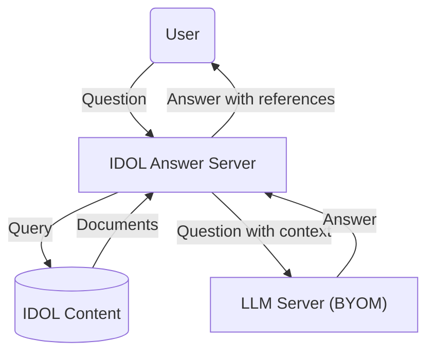

IDOL Answer Server's RAG architecture is open to your LLM of choice ("Bring Your Own Model"), which can be hosted locally, or as a remote service.  Remote LLM services may incur a cost and could expose your data to third parties.  For this guide, we will set up a local system.

## LLM selection and hardware requirements

For reasonable response times from an LLM, access to a GPU is recommended but - luckily for us - is not essential for testing and demonstrations.

"How is a GPU not essential?", you may wonder. You will be downloading [quantized LLMs](https://huggingface.co/docs/optimum/main/en/concept_guides/quantization), which have reduced compute and memory costs and can run on CPU.

For this tutorial we will consider a family of three related models of different sizes, so that you can easily switch between them to build a performant system on your hardware:

- [Mistral-7B-Instruct-v0.3-GGUF](https://huggingface.co/lmstudio-community/Mistral-7B-Instruct-v0.3-GGUF),
- [Llama-3.2-3B-Instruct-GGUF](https://huggingface.co/lmstudio-community/Llama-3.2-3B-Instruct-GGUF), and
- [Llama-3.2-1B-Instruct-GGUF](https://huggingface.co/lmstudio-community/Llama-3.2-1B-Instruct-GGUF).

These models have all been chosen to be both good at answering questions and acceptably performant on a laptop for testing, even without a GPU.

### What's in a name?

The "7B", "3B" and "1B" labels refer to the size fo the models, *e.g.* seven billion parameters for "Mistral 7B". The more parameters a model has, the more hardware resources are required, with the potential benefit of more useful responses.

The "Instruct" label refers to a fine-tuning process of a base LLM, intended to teach the model to follow user instructions, *e.g.* to answer questions.

The label "GGUF" indicates that the model is quantized, as introduced above.

These complete labels, *e.g.* "Mistral-7B-Instruct-v0.3-GGUF", therefore tell you about the provenance of the model. This one is a quantized version of the "Mistral-7B-Instruct-v0.3" LLM, which is the result of fine-tuning "Mistral-7B-v0.3" to follow user instructions. To view details of the model and its provenance, go to [Hugging Face](https://huggingface.co/lmstudio-community/Mistral-7B-Instruct-v0.3-GGUF).


## Local LLM setup

**Hugging Face Hub** has become the standard platform for hosting machine learning models including LLMs. Many models are shared openly but a growing number require you to create an account and use an associated access token.

Create your (free) account here: <https://huggingface.co/join>:

1. Navigate to the access tokens page in settings: <https://huggingface.co/settings/tokens> and create a new token.

    

1. Give your token a memorable name and grant **Read** access. Save the token value somewhere safe, you will not be able to see it again.

With this token you can download local models and supporting files to set up your system.  You will need:

1. a **model file** (the "LLM"), used to generate answers,
1. a **model server**, which provides an API that lets you ask questions, and
1. a **tokenizer**, used to determine the amount of contextual information (relevant text retrieved by IDOL) that can be passed to the LLM along with your question, and so enable you to get an answer based on your own data.

### Download an LLM

Download the model files directly from Hugging Face with the links below:

- [Mistral-7B-Instruct-v0.3-GGUF](https://huggingface.co/lmstudio-community/Mistral-7B-Instruct-v0.3-GGUF/resolve/main/Mistral-7B-Instruct-v0.3-Q4_K_M.gguf?download=true),
- [Llama-3.2-3B-Instruct-Q4_K_M.gguf](https://huggingface.co/lmstudio-community/Llama-3.2-3B-Instruct-GGUF/resolve/main/Llama-3.2-3B-Instruct-Q4_K_M.gguf?download=true)
- [Llama-3.2-1B-Instruct-Q4_K_M.gguf](https://huggingface.co/lmstudio-community/Llama-3.2-1B-Instruct-GGUF/resolve/main/Llama-3.2-1B-Instruct-Q4_K_M.gguf?download=true), and

### Set up a local LLM server

IDOL Answer's RAG system requires an HTTP server to provide a set of APIs that allow interaction with a downloaded LLM. There are a growing number of options available, many of which conveniently integrate with Hugging Face and can be deployed with Docker.

For a quick and easy setup on your Windows laptop, follow [these steps](./LLM_SERVER.md) to install "LLaMA.cpp" as an example LLM server.

> NOTE: [LLaMA.cpp](https://github.com/ggerganov/llama.cpp) is the opensource engine behind the popular (and free for personal use) desktop application [LM Studio](https://lmstudio.ai/), which also has a [server mode](https://lmstudio.ai/docs/api/server).

> NOTE: For production deployments, also consider using [vLLM](https://docs.vllm.ai/en/latest/serving/deploying_with_docker.html#deploying-with-docker). We won't use it here because vLLM does not currently support quantized LLMs.

### Download local tokenizer files

IDOL Answer's RAG system requires a "tokenizer" in order to determine the amount of contextual information that can be passed to an LLM for question answering.

This project includes a helper script that will download the appropriate tokenizer for your LLM.

Copy the script into your deployment folder to give:

```sh
/opt/idol/idol-containers-toolkit/data-admin/answerserver/rag/download_tokenizer_files.py
```

Edit the script to add your Hugging Face access token:

```py
LLM_MODEL_TOKENIZER = "mistralai/Mistral-7B-Instruct-v0.3"
LLM_MODEL_REVISION = "main"
HUGGINGFACE_API_TOKEN = "<YOUR_TOKEN>"
```

> NOTE: This tokenizer is common to the three models suggested above, so you only need to set this up once.

> TIP: You noted down your Hugging Face token string earlier; it begins with `hf_`. This token is required by the `mistralai` project to access their tokenizer.

Install Python dependencies:

```sh
sudo apt install python3-pip
pip install transformers sentencepiece protobuf
```

Run the included script:

```sh
cd/opt/idol/idol-containers-toolkit/data-admin/answerserver/rag
python3 download_tokenizer_files.py
```

This should produce a folder called `tokenizer_cache`, with the following contents:

```sh
$ ls tokenizer_cache/
special_tokens_map.json  tokenizer.json  tokenizer.model  tokenizer_config.json
```

#### Possible errors

If you do not add your Hugging Face token correctly, or it does not have the correct "Read" access, as discussed above, you will see the following error message:

```log
ValueError: Invalid token passed!
```

## Configure an Answer Server RAG system

Edit your Answer Server configuration file `/opt/idol/idol-containers-toolkit/data-admin/answerserver/answerserver.cfg`:

1. Allow access to IDOL Admin from outside the container:

    ```diff
    [Service]
    ...
    - Access-Control-Allow-Origin=http://localhost:12000
    + Access-Control-Allow-Origin=*
    ```

1. Replace the default "Passage Extractor" system with a "RAG" system for LLM-enabled question answering:

    ```diff
    [Systems]
    0=AnswerBank
    -1=PassageExtractor
    +1=RAG
    2=FactBank
    +
    + [RAG]
    + Type=RAG
    + IdolHost=idol-passageextractor-content
    + IdolAciPort=9100
    + ModuleID=RAGLLMModule 
    + RetrievalType=mixed
    + PromptTemplatePath=./rag/prompt_template.txt
    + PromptTokenLimit=2000
    + ACIMaxResults=3
    + MaxQuestionSize=70
    + 
    + [RAGLLMModule]
    + Type=GenerativePython 
    + Script=./rag/llamacpp_server.py
    ```

> NOTE: For details on the "RAG" configuration options, read the [documentation](https://www.microfocus.com/documentation/idol/knowledge-discovery-25.1/AnswerServer_25.1_Documentation/Help/Content/Configuration/Systems/RAG/RAG_Config.htm).

### Considerations for prompt size

Each LLM accepts a maximum prompt size (measured in tokens). For Llama 3.2 models, the upper limit is [128K tokens](https://huggingface.co/meta-llama/Llama-3.2-1B-Instruct). However, prompt processing accounts for a significant fraction of the LLM response time, so using the full available prompt size is not practical here.

With IDOL Answer Server, this prompt size limit is managed using the `PromptTokenLimit` parameter.  With the same example question, varying this parameter has the following effect on response time:

`PromptTokenLimit` | **Ask** response time / seconds
--- | ---
1000 | 5.1
2000 | 9.6
3000 | 14.6
4000 | 19.6
5000 | 27.5

> TABLE: IDOL Answer Server **Ask** action response times (in seconds) for RAG with three LLMs.

To balance speed with usefulness, consider the rule-of-thumb that [100 tokens is approximately 75 words](https://help.openai.com/en/articles/4936856-what-are-tokens-and-how-to-count-them). For example, setting this 2,000-token limit will allow IDOL Answer Server to provide up to roughly 1,500 words of relevant information to the LLM for RAG.

To maximize the relevancy of a 1,500 word prompt, text is intelligently summarized from the best-matching documents in the IDOL Content index. Use the `ACIMaxResults` parameter to limit how many of those best-matching documents to use when building this summary prompt.

### LLM interaction

The above configuration references two external files:

- `prompt_template.txt`: combines the users question and the text from relevant documents retrieved by IDOL into a single prompt for the LLM.
- `llamacpp_server.py`: defines functions for Answer Server to call out to the LLaMA.cpp server you have set up.

Both files are included in this tutorial repository. Copy them into your docker project in the same folder as your tokenizer files:

```sh
/opt/idol/idol-containers-toolkit/data-admin/answerserver/rag/
```

The `.py` script expects properties from some environment variables to run. Add them to your docker environment with:

1. Add the following lines to `/opt/idol/idol-containers-toolkit/data-admin/.env`:

    ```ini
    # RAG System parameters for IDOL Answer Server
    IDOL_LLM_ENDPOINT=http://<YOUR_WSL_IP_ADDRESS>:8888/v1/chat/completions # llama.cpp server
    # IDOL_LLM_MODEL=/models/Mistral-7B-Instruct-v0.3-Q4_K_M.gguf
    # IDOL_LLM_MODEL=/models/Llama-3.2-3B-Instruct-Q4_K_M.gguf
    IDOL_LLM_MODEL=/models/Llama-3.2-1B-Instruct-Q4_K_M.gguf
    ```

    > NOTE: You have already found your WSL (guest) IP address in the [WSL guide](../../introduction/containers/SETUP_WINDOWS_WSL.md#network-access), where the value shown was `172.18.109.25`.

    > NOTE: Uncomment your preferred model from the three above for your first tests.  Ensure that this matches the model you have enabled in your LLM server.

1. Add these new files and environment variables to your deployment by editing `/opt/idol/idol-containers-toolkit/data-admin/docker-compose.yml` as follows:

    ```diff
    idol-answerserver:
      image: ${IDOL_REGISTRY}/answerserver:${IDOL_SERVER_VERSION}
      extra_hosts: *external-licenseserver-host
    + environment:
    +   - IDOL_LLM_ENDPOINT=${IDOL_LLM_ENDPOINT}
    +   - IDOL_LLM_MODEL=${IDOL_LLM_MODEL}
      volumes:
    +   - ./answerserver/rag:/answerserver/rag
        - ./answerserver/answerserver.cfg:/answerserver/cfg/answerserver.cfg
        - ./answerserver/startup_tasks.sh:/answerserver/prestart_scripts/002_startup_tasks.sh
    ```

Restart the Answer Server container to apply these changes:

```sh
cd /opt/idol/idol-containers-toolkit/data-admin
./deploy.sh stop idol-answerserver
./deploy.sh up -d
```

Check the logs to see the RAG system is created without errors:

```sh
$ docker logs data-admin-idol-answerserver-1 -f
...
30/08/2024 08:33:36 [1] 30-Normal: Created answer system 'RAG' (type: rag)
```

## Get an answer from a sample document

### Index a sample document

Open IDOL Admin for Content at <http://localhost:9100/action=admin#page/console/index> and do the following:

1. Under "Choose Data", select the "Text" radio button. For simplicity, add the existing sample document "Thought for the Day".

    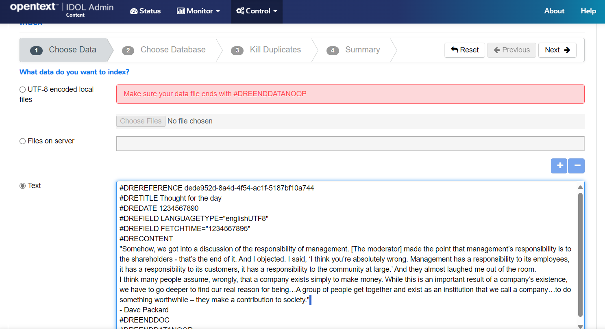

    > HINT: You must edit the text for the **Next** button to activate, just add a space at the end as shown in the screenshot above.

1. Click **Next** to advance to "Choose Database" and select "News" from the dropdown menu:

    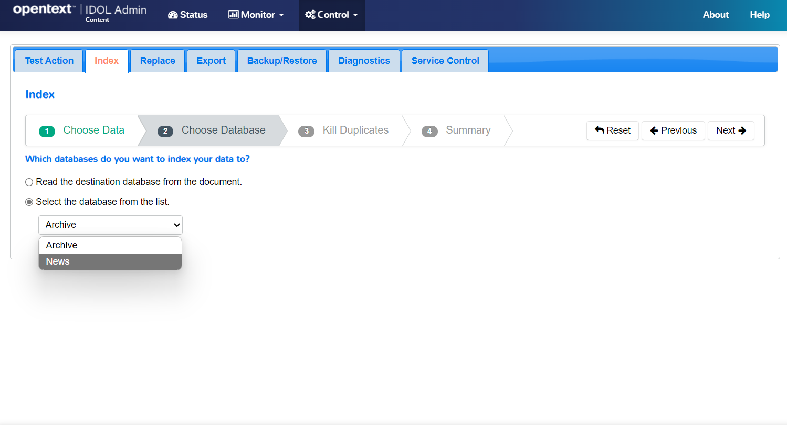

1. Click **Next** to advance to "Kill Duplicates". Keep default options.

1. Click **Next** to advance to "Summary", then click **Index**

    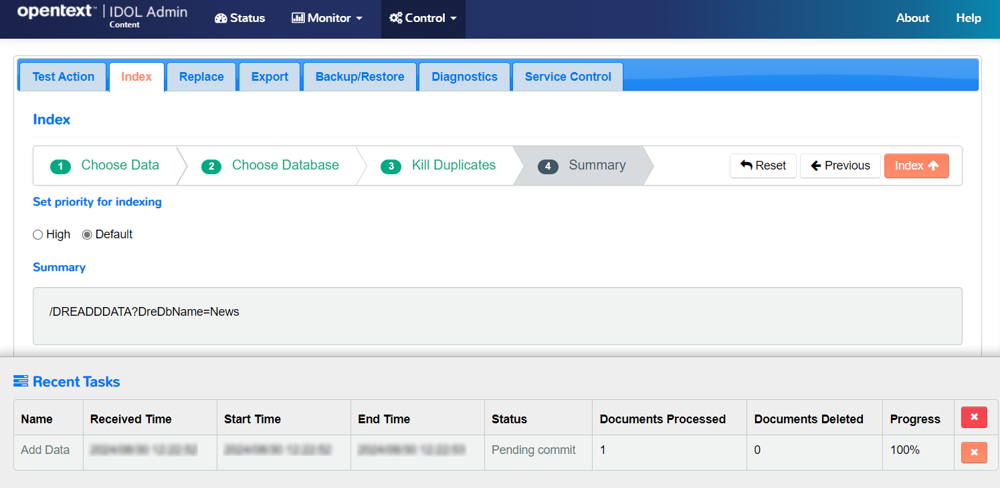

1. Scroll down and click **Sync** to finalize the indexing.

    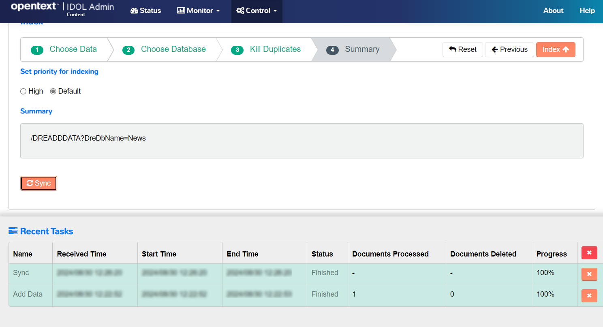

You can now retrieve your document with a query:

1. Under the "Control" menu on the top bar, select "Databases".

    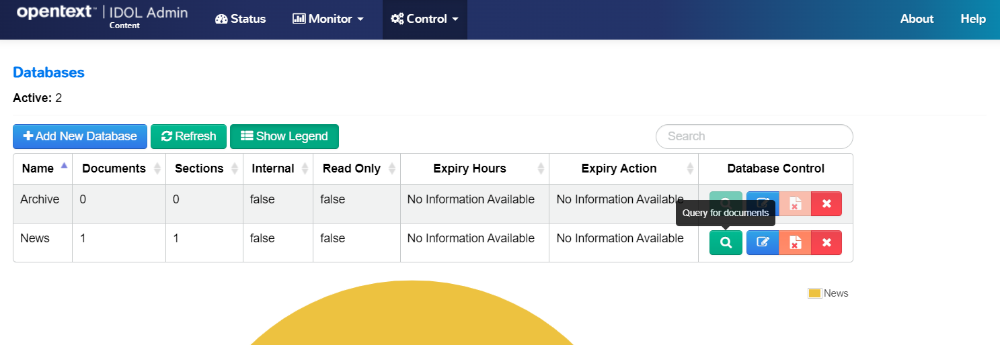

1. **Click** the search icon for the "News" database to query for documents.

    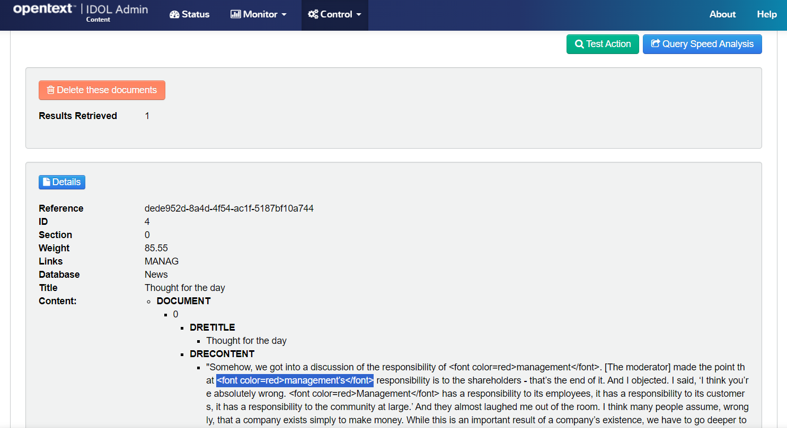

### Generate an answer from your documents

Open IDOL Admin for Answer Server at <http://localhost:12000/action=admin#page/console/test-action> and do the following:

1. Paste the following action:

    ```url
    action=ask&text=what is management's responsibility?
    ```

    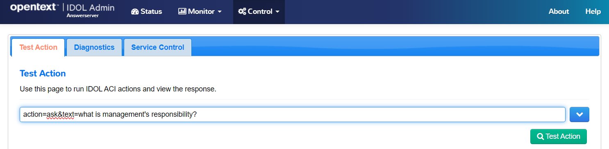

1. Click **Test Action** to see your LLM-generated answer.

    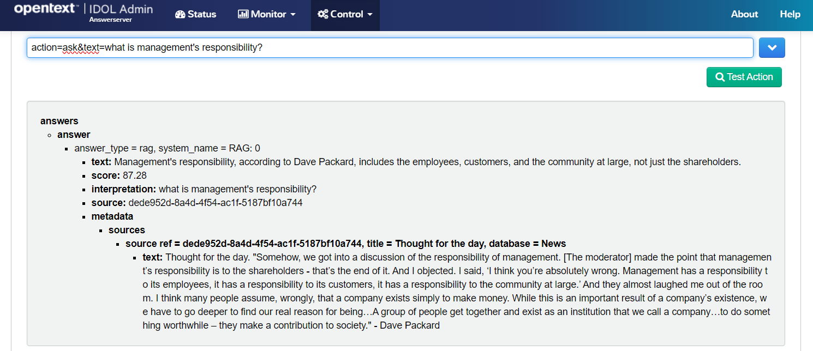

    > NOTE: The answer is returned with a confidence score, as well as details of the reference document(s) for verification.

#### Possible answer errors

If your LLM Server is not running or not accessible, you will see the following error message:

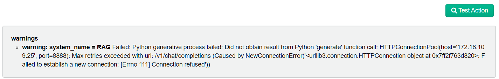

Ensure that your LLM server is running and that your `.env` file correctly references your WSL system IP address.

#### Under the hood with RAG

When we run the Answer Server **Ask** action, you know that behind-the-scenes IDOL Content is being used to return relevant text as context for the LLM.

Let's see exactly how this works:

1. the question is asked:

    ```url
    action=ask&text=what is management's responsibility?
    ```

1. the question text is converted to a search query:

    ```txt
    managements responsibility
    ```

1. a query action has sent to IDOL Content:

    ```url
    action=query&text=managements responsibility&expandQuery=true
    ```

    > NOTE: The `expandQuery` property only has an effect if you also configure QMS.

1. the response is requested with summarized text only:

    ```url
    &print=none&summary=rag
    ```

1. limits are placed on the returned text to match the acceptable prompt size for your target LLM:

    ```url
    &maxResults=3&totalCharacters=9050
    ```

    > REMINDER: See [above](#considerations-for-prompt-size) for discussion on parameters affecting the prompt size.

To see the IDOL Content query being run, try out one of *the most useful* IDOL component actions: [Get Request Log](http://idol-docker-host:9100/a=grl):

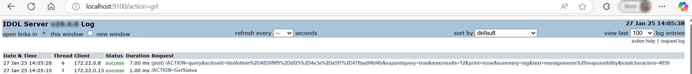

From this view, you can click on any action to re-run it and view the response:

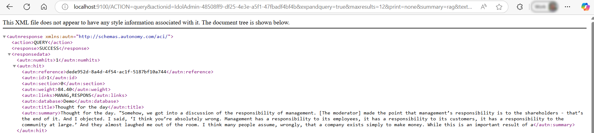

This behind the scenes use of the powerful IDOL Content query is what provides the key to making use of your data with generative AI.

### Ask questions in Data Admin

To complete this lesson, now try to ask the same question from the IDOL Data Admin user interface.

Log in again to IDOL Data Admin on <http://idol-docker-host:8080/>, with your new user, *e.g.* "idol".

From the **Search** page, try the same question "What is management's responsibility?"

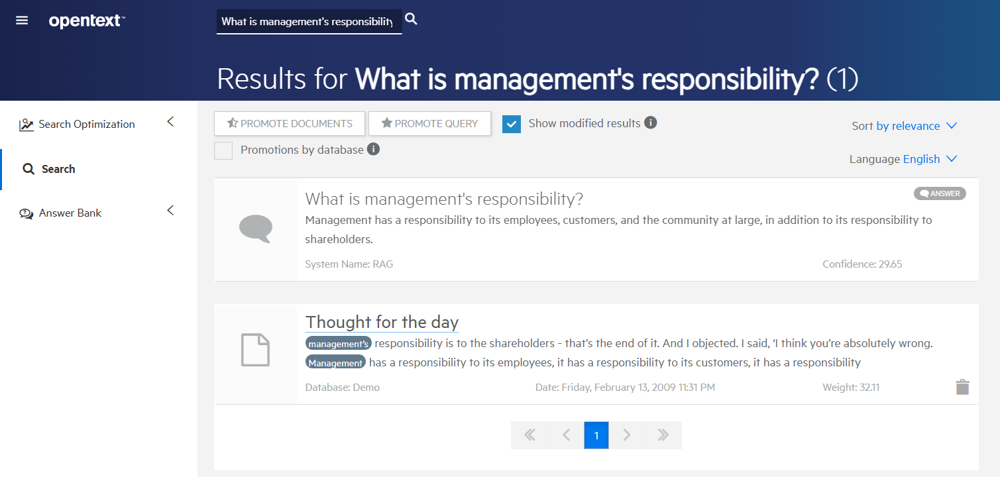

## Conclusions

You have created a generative-AI-enabled question answering system on your own laptop using IDOL Answer's RAG system.  You understand the chain of events from question to query to answer.

## Next step

Extend this containerized deployment to add NiFi and index more data to interrogate with IDOL Answer Server.

Go to [Part III](./PART_III.md).

Alternatively, explore other advanced IDOL configurations in the [showcase section](../../README.md#showcase-lessons).
