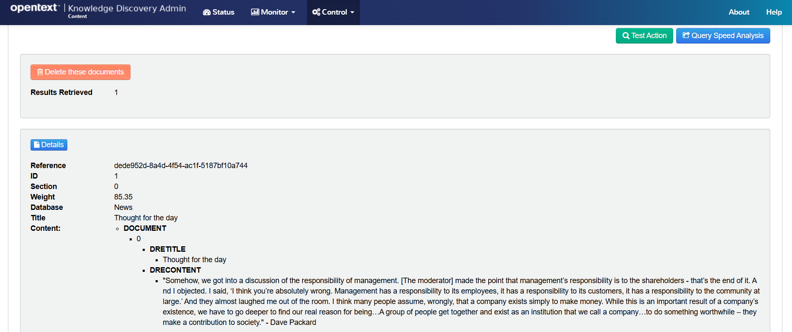

# Answer questions with RAG

**RAG** (Retrieval Augmented Generation) uses a large language models (LLM) to generate answers from trusted documents in your system.

IDOL Answer Server's RAG system converts your question into a query to retrieve relevant documents.  Selected text from these documents is then sent as "context" with your question as a prompt to the external LLM.  This allows the LLM to answer questions based on your data.  IDOL Answer Server can then return the answer with reference documents for validation.


The architecture is open to your LLM of your choice ("Bring Your Own Model"), which can be hosted locally (requiring a GPU for responsive answering), or as a remote service, which may incur a cost.

In this lesson, you will:

- Install an LLM server and download a local model.
- Configure IDOL Answer Server with a RAG system.
- Ingest sample documents into IDOL Content.
- Get answers from your documents using IDOL Data Admin.

---

- [System requirements](#system-requirements)
- [Create an account with Hugging Face](#create-an-account-with-hugging-face)
- [Set up a local LLM server](#set-up-a-local-llm-server)
- [Configure an Answer Server RAG system](#configure-an-answer-server-rag-system)
  - [Possible start-up errors](#possible-start-up-errors)
- [Get an answer from a sample document](#get-an-answer-from-a-sample-document)
  - [Index a sample document](#index-a-sample-document)
  - [Generate an answer from your document](#generate-an-answer-from-your-document)
    - [Possible answer errors](#possible-answer-errors)
- [Conclusions](#conclusions)
- [Next step](#next-step)

---

## System requirements

For reasonable response times from an LLM, access to a GPU is recommended but is not essential.  These steps have been tested on a laptop with an Nvidia T600 card, with 4 GB memory.

How is a GPU not essential, you may wonder? You will be downloading [quantized LLMs](https://huggingface.co/docs/optimum/main/en/concept_guides/quantization), which have reduced compute and memory costs and can run on CPU.  If you have a smaller Nvidia GPU available, like the 4 GB T600, you can use models with support for "partial GPU offloading" to run even faster.

## Create an account with Hugging Face

Hugging Face Hub has become the standard platform for hosting machine learning models including LLMs.  Many models are shared openly but a growing number require you to create an account and use an associated access token.

Create your (free) account here: <https://huggingface.co/join>.

Navigate to the access tokens page in settings: <https://huggingface.co/settings/tokens> and create a new token.


Give your token and memorable name and **Read** access.  Save the token value somewhere safe, you will not be able to see it again.

## Set up a local LLM server

IDOL Answer's RAG system requires an HTTP server to provide a set of APIs to interact with a downloaded LLM.  There are a growing number of options available, many of which conveniently integrate with Hugging Face and can be deployed with Docker.

For a quick and easy setup on your Windows laptop, follow [these steps](./LLAMA_CPP.md) to install LLaMA.cpp server.

> NOTE: [LLaMA.cpp](https://github.com/ggerganov/llama.cpp) is the opensource engine behind the popular (free for personal use) desktop application [LM Studio](https://lmstudio.ai/).

> NOTE: For production deployments, consider using [vLLM](https://docs.vllm.ai/en/latest/serving/deploying_with_docker.html#deploying-with-docker). vLLM does not currently support quantized LLMs.

## Configure an Answer Server RAG system

Edit your Answer Server configuration file `/opt/idol/idol-containers-toolkit/data-admin/answerserver/answerserver.cfg`:

1. Allow access to IDOL Admin from outside the container:

    ```diff
    [Service]
    ...
    - Access-Control-Allow-Origin=http://localhost:12000
    + Access-Control-Allow-Origin=*
    ```

1. Replace the default "Passage Extractor" system with a RAG system for LLM-enabled question answering:

    ```diff
    [Systems]
    0=AnswerBank
    -1=PassageExtractor
    +1=RAG
    2=FactBank
    +
    + [RAG]
    + Type=RAG
    + IdolHost=idol-passageextractor-content
    + IdolAciPort=9100
    + ModuleID=RAGLLMModule 
    + RetrievalType=mixed
    + PromptTemplatePath=./rag/prompt_template.txt
    + PromptTokenLimit=1000
    + MaxQuestionSize=70
    + 
    + [RAGLLMModule]
    + Type=GenerativePython 
    + Script=./rag/llamacpp_server.py
    ```

The above configuration references two external files:

- `prompt_template.txt` combines the users question and the text from relevant documents retrieved by IDOL into a single prompt for the LLM.
- `llamacpp_server.py` defines functions for Answer Server to call out to the LLaMA.cpp server you have set up.

Both files are included in this tutorial repository.  Copy them into your docker project to give:

```sh
$ ls /opt/idol/idol-containers-toolkit/data-admin/answerserver/rag/
 llamacpp_server.py   prompt_template.txt
```

The `.py` script expects properties from some environment variables to run.  Add them to your docker environment with:

1. Add the following lines to `/opt/idol/idol-containers-toolkit/data-admin/.env`:

    ```ini
    # RAG System parameters for IDOL Answer Server
    IDOL_LLM_ENDPOINT=http://<YOUR_WSL_IP_ADDRESS>:8888/v1/chat/+ completions # llama.cpp server
    IDOL_LLM_MODEL_QUANTIZED=/models/Mistral-7B-Instruct-v0.+ 3-Q4_K_M.gguf
    IDOL_LLM_MODEL=mistralai/Mistral-7B-Instruct-v0.3
    IDOL_LLM_MODEL_REVISION=main
    IDOL_HUGGINGFACE_API_TOKEN=<YOUR_TOKEN>
    ```

    > TIP: You noted down your Hugging Face token string earlier; it begins with `hf_`.  This token is required by the `mistralai` project to access their models.  

    > TIP: You have already found your WSL (guest) IP address in the [WSL guide](../../introduction/containers/SETUP_WINDOWS_WSL.md#network-access)

1. Edit the following section in `/opt/idol/idol-containers-toolkit/data-admin/docker-compose.yml`:

    ```diff
    idol-answerserver:
      image: ${IDOL_REGISTRY}/answerserver:${IDOL_SERVER_VERSION}
      extra_hosts: *external-licenseserver-host
    + environment:
    +   - IDOL_LLM_ENDPOINT=${IDOL_LLM_ENDPOINT}
    +   - IDOL_LLM_MODEL=${IDOL_LLM_MODEL}
    +   - IDOL_LLM_MODEL_QUANTIZED=${IDOL_LLM_MODEL_QUANTIZED}
    +   - IDOL_HUGGINGFACE_API_TOKEN=${IDOL_HUGGINGFACE_API_TOKEN}
      volumes:
    +   - ./answerserver/rag:/answerserver/rag
        - ./answerserver/answerserver.cfg:/answerserver/cfg/answerserver.cfg
        - ./answerserver/startup_tasks.sh:/answerserver/prestart_scripts/002_startup_tasks.sh
    ```

Restart the Answer Server container to apply these changes:

```sh
cd /opt/idol/idol-containers-toolkit/data-admin
./deploy.sh stop idol-answerserver
./deploy.sh up -d
```

Check the logs to see the RAG system is created without errors:

```sh
$ docker logs data-admin-idol-answerserver-1 -f
...
30/08/2024 08:33:36 [1] 30-Normal: Created answer system 'RAG' (type: rag)
```

### Possible start-up errors

If you do not add your Hugging Face token correctly, or it does not have the correct "Read" access, as discussed above, you will see the following error message:

```log
30/08/2024 14:22:15 [1] 99-Always: Failed to configure answer system: Invalid configuration file: Failed to import Python script ./rag/llamacpp_server.py: Invalid token passed!
```

## Get an answer from a sample document

### Index a sample document

Open IDOL Admin for Content at <http://localhost:9100/action=admin#page/console/index> and do the following:

1. Under "Choose Data", select the "Text" radio button.  For simplicity, add the existing sample document "Thought for the Day".

    

    > NOTE: You must edit the text for the **Next** button to activate, just add a space at the end as shown in the screenshot above.

1. Click **Next** to advance to "Choose Database" and select "News" from the dropbown menu:

    

1. Click **Next** to advance to "Kill Duplicates".  Keep default options.

1. Click **Next** to advance to "Summary", then click **Index**

    

1. Scroll down and click **Sync** to finalize the indexing.

    

You can now search for your document:

1. Under the "Control" menu on the top bar, select "Databases".

1. **Click** the search icon to query for documents.

    

1. Modify the example query action to search for the text "management":

    
  
1. Add another query option, for example to highlight matching terms in the returned documents, then click **Test Action**.

    

    > NOTE: For details on this `query` action, see the [IDOL Content Help](https://www.microfocus.com/documentation/idol/IDOL_24_3/Content_24.3_Documentation/Help/Content/Actions/Query/Query.htm).

1. View the results and note how the matching terms for the query text "management" are marked up for highlighting.

    

### Generate an answer from your document

Open IDOL Admin for Answer Server at <http://localhost:12000/action=admin#page/console/test-action> and do the following:

1. Paste the following action:

    ```url
    action=ask&text=what is management's responsibility?
    ```

    

1. Click **Test Action** to see your LLM-generated answer.

    

    > NOTE: The answer is returned with a confidence score, as well as details of the reference document(s) for verification.

#### Possible answer errors

If your LLM Server is not running or not accessible, you will see the following error message:


Ensure that your LLaMA.cpp server is running and that your `.env` file correctly references your WSL system IP address.

## Conclusions

You have created a generative-AI-enabled question answering system on your own laptop using IDOL Answer's RAG system.  

## Next step

Build a set of curated answers with Answer Bank.  Go to [Part III](./PART_III.md).

Alternatively, explore other advanced IDOL configurations in the [showcase section](../../README.md#advanced-lessons).
