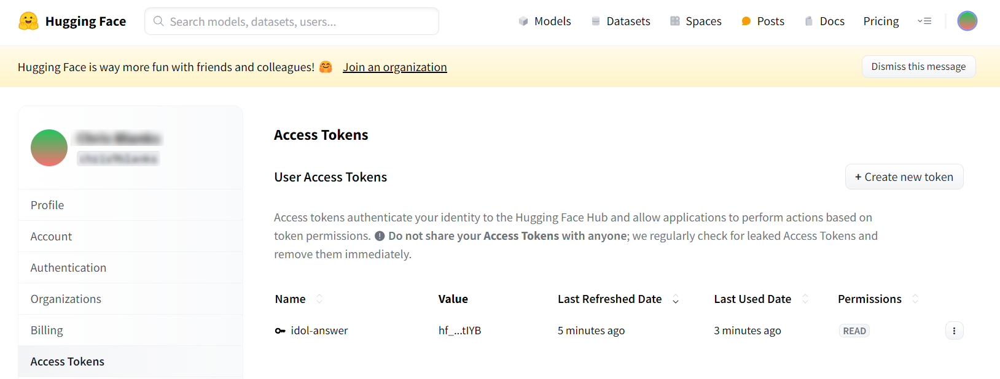

# Answer questions with RAG

The **RAG** process combined a search (retrieval) engine with a large language model (LLM) to generate answers from trusted documents in your system.

In this lesson, you will:

- Install an LLM server and download a local model.
- Configure IDOL Answer Server with a RAG system.
- Ingest a sample document into IDOL Content.
- Get answers from your document using IDOL Data Admin.

---

- [RAG (Retrieval Augmented Generation) with IDOL Answer Server](#rag-retrieval-augmented-generation-with-idol-answer-server)
- [Hardware requirements](#hardware-requirements)
- [Local LLM setup](#local-llm-setup)
  - [Download an LLM](#download-an-llm)
  - [Set up a local LLM server](#set-up-a-local-llm-server)
  - [Download local tokenizer files](#download-local-tokenizer-files)
    - [Possible errors](#possible-errors)
- [Configure an Answer Server RAG system](#configure-an-answer-server-rag-system)
- [Get an answer from a sample document](#get-an-answer-from-a-sample-document)
  - [Index a sample document](#index-a-sample-document)
  - [Generate an answer from your documents](#generate-an-answer-from-your-documents)
    - [Possible answer errors](#possible-answer-errors)
- [Conclusions](#conclusions)
- [Next step](#next-step)

---

## RAG (Retrieval Augmented Generation) with IDOL Answer Server

IDOL Answer Server's RAG system converts your question into a query to retrieve relevant documents. Selected text from these documents is then sent as "context" along with your question as a prompt to the external LLM. This allows the LLM to answer questions based on your data. IDOL Answer Server can then return the answer with reference documents for validation.


IDOL Answer Server's RAG architecture is open to your LLM of choice ("Bring Your Own Model"), which can be hosted locally, or as a remote service.  Remote LLM services may incur a cost and could expose your data to third parties.  For this guide, we will set up a local system.

## Hardware requirements

For reasonable response times from an LLM, access to a GPU is recommended but is not essential for testing and demonstrations.

"How is a GPU not essential?", you may wonder. You will be downloading [quantized LLMs](https://huggingface.co/docs/optimum/main/en/concept_guides/quantization), which have reduced compute and memory costs and can run on CPU.

## Local LLM setup

**Hugging Face Hub** has become the standard platform for hosting machine learning models including LLMs. Many models are shared openly but a growing number require you to create an account and use an associated access token.

Create your (free) account here: <https://huggingface.co/join>:

1. Navigate to the access tokens page in settings: <https://huggingface.co/settings/tokens> and create a new token.

    

1. Give your token a memorable name and grant **Read** access. Save the token value somewhere safe, you will not be able to see it again.

With this token you can download local models and supporting files to set up your system.  You will need:

1. a **model file** (the "LLM"), used to generate answers,
1. a **model server**, which provides an API that lets you ask questions, and
1. a **tokenizer**, used to determine the amount of contextual information (relevant text retrieved by IDOL) that can be passed to the LLM along with your question, and so enable you to get an answer based on your own data.

### Download an LLM

You can choose your favorite LLM, but for this tutorial, you will use `Mistral-7B-Instruct-v0.3-GGUF`. Click to [download](https://huggingface.co/lmstudio-community/Mistral-7B-Instruct-v0.3-GGUF/resolve/main/Mistral-7B-Instruct-v0.3-Q4_K_M.gguf?download=true) the model from Hugging Face with your web browser.

This model has been chosen to be both good at answering your questions and acceptably performant on your laptop for testing, even without a GPU.

> NOTE: It is a quantized version of the `Mistral-7B-Instruct-v0.3` LLM, which itself is the result of fine-tuning `Mistral-7B-v0.3` to follow user instructions. To view details of the model and its provenance, go to [Hugging Face](https://huggingface.co/lmstudio-community/Mistral-7B-Instruct-v0.3-GGUF).
>
> 

### Set up a local LLM server

IDOL Answer's RAG system requires an HTTP server to provide a set of APIs to interact with a downloaded LLM. There are a growing number of options available, many of which conveniently integrate with Hugging Face and can be deployed with Docker.

For a quick and easy setup on your Windows laptop, follow [these steps](./LLM_SERVER.md) to install LLaMA.cpp as an example LLM server.

> NOTE: [LLaMA.cpp](https://github.com/ggerganov/llama.cpp) is the opensource engine behind the popular (free for personal use) desktop application [LM Studio](https://lmstudio.ai/), which also has a [server mode](https://lmstudio.ai/docs/api/server).

> NOTE: For production deployments, consider using [vLLM](https://docs.vllm.ai/en/latest/serving/deploying_with_docker.html#deploying-with-docker). We won't use it here because vLLM does not currently support quantized LLMs.

### Download local tokenizer files

IDOL Answer's RAG system requires a "tokenizer" in order to determine the amount of contextual information that can be passed to an LLM for question answering.

This project includes a helper script that will download the appropriate tokenizer for your LLM.

Copy the script into your deployment folder to give:

```sh
/opt/idol/idol-containers-toolkit/data-admin/answerserver/rag/download_tokenizer_files.py
```

Edit the script to add your Hugging Face access token:

```py
LLM_MODEL_TOKENIZER = "mistralai/Mistral-7B-Instruct-v0.3"
LLM_MODEL_REVISION = "main"
HUGGINGFACE_API_TOKEN = "<YOUR_TOKEN>"
```

> TIP: You noted down your Hugging Face token string earlier; it begins with `hf_`. This token is required by the `mistralai` project to access their tokenizer.

Install dependencies and run the script:

```sh
cd/opt/idol/idol-containers-toolkit/data-admin/answerserver/rag
pip install sentencepiece
pip install protobuf
python3 download_tokenizer_files.py
```

This should produce a folder called `tokenizer_cache`, with the following contents:

```sh
$ ls tokenizer_cache/
special_tokens_map.json  tokenizer.json  tokenizer.model  tokenizer_config.json
```

#### Possible errors

If you do not add your Hugging Face token correctly, or it does not have the correct "Read" access, as discussed above, you will see the following error message:

```log
ValueError: Invalid token passed!
```

## Configure an Answer Server RAG system

Edit your Answer Server configuration file `/opt/idol/idol-containers-toolkit/data-admin/answerserver/answerserver.cfg`:

1. Allow access to IDOL Admin from outside the container:

    ```diff
    [Service]
    ...
    - Access-Control-Allow-Origin=http://localhost:12000
    + Access-Control-Allow-Origin=*
    ```

1. Replace the default "Passage Extractor" system with a "RAG" system for LLM-enabled question answering:

    ```diff
    [Systems]
    0=AnswerBank
    -1=PassageExtractor
    +1=RAG
    2=FactBank
    +
    + [RAG]
    + Type=RAG
    + IdolHost=idol-passageextractor-content
    + IdolAciPort=9100
    + ModuleID=RAGLLMModule 
    + RetrievalType=mixed
    + PromptTemplatePath=./rag/prompt_template.txt
    + PromptTokenLimit=1000
    + MaxQuestionSize=70
    + 
    + [RAGLLMModule]
    + Type=GenerativePython 
    + Script=./rag/llamacpp_server.py
    ```

The above configuration references two external files:

- `prompt_template.txt`: combines the users question and the text from relevant documents retrieved by IDOL into a single prompt for the LLM.
- `llamacpp_server.py`: defines functions for Answer Server to call out to the LLaMA.cpp server you have set up.

Both files are included in this tutorial repository. Copy them into your docker project in the same folder as your tokenizer files:

```sh
/opt/idol/idol-containers-toolkit/data-admin/answerserver/rag/
```

The `.py` script expects properties from some environment variables to run. Add them to your docker environment with:

1. Add the following lines to `/opt/idol/idol-containers-toolkit/data-admin/.env`:

    ```ini
    # RAG System parameters for IDOL Answer Server
    IDOL_LLM_ENDPOINT=http://<YOUR_WSL_IP_ADDRESS>:8888/v1/chat/completions # llama.cpp server
    IDOL_LLM_MODEL=/models/Mistral-7B-Instruct-v0.3-Q4_K_M.gguf
    ```

    > NOTE: You have already found your WSL (guest) IP address in the [WSL guide](../../introduction/containers/SETUP_WINDOWS_WSL.md#network-access), where the value shown was `172.18.109.25`.

    > NOTE: If you prefer another model, specify it here, *e.g.*:
    >
    > ```ini
    > IDOL_LLM_MODEL=/models/Llama-3.2-3B-Instruct-Q4_K_M.gguf
    > ```

1. Add these new files and environment variables to your deployment by editing `/opt/idol/idol-containers-toolkit/data-admin/docker-compose.yml` as follows:

    ```diff
    idol-answerserver:
      image: ${IDOL_REGISTRY}/answerserver:${IDOL_SERVER_VERSION}
      extra_hosts: *external-licenseserver-host
    + environment:
    +   - IDOL_LLM_ENDPOINT=${IDOL_LLM_ENDPOINT}
    +   - IDOL_LLM_MODEL=${IDOL_LLM_MODEL}
      volumes:
    +   - ./answerserver/rag:/answerserver/rag
        - ./answerserver/answerserver.cfg:/answerserver/cfg/answerserver.cfg
        - ./answerserver/startup_tasks.sh:/answerserver/prestart_scripts/002_startup_tasks.sh
    ```

Restart the Answer Server container to apply these changes:

```sh
cd /opt/idol/idol-containers-toolkit/data-admin
./deploy.sh stop idol-answerserver
./deploy.sh up -d
```

Check the logs to see the RAG system is created without errors:

```sh
$ docker logs data-admin-idol-answerserver-1 -f
...
30/08/2024 08:33:36 [1] 30-Normal: Created answer system 'RAG' (type: rag)
```

## Get an answer from a sample document

### Index a sample document

Open IDOL Admin for Content at <http://localhost:9100/action=admin#page/console/index> and do the following:

1. Under "Choose Data", select the "Text" radio button. For simplicity, add the existing sample document "Thought for the Day".

    

    > HINT: You must edit the text for the **Next** button to activate, just add a space at the end as shown in the screenshot above.

1. Click **Next** to advance to "Choose Database" and select "News" from the dropdown menu:

    

1. Click **Next** to advance to "Kill Duplicates". Keep default options.

1. Click **Next** to advance to "Summary", then click **Index**

    

1. Scroll down and click **Sync** to finalize the indexing.

    

You can now retrieve your document with a query:

1. Under the "Control" menu on the top bar, select "Databases".

    

1. **Click** the search icon for the "News" database to query for documents.

    

### Generate an answer from your documents

Open IDOL Admin for Answer Server at <http://localhost:12000/action=admin#page/console/test-action> and do the following:

1. Paste the following action:

    ```url
    action=ask&text=what is management's responsibility?
    ```

    

1. Click **Test Action** to see your LLM-generated answer.

    

    > NOTE: The answer is returned with a confidence score, as well as details of the reference document(s) for verification.

#### Possible answer errors

If your LLM Server is not running or not accessible, you will see the following error message:


Ensure that your LLM server is running and that your `.env` file correctly references your WSL system IP address.

## Conclusions

You have created a generative-AI-enabled question answering system on your own laptop using IDOL Answer's RAG system.

## Next step

Index your on data into IDOL using NiFi.
<!-- Go to [Part III](./PART_III.md). -->

> COMING SOON!

Jump to Answer Bank configuration and build a set of curated answers.
<!-- Go to [Part IV](./PART_IV.md). -->

> COMING SOON!

Alternatively, explore other advanced IDOL configurations in the [showcase section](../../README.md#showcase-lessons).
