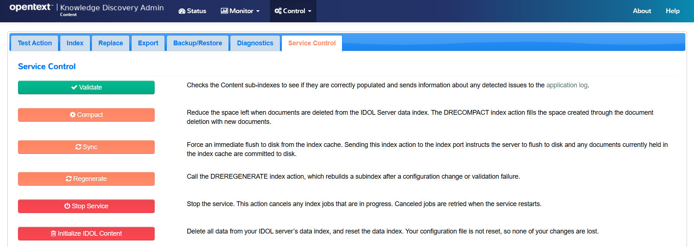
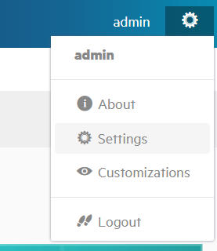
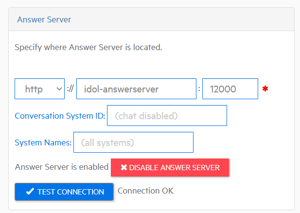
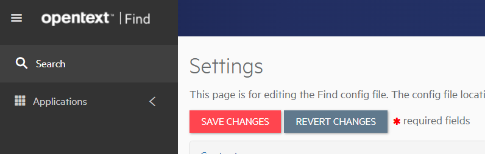
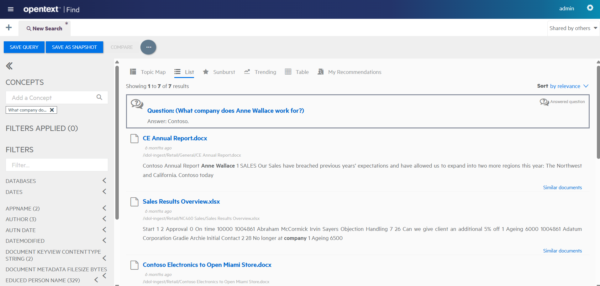

# PART III - Combine with NiFi ingest

As previously noted, the out-of-the-box `data-admin` deployment does not contain a NiFi instance for document ingestion. Adding that will enable you to index any files into your system and build your own great demos with Knowledge Discovery Answer Server!

In this lesson, you will:

- Combining elements you have already seen from `basic-idol` into this deployment.
- Ingest more sample documents with NiFi.
- Get answers from your new documents using Knowledge Discovery Find.

---

- [Borrowing from `basic-idol`](#borrowing-from-basic-idol)
  - [Sample data folder](#sample-data-folder)
  - [NiFi container](#nifi-container)
  - [Knowledge Discovery Content configuration](#knowledge-discovery-content-configuration)
  - [Knowledge Discovery View Server configuration](#knowledge-discovery-view-server-configuration)
  - [Knowledge Discovery Find](#knowledge-discovery-find)
- [Restart the modified `data-admin` deployment](#restart-the-modified-data-admin-deployment)
  - [Follow the ingestion](#follow-the-ingestion)
  - [Confirm documents are indexed into Knowledge Discovery Content](#confirm-documents-are-indexed-into-knowledge-discovery-content)
- [Try Knowledge Discovery Find for question answering](#try-knowledge-discovery-find-for-question-answering)
  - [Configure Find for question answering](#configure-find-for-question-answering)
  - [Ask a question in Knowledge Discovery Find](#ask-a-question-in-knowledge-discovery-find)
- [Conclusions](#conclusions)
- [Next step](#next-step)

---

## Borrowing from `basic-idol`

In order to replicate the data ingestion and viewing set up from the previous lesson, we need:

1. the sample data folder with our documents to be ingested,
1. the NiFi container,
1. the Knowledge Discovery Content configuration file with our custom parametric field setup,
1. the Knowledge Discovery View Server configuration, using NiFi to retrieve documents, and
1. the Knowledge Discovery Find container with view configuration.

### Sample data folder

Copy over the sample data "hot folder" configuration:

```sh
cd /opt/idol/idol-containers-toolkit/data-admin
cp ../basic-idol/docker-compose.bindmount.yml .
```

Update your `deploy.sh` script to use it:

```diff
docker compose \
  -f docker-compose.yml \
  -f docker-compose.expose-ports.yml \
+ -f docker-compose.bindmount.yml \
  "$@"
```

### NiFi container

Copy over the `nifi` configuration folder:

```sh
cp -r ../basic-idol/nifi .
```

Edit the Knowledge Discovery Content hostname in `nifi/flow/basic.json`:

```diff
- "Host": "idol-content",
+ "Host": "idol-passageextractor-content",
```

Add the following service to your `docker-compose.yml` file:

```yml
idol-nifi:
  image: ${IDOL_REGISTRY}/nifi-ver2-minimal:${IDOL_SERVER_VERSION} # choose nifi-ver{1,2}-{minimal,full}
  extra_hosts: *external-licenseserver-host
  shm_size: 256m
  environment:
    - NIFI_WEB_PROXY_CONTEXT_PATH=/idol-nifi
    - NIFI_WEB_HTTP_PORT=8081
    - NIFI_SENSITIVE_PROPS_KEY=my_nifi_sensitive_props_key
    - IDOL_NIFI_FLOWFILE=/opt/nifi/scripts/flow-basic-idol.json
  volumes:
    - idol-ingest-volume:/idol-ingest
    - ./nifi/resources/import-flow.sh:/opt/nifi/scripts/import-flow.sh
    - ./nifi/resources/basic-idol-entrypoint.sh:/opt/nifi/scripts/basic-idol-entrypoint.sh
    - ./nifi/flow/basic.json:/opt/nifi/scripts/flow-basic-idol.json
  entrypoint:
    - sh
    - -c
    - "/opt/nifi/scripts/basic-idol-entrypoint.sh"
```

Add the following service to your `docker-compose.expose-ports.yml` file:

```yml
idol-nifi:
  ports:
    - 8001:8081
    - 11000:11000
```

### Knowledge Discovery Content configuration

In the previous lesson, we created a configuration file mount point to enable some edits. Let's replicate that here.

```sh
cp -r ../basic-idol/content/cfg passageextractor_content/
```

Update your `docker-compose.yml` to use it:

```diff
idol-passageextractor-content:
  image: ${IDOL_REGISTRY}/content:${IDOL_SERVER_VERSION}
  extra_hosts: *external-licenseserver-host
  volumes:
-   - ./passageextractor_content/content.cfg:/content/cfg/content.cfg
+   - ./passageextractor_content/cfg:/content/cfg
```

### Knowledge Discovery View Server configuration

In `docker-compose.yml`, remove the mounted Knowledge Discovery View Server configuration to roll back to defaults:

```diff
idol-dataadmin-viewserver:
  image: ${IDOL_REGISTRY}/view:${IDOL_SERVER_VERSION}
  extra_hosts: *external-licenseserver-host
  environment: *http-proxy-settings
- volumes:
-   - ./viewserver/view.cfg:/view/cfg/view.cfg
-   - ./viewserver/startup_tasks.sh:/view/prestart_scripts/002_startup_tasks.sh
```

Restart Knowledge Discovery View Server and copy out the default configuration files.

```sh
./deploy.sh down idol-dataadmin-viewserver
./deploy.sh up -d
```

```sh
$ docker cp data-admin-idol-dataadmin-viewserver-1:/view/cfg ./viewserver/
Successfully copied 11.8kB to /opt/idol/tutorial/idol-containers-toolkit/data-admin/viewserver/
```

Mount the configuration folder in `docker-compose.yml`, ready to make edits:

```diff
idol-dataadmin-viewserver:
  image: ${IDOL_REGISTRY}/view:${IDOL_SERVER_VERSION}
  extra_hosts: *external-licenseserver-host
  environment: *http-proxy-settings
+ volumes:
+   - ./viewserver/cfg:/view/cfg
```

Edit Agent Store and Document Store host details in your `viewserver/cfg/view.cfg` file:

```diff
- IDOLHost=idol-agentstore
- IDOLPort=9050
+ IDOLHost=idol-qms-agentstore
+ IDOLPort=20050
```

```diff
- DocumentStoreHost=idol-content
+ DocumentStoreHost=idol-passageextractor-content
DocumentStorePort=9100
```

Restart Knowledge Discovery View Server:

```sh
./deploy.sh down idol-dataadmin-viewserver
./deploy.sh up -d
```

### Knowledge Discovery Find

Copy over the sample data "hot folder" configuration:

```sh
cp -r ../basic-idol/find .
```

Edit the Knowledge Discovery server host names in `find/config_basic.json`:

```diff
- "Host": "idol-community",
+ "Host": "idol-dataadmin-community",
```

```diff
- "Host": "idol-content",
+ "Host": "idol-passageextractor-content",
```

```diff
- "Host": "idol-view",
+ "Host": "idol-dataadmin-viewserver",
```

Enable and configure Knowledge Discovery AnswerServer:

```diff
"answerServer" : {
  "server" : {
    "protocol" : "HTTP",
-   "host" : "localhost",
-   "port" : 7700
+   "host" : "idol-answerserver",
+   "port" : 12000
  },
  "systemNames" : [ ],
- "enabled" : false,
+ "enabled" : true,
  "conversationSystemName" : ""
},
```

Add the following service to your `docker-compose.yml` file:

```yml
idol-find:
  image: ${IDOL_REGISTRY}/find:${IDOL_SERVER_VERSION}
  environment:
    - IDOL_UI_CFG=config_basic.json # this controls the configuration of Find
  volumes:
    - ./find/config_basic.json:/opt/find/home/config_basic.json:ro # this mounts an external cfg file
  depends_on:
    - idol-answerserver
    - idol-dataadmin-community
    - idol-dataadmin-viewserver
```

Add the following service to your `docker-compose.expose-ports.yml` file:

```yml
idol-find:
  ports:
    - 8000:8000
```

## Restart the modified `data-admin` deployment

Stop and destroy the existing Knowledge Discovery Content instance:

```sh
./deploy.sh down idol-passageextractor-content
```

Launch the updated deployment script to start all the new containers:

```sh
./deploy.sh up -d
```

### Follow the ingestion

Monitor the NiFi startup logs with:

```sh
./deploy.sh logs -f idol-nifi
```

Open NiFi at <http://idol-docker-host:8001/nifi/> and note that the processors are automatically started.

### Confirm documents are indexed into Knowledge Discovery Content

Access Knowledge Discovery Content via the Knowledge Discovery Admin interface on <http://idol-docker-host:9100/a=admin>.

To make your documents immediately searchable, trigger synchronization with the **Sync** command:



## Try Knowledge Discovery Find for question answering

You have already seen how to use Knowledge Discovery Data Admin for question answering but you can now also see how to connect Knowledge Discovery Find to Answer Server to do the same thing.

### Configure Find for question answering

Log in to Find on <http://idol-docker-host:8000/>. The default credentials are `admin` / `lLuJBjv38ADR`.

> NOTE: This default password has been set up in Knowledge Discovery Community by the start-up script `data-admin/community/poststart_tasks.sh`.

From the cog menu, select **Settings**:



Scroll down to fill in the **Answer Server** configuration as follows:

- Set `hostname` to `idol-answerserver`
- Set `port` to `12000`
- Select **Enable Answer Serer**



Scroll up to click **Save changes** and then confirm.

### Ask a question in Knowledge Discovery Find

From the top left hamburger menu, select **Search**:



In the query box, ask the question "What company does Anne Wallace work for?", then navigate to the **List** tab to see the answer:



After a short wait for the LLM, you will see an answer box appear above the list of retrieved documents.

## Conclusions

You have learned how to merge useful parts from container configurations to make your own, more complex system.

With NiFi set up to index files into your Answer Server system, you now have the power to demonstrate RAG question answering on any data, right here on your laptop!

## Next step

Set up conversations with Knowledge Discovery Answer Server to enable a chat-style interaction in Knowledge Discovery Find.

Go to [Part IV](./PART_IV.md).

Alternatively, explore other advanced Knowledge Discovery configurations in the [showcase section](../../README.md#showcase-lessons).
