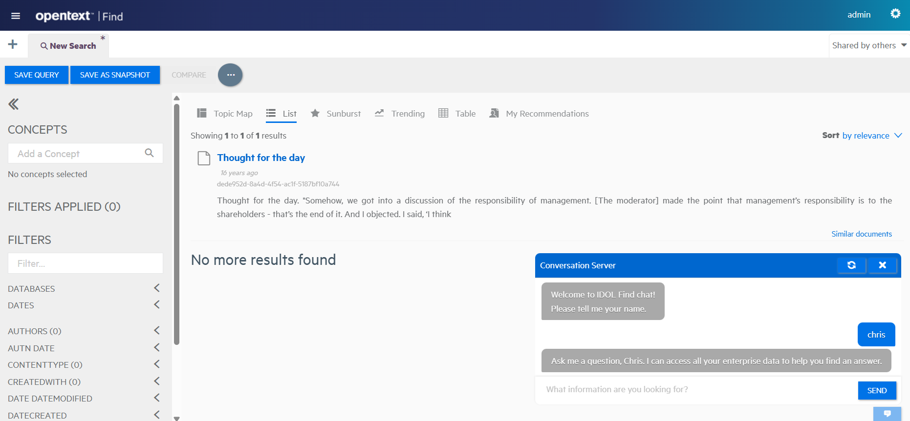
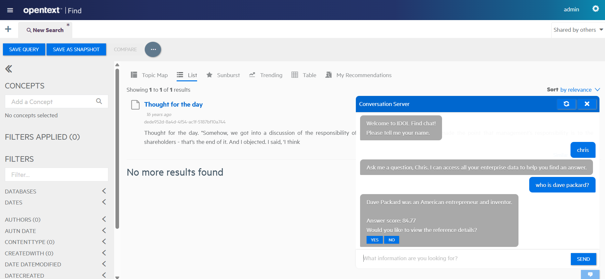
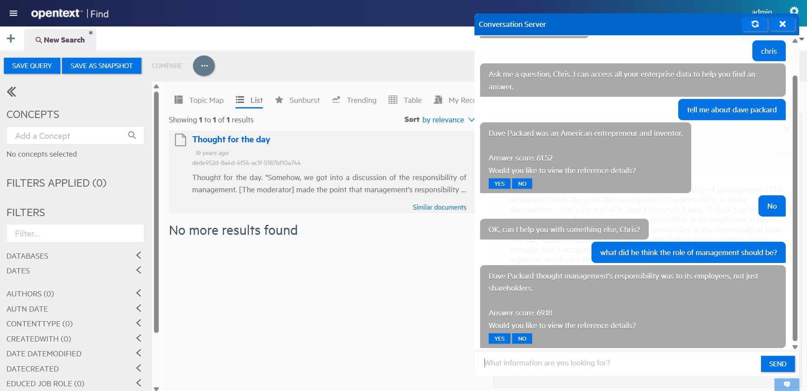

# PART IV - Enable Conversations

Set up a conversation system with IDOL Answer Server to enable a chat-style interaction.

In this lesson, you will:

- Configure a basic conversation system for IDOL Answer Server.
- Enable chat mode in IDOL Find.

---

- [Set up a simple conversation system](#set-up-a-simple-conversation-system)
  - [Update the Answer Server configuration](#update-the-answer-server-configuration)
  - [Mount the conversation task files](#mount-the-conversation-task-files)
  - [Apply changes for Answer Server](#apply-changes-for-answer-server)
  - [Update IDOL Find](#update-idol-find)
- [Your first conversation](#your-first-conversation)
- [Conclusions](#conclusions)
- [Next step](#next-step)

---

## Set up a simple conversation system

Back in [PART I](./PART_I.md#answer-system-types) of this guide, we introduced the various answer systems available in IDOL Answer Server.

The **Conversation** system is unique in that it introduces the concept of persistent variables across multiple **Ask** actions.

### Update the Answer Server configuration

Make the following edits to `dataadmin/answerserver/answerserver.cfg` to enable a Conversation system:

```diff
  [Systems]
  // Numbered list of config sections configuring an answer system
  0=AnswerBank
  1=RAG
  2=FactBank
+ 3=FindConversation
```

```ini
[FindConversation]
Type=Conversation
TaskConfigurationFile=./conversation/find-chat/task-config.json
# Idle conversations expire after 10 minutes
SessionExpirationIdleTime=600
```

The *Conversation*-type configuration section must reference a `task_config.json` file, which is where you configure the chat bot interaction, and an accompanying `task_handlers.lua` script, where you can include variables and define functions to run tasks and validate input.

Both files are included in this tutorial repository. Copy them into your docker project to give you:

```sh
$ ls /opt/idol/idol-containers-toolkit/data-admin/answerserver/conversation/find-chat/
sample_transcript.txt  task_config.json  task_handlers.lua
```

> NOTE: For full details of the conversation **task** configuration options, read the [documentation](https://www.microfocus.com/documentation/idol/IDOL_24_4/AnswerServer_24.4_Documentation/Help/Content/Manage%20Conversation/Conv_TaskConfiguration.htm).

> INFO: IDOL Answer Server ships with an interesting example Travel Agent chat bot, which you can copy out of the running container to explore:
>
> ```sh
> $ docker cp data-admin-idol-answerserver-1:/answerserver/conversation/examples/travel ./answerserver/conversation/
> Successfully copied 20kB to /opt/idol/tutorial/idol-containers-toolkit/data-admin/answerserver/conversation/
> ```

> NOTE: There is an important link for chat history handling between the **ask_answer_server** function from `task_handlers.lua` and the **generate** function from the `rag/llamacpp_server.py` script. Both functions expect any chat history to be separated by a `+` character in the sequence: user, assistant, user, assistant, user, etc.

### Mount the conversation task files

Modify your `docker-compose.yml` to include these new configuration files:

```diff
  idol-answerserver:
    ...
    volumes:
+     - ./answerserver/conversation/find-chat:/answerserver/conversation/find-chat
      - ./answerserver/rag:/answerserver/rag
```

### Apply changes for Answer Server

Restart the IDOL Answer Server container:

```sh
./deploy.sh down idol-answerserver
./deploy.sh up -d
```

### Update IDOL Find

To use this conversation system in IDOL Find, modify the `find/config_basic.json` file:

```diff
"answerServer" : {
    "server" : {
      "protocol" : "HTTP",
      "host" : "idol-answerserver",
      "port" : 12000
    },
    "systemNames" : [ ],
    "enabled" : true,
-   "conversationSystemName" : ""
+   "conversationSystemName" : "FindConversation"
}
```

Restart IDOL Find:

```sh
./deploy.sh down idol-find
./deploy.sh up -d
```

## Your first conversation

Log in to IDOL Find again on <http://idol-docker-host:8000/>. Remember the default credentials are `admin` / `lLuJBjv38ADR`.

Notice that a small blue button has appeared at the very bottom-right of the window.  Click it to open the conversation window:



Try out a question, for example: "who is dave packard?"



In reply, you receive an answer and a score.  You are then prompted to select whether you want to see more detail on the answer or not.

> NOTE: This behavior is defined by the `FALLBACK` task in `task_config.json` and its associated `ask_answer_server()` function in `task_handlers.lua`.

Because the conversation system allows us to store context between questions, you can ask follow-up questions like "what did he think the role of management should be?" and safely expect that the subject of that "he" is understood.



> NOTE: Monitor the Answer Server logs while you chat to see what's ahppening under the hood:
>
> ```sh
> $ docker logs data-admin-idol-answerserver-1 -f
> ...
> 10:02:53 [20] 00-Always: Request from 172.22.0.4
> 10:02:42 [21] 00-Always: Action=Converse&Text=who%20is%20the%20dave%20packard%3F&SystemName=FindConversation&SessionId=17565797246588792001 (172.22.0.4)
> 10:02:42 [21] 00-Always: Generated ActionId c16a5a996eb3cab78fef0a4e6d2c70383dbf2f67
> 10:02:42 [21] 30-Normal: [task_handlers.lua] - ask_answer_server(): who is the dave packard?
> 10:02:45 [21] 30-Normal: Saving answer as contextual data...
> 10:02:45 [21] 30-Normal: [task_handlers.lua] - ask_answer_server(): Dave Packard was an American entrepreneur and inventor.
> 10:02:45 [21] 30-Normal: Request completed in 2644 ms.
> ...
> 10:03:13 [21] 00-Always: Request from 172.22.0.4
> 10:03:13 [21] 00-Always: Action=Converse&Text=what%27s%20his%20opinion%20on%20management%27s%20role%20in%20business%3F&SystemName=FindConversation&> SessionId=17565797246588792001 (172.22.0.4)
> 10:03:13 [21] 00-Always: Generated ActionId 81b5e5f6287456a173fb8e089abbb7bf6b6ac0c8
> 10:03:13 [21] 30-Normal: [task_handlers.lua] - ask_answer_server(): what's his opinion on management's role in business?
> 10:03:13 [21] 30-Normal: [task_handlers.lua] - ask_answer_server(): who is the dave packard?+Dave Packard was an American entrepreneur and inventor.+what's his opinion on > management's role in business?
> 10:03:16 [21] 30-Normal: Saving answer as contextual data...
> 10:03:16 [21] 30-Normal: [task_handlers.lua] - ask_answer_server(): Management's responsibility is to shareholders, not employees, customers, or the community.
> ```

## Conclusions

You have seen how to create a basic but already quite capable conversation engine with IDOL Answer Server and can configure IDOL Find to use it.

## Next step

Try this out with your own data! This chat interaction can make for a great conclusion to any Find demo. I hope you find it useful.

Jump to Answer Bank configuration to build a set of curated answers and help ensure that users get the right answers to their questions.

<!-- Go to [Part V](./PART_V.md). -->

> COMING SOON!

Alternatively, explore other advanced IDOL configurations in the [showcase section](../../README.md#showcase-lessons).
